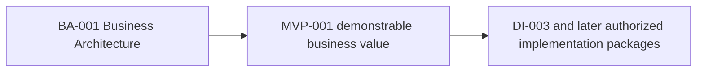

# AR-001 — Business Architecture Ratification

**Status:** Ratified conceptual foundation.  
**Scope:** BA-001A through BA-001D.  
**Implementation authority:** None. Future implementation requires separately ratified and authorized work packages.

## 1. Purpose

Architectural ratification establishes a stable conceptual reference for future evolution. BA-001 is considered conceptually stable and is ratified as the governing business architecture for Yarvis. It records architectural consensus on how the platform understands opportunities, evidence, knowledge, proposals, authority, and governed operational progress.

## 2. Scope

BA-001 defines the permanent conceptual foundations of Yarvis. Future Design, MVP, and Implementation documents shall implement or specialize these foundations; they shall not redefine them without explicit architectural review and ratification.

## 3. Foundational Concepts

The following constitute Yarvis's official business vocabulary:

- **Artifact:** an immutable information asset with source and provenance.
- **Evidence:** an Artifact or observation interpreted for a stated business purpose.
- **Knowledge:** governed, attributable interpretation of evidence.
- **Proposal:** a non-authoritative option informed by knowledge.
- **Human Confirmation:** the accountable act that authorizes a consequential business transition.
- **Evidence-backed Operational Model:** the current explainable understanding of the business, traceable to governed support.
- **Opportunity:** the governed unit of potential value that precedes a Project or other outcome.
- **Project:** an authorized, bounded execution endeavor.
- **Workflow:** the Business Line-specific progression of stages, gates, waiting states, and decisions.
- **Dossier:** a purpose-specific collection of requirements, evidence, knowledge, and attestations.
- **Requirement:** a condition that must be satisfied, evidenced, or explicitly excepted.
- **Milestone:** a governed checkpoint that unlocks legitimate progression.

## 4. Foundational Principles

- Evidence precedes automation.
- Proposals are never authoritative.
- Human Confirmation authorizes consequential business transitions unless a separately approved policy delegates bounded authority.
- Systems of Record remain authoritative in their own domains.
- Yarvis constructs understanding; it does not replace transactional or specialist systems.
- Every authoritative state remains explainable through its governing policy, authority, knowledge, and evidence.
- Artifacts remain immutable and Evidence remains attributable.
- Chronology-independent evidence ingestion may enrich understanding without invisibly rewriting history.
- Historical Reconstruction is a core platform capability and produces proposals for confirmation, not autonomous business changes.
- Architecture evolves through specialization, not replacement: Business Lines extend templates, vocabulary, evidence taxonomy, and policies while preserving the core model.

## 5. Architectural Governance

Future BA, MVP, and DI documents may extend, specialize, or implement BA-001. They should not redefine its foundational concepts or principles without explicit architectural review and ratification. Local vertical rules may add context, but may not weaken evidence attribution, proposal non-authority, human accountability, explainability, or System-of-Record boundaries.

## 6. Relationship to Future Work

BA-001 is sufficiently stable to guide future design. MVP-001 defines the first demonstrable value slice within this conceptual foundation. DI-003 and later packages may implement approved capability increments only after their own architecture, authorization, contracts, and engineering gates are complete.

## 7. Ratification Statement

BA-001A through BA-001D are ratified as the governing conceptual business framework for Yarvis. Future work shall preserve and specialize this framework; it shall not treat documents, automation, or technical components as substitutes for evidence-backed understanding, governed human authority, and explainable operational progress.
