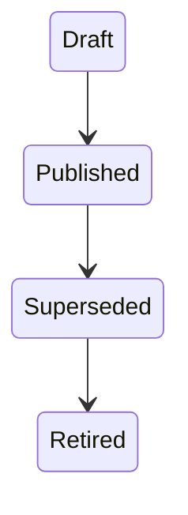

# AR-003 — Process Architecture Ratification

**Status:** Ratified architecture.  
**Scope:** Template Definitions, Dossier Templates, Requirements, Milestones, and Template Version Binding.  
**Source review:** [DR-001](../design/DR-001_DOSSIER_TEMPLATE_REQUIREMENT_AND_MILESTONE_MODEL.md).  
**Implementation authority:** None. Future capabilities require their own approved implementation gate.

## 1. Purpose

DR-001 evaluated alternative process models. AR-003 adopts its selected model as the governing process architecture for YARVIS. This establishes architectural authority, not implementation authorization.

## 2. Ratified Architecture

The following are authoritative architectural concepts:

- Opportunity Template;
- Dossier Template;
- Published Template Version;
- Requirement Definition and Requirement Instance;
- Milestone Definition and Milestone Instance;
- Business Residence; and
- Template Version Binding.

## 3. Ratified Decision

YARVIS adopts **Versioned Template Definitions with Dossier-local Requirement and Milestone Instances**.

- A Dossier permanently binds to one Published Template Version.
- Published Template Versions are immutable.
- Existing Dossiers never change silently.
- New versions affect future Dossiers only, unless a future governed migration explicitly authorizes otherwise.

## 4. Architectural Principles

The architecture ratifies reusable definitions, immutable published templates, tenant-local instances, historical immutability, explainable provenance, Business Residence separation, Evidence independence, and governed evolution.

## 5. Architectural Boundaries

Templates define process. Dossiers instantiate process. Requirements are governed obligations; Milestones are governed checkpoints. Artifacts remain governed by the Document Registry. Evidence and Knowledge remain future capabilities. Operational Models remain separate.

## 6. Architectural Invariants

- Every Requirement Instance originates from one Published Requirement Definition.
- Every Milestone Instance originates from one Published Milestone Definition.
- Every Dossier binds to exactly one Published Template Version.
- Published templates never mutate.
- Requirement Instances never silently inherit definition changes.
- Historical Reconstruction produces proposals, never authoritative history.
- Filesystem hierarchy is never authoritative.
- Business Residence and Artifact Storage remain permanently separated.

## 7. Versioning Policy

Only Published versions may instantiate Dossiers. Superseded versions remain valid for their existing Dossiers; Retired versions remain historically valid. Moving a Dossier between versions requires a future governed capability.

## 8. Future Capability Alignment

Future capabilities must preserve this architecture and may not use template evolution to silently rewrite Dossier history.

## 9. Consequences

This architecture enables stable historical interpretation, reproducible audits, safe template evolution, multi-vertical reuse, explainable Historical Reconstruction, and controlled future policy governance.

## 10. Deferred Decisions

Policy language, runtime workflow engines, Evidence extraction, Dossier completeness algorithms, template administration, template migration, waiver governance, and AI-assisted Requirement generation remain deferred.

## 11. Ratification Statement

The process architecture defined by DR-001 is hereby ratified as the authoritative architecture governing Template Definitions, Dossier Templates, Requirement Definitions, Requirement Instances, Milestone Definitions, Milestone Instances, and Template Version Binding. Future implementation shall conform to AR-003 unless superseded by a future ratified architecture decision.
