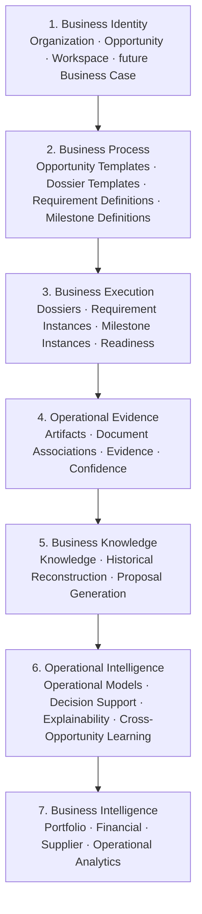
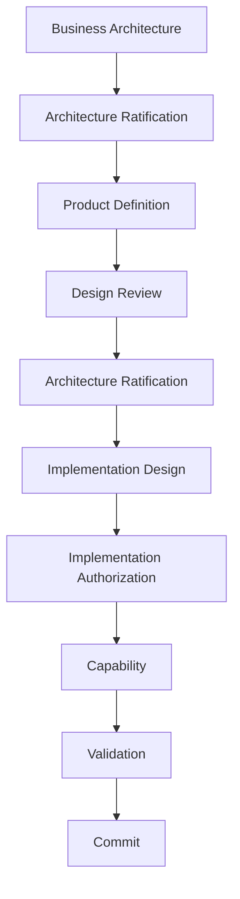
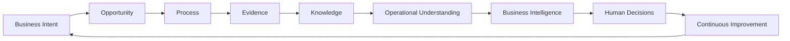

# AR-004 — Platform Evolution Roadmap

**Status:** Ratified architectural roadmap.
**Authority:** [AR-002 — Business Architecture Ratification](AR-002_BUSINESS_ARCHITECTURE_RATIFICATION.md) and [AR-003 — Process Architecture Ratification](AR-003_PROCESS_ARCHITECTURE_RATIFICATION.md).
**Engineering practice:** [EP-001 — Engineering Governance & Development Practices](../engineering/EP-001_ENGINEERING_GOVERNANCE_AND_DEVELOPMENT_PRACTICES.md).
**Implementation authority:** None. This roadmap sequences architecture; each capability requires its own design, ratification, implementation authorization, validation, and closure evidence.

## 1. Purpose

YARVIS evolves through architectural capabilities, not isolated features. This roadmap is the authoritative guide for the long-term sequencing of those capabilities and their dependencies. Implementation priorities may change in response to business evidence, but the architectural dependency order remains stable unless changed through explicit architectural review.

## 2. Platform Vision

YARVIS is an **Evidence-backed Business State Platform** that continuously transforms business intent, operational evidence, and human decisions into explainable operational understanding.

It is not a CRM, DMS, ERP, workflow engine, or AI assistant. YARVIS coexists with Systems of Record, preserving their authority in their own domains while constructing an attributable and governable understanding across business work.

## 3. Architectural Layers



Each layer uses, but does not redefine, the meaning established below it. The Document Registry remains the governed Artifact boundary; process structures remain distinct from document storage and Evidence interpretation.

## 4. Capability Evolution

The recommended evolution begins with the foundational capability chain defined by [DI-003 — Opportunity Foundation](../design/DI-003_OPPORTUNITY_FOUNDATION.md) and the process model ratified by [AR-003](AR-003_PROCESS_ARCHITECTURE_RATIFICATION.md).

```mermaid
flowchart LR
    F[Foundation<br/>Opportunity · Workspace · Specialization · Dossier] --> P[Process]
    P --> C05[C05<br/>Versioned Dossier Templates]
    C05 --> C06[C06<br/>Requirement Instance Bootstrap]
    C06 --> C07[C07<br/>Milestone Instance Bootstrap]
    C07 --> C08[C08<br/>Readiness Projection]
    C08 --> C09[C09<br/>Artifact / Document Associations]
    C09 --> E[Evidence]
    E --> K[DI-004<br/>Knowledge]
    K --> I[DI-005<br/>Operational Intelligence]
    I --> BI[DI-006+<br/>Business Intelligence]
```



Foundation establishes authoritative business identity and residence. The process sequence then establishes reusable, versioned definitions before creating governed local instances, readiness, and document/evidence relationships. Higher layers depend on lower-layer states being attributable, historically stable, and explainable.

## 5. Dependency Principles

- **Identity before Process.** Process must have a known tenant-local business residence and accountable lifecycle.
- **Process before Execution.** Execution instances require governed definitions, vocabulary, and dependencies.
- **Execution before Evidence.** Evidence has meaning only in relation to a business obligation, context, or decision.
- **Evidence before Knowledge.** Knowledge is attributable interpretation, not an ungrounded data accumulation.
- **Knowledge before Intelligence.** Decision support and learning must be explainable through governed knowledge and support.
- **Intelligence before Automation.** Automation may only act within approved authority, policy, and explainability boundaries.

Reversing this order produces fragile architecture: it treats data as understanding, makes automation authoritative without sufficient context, and prevents later explanation of why a state exists.

## 6. Vertical Expansion

Business lines specialize the platform through templates, vocabulary, evidence taxonomies, requirements, milestones, and governed policies—not through separate engines. Residential Solar, Commercial Solar, EV Charging, Battery Storage, and Engineering Services are illustrative verticals.

The core platform remains unchanged while each vertical supplies an approved specialization of the common Opportunity, Workspace, Dossier, Requirement, Milestone, Evidence, and Confirmation concepts. This preserves reuse, tenant isolation, historical reconstruction, and explainability across industries.

## 7. Evolution Rules

Future capabilities shall:

- extend ratified architecture rather than duplicate concepts;
- reuse the authoritative aggregate or Business Residence where one exists;
- preserve Business Residence and System-of-Record boundaries;
- preserve historical immutability and attributable provenance;
- preserve explainability, human confirmation, and proposal non-authority; and
- introduce new vertical semantics through governed specialization rather than replacement of the platform core.

## 8. Architectural Decision Gates



Business Architecture defines enduring concepts and boundaries. Architecture Ratification records architectural consensus. Product Definition establishes demonstrable value. Design Review evaluates a bounded model or decision. Implementation Design specifies the allowed technical slice; Implementation Authorization opens its engineering gate. Capability work implements only that authorized slice, and Validation plus Commit provide its closure evidence. The lifecycle is governed by [EP-001](../engineering/EP-001_ENGINEERING_GOVERNANCE_AND_DEVELOPMENT_PRACTICES.md).

## 9. Long-term Vision



The destination is an operating model in which business intent becomes governed opportunity and process; operational evidence supports attributable knowledge; knowledge supports explainable intelligence; and accountable human decisions improve the next cycle. Proposals may assist at every appropriate layer, but authoritative state transitions remain governed by confirmation unless a future approved policy delegates bounded authority.

## 10. Deferred Strategic Horizons

The following are strategic horizons, not authorized work: Business Cases, Relationship Intelligence, Marketplace capabilities, ERP integration, Predictive Planning, Autonomous Recommendations, Financial Intelligence, Organizational Learning, multi-tenant benchmarking, and Policy Engines. Each requires a separately governed assessment of owner, authority, evidence, privacy, explainability, and System-of-Record boundaries.

## 11. Roadmap Governance

AR-004 governs architectural direction and dependency sequencing. It never authorizes implementation. Every individual capability continues through the required chain:

```text
DR → AR → DI → IG → Implementation
```

The applicable decision records must establish the relevant contract ownership, persistence and lifecycle rules, authority boundary, non-goals, validation evidence, and closure conditions before implementation begins.

## 12. Ratified Vision Statement

YARVIS is an extensible operational platform whose understanding grows through governed business capabilities rather than isolated software features. Its evolution preserves evidence, human authority, historical continuity, explainability, and specialization while advancing from identity and process toward knowledge, intelligence, and accountable continuous improvement.

## Related Architecture

- [BA-001 — Opportunity Lifecycle Engine Architecture](../business/BA-001_OPPORTUNITY_LIFECYCLE_ENGINE_ARCHITECTURE.md)
- [BA-001B — Opportunity Lifecycle Operational Architecture](../business/BA-001B_OPPORTUNITY_LIFECYCLE_OPERATIONAL_ARCHITECTURE.md)
- [BA-001C — Business Capability Model and Platform Strategy](../business/BA-001C_BUSINESS_CAPABILITY_MODEL_AND_PLATFORM_STRATEGY.md)
- [BA-001D — Governance, Authority and Decision Architecture](../business/BA-001D_GOVERNANCE_AUTHORITY_AND_DECISION_ARCHITECTURE.md)
- [MVP-001 — First Demonstrable Business Value](../product/MVP-001_FIRST_DEMONSTRABLE_BUSINESS_VALUE.md)
- [DR-001 — Dossier Template, Requirement and Milestone Model](../design/DR-001_DOSSIER_TEMPLATE_REQUIREMENT_AND_MILESTONE_MODEL.md)
