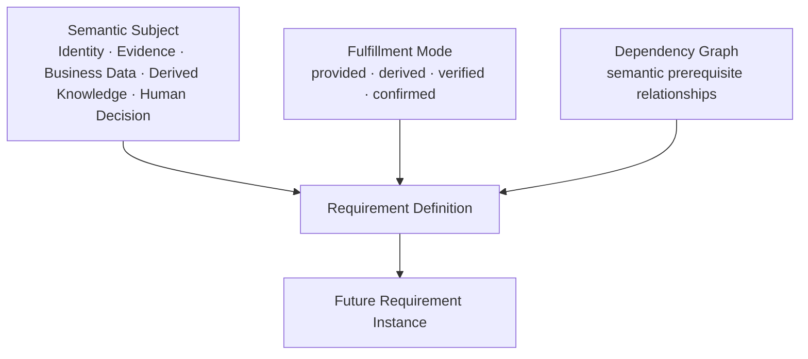

# AR-005 — Requirement Semantic Architecture Ratification

**Status:** Ratified architecture; non-authorizing.
**Source review:** [DR-002 — Requirement Definition Semantic Model](../design/DR-002_REQUIREMENT_DEFINITION_SEMANTIC_MODEL.md).
**Implementation authority:** None. Requirement implementation remains closed pending a future IG-004.

## 1. Purpose and Motivation

The Foundation provides governed Opportunity, Workspace, Dossier, and Published Dossier Template Version identities. AR-005 ratifies the semantic architecture required to express reusable business obligations independently of business vertical, document, workflow, or implementation choice.

## 2. Ratified Principles

- A Requirement is a governed **business obligation**.
- Requirement Definition and Requirement Instance are separate business concepts.
- Requirements are independent of documents, workflows, tasks, milestones, and checklists.
- Requirements express business knowledge, not operational sequencing.
- Business verticals specialize Requirements; Requirements never specialize business verticals.

## 3. Ratified Semantic Model

The three dimensions are orthogonal. Semantic Subject states what business concern is being established. Fulfillment Mode states how it is established. Dependency Graph states what other obligations semantically support or precede it. None of these dimensions defines task order, workflow route, user-interface sequence, or execution timing.

## 4. Dependency Architecture

Requirement dependencies are semantic relationships. Future Readiness may reason over whether required dependencies are sufficiently provided, derived, verified, or confirmed, but this ratification does not define a Readiness algorithm or execution mechanism.

## 5. Business Examples

The model applies without vertical-specific architecture. In Energy Fotónica, a Utility Bill may support derived Estimated Energy Demand, which supports a Technical Proposal. In NetPay, Monthly Volume, Average Ticket, and Tax Registration may support a Commercial Proposal. These are semantic relationships, not a prescribed workflow.

## 6. Commercial Observation

Commercial Proposals are future business aggregates. Requirements enable Commercial Decisions; Commercial Decisions generate Proposal versions; proposal documents are projections of business state rather than the authoritative state. This is an architectural dependency only and grants no Commercial or Proposal Engine implementation authority.

## 7. Architectural Invariants

- Requirement ≠ Document, Workflow, Task, Checklist, or Milestone.
- Definition ≠ Instance.
- Proposal ≠ PDF.
- Business Aggregate → Projection → Document.
- Filesystem hierarchy is never authoritative.
- Published semantic meaning and future Dossier-local instances must remain historically explainable.

## 8. Future Dependencies

This architecture governs the future design of DI-003 C06 Requirement Definitions, C07 Requirement Instances, C08 Readiness, C09 Document Associations, and a future Commercial Decision Engine.

## 9. Explicitly Deferred

Requirement persistence and instances, Milestones, Rules and Policy Engines, Readiness algorithms, Commercial and Proposal Engines, Settlement, Evidence, Knowledge, AI, OCR, integrations, workflow execution, and Historical Reconstruction remain unauthorized.

## 10. Recommendation for IG-004

A future IG-004 may open a bounded C06 implementation gate only after a corresponding implementation design defines aggregate ownership, published-template binding, authority, immutable provenance, contracts, migration, validation, and explicit non-goals. It must not infer authority for C07–C09 or any deferred engine.

## Ratification Statement

AR-005 ratifies the Requirement semantic model as the governing architecture for future Requirement Definitions throughout YARVIS. Future work shall extend this model without collapsing business obligation, evidence, workflow, task, milestone, or document into one concept.

## Related Records

- [AR-003 — Process Architecture Ratification](AR-003_PROCESS_ARCHITECTURE_RATIFICATION.md)
- [AR-004 — Platform Evolution Roadmap](AR-004_PLATFORM_EVOLUTION_ROADMAP.md)
- [DR-001 — Dossier Template, Requirement and Milestone Model](../design/DR-001_DOSSIER_TEMPLATE_REQUIREMENT_AND_MILESTONE_MODEL.md)
- [IG-003 — Process Engine Implementation Authorization](../engineering/IG-003_PROCESS_ENGINE_IMPLEMENTATION_AUTHORIZATION.md)
