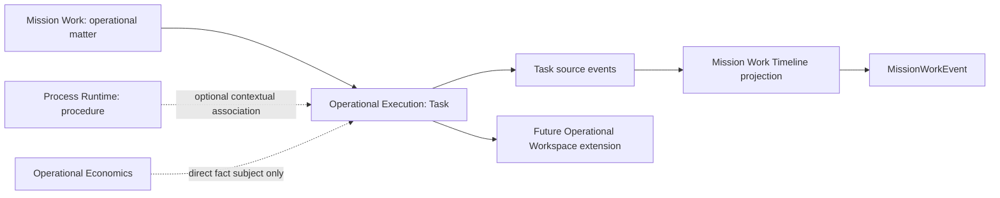
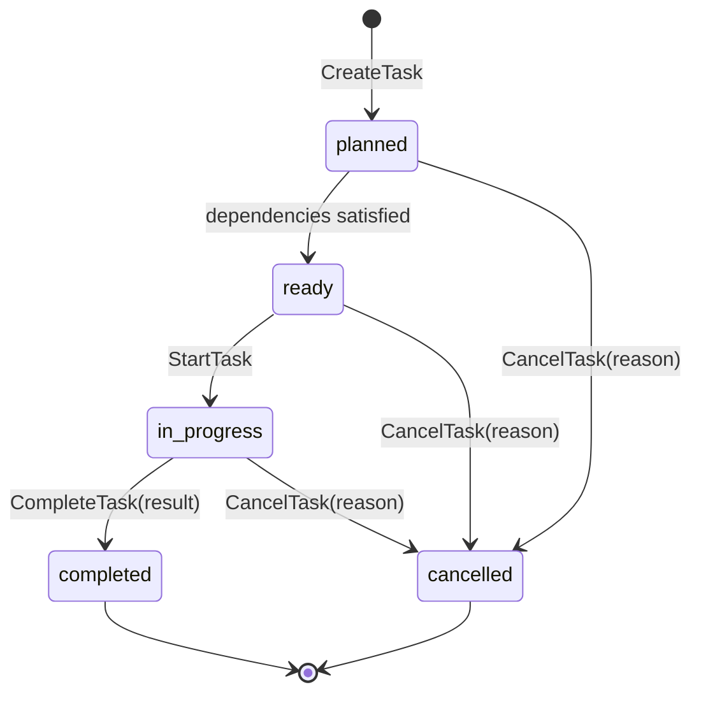

# Operational Execution Architecture

**Status:** Accepted OE-001 Architecture Decisions
**Work package:** OE-001 — Operational Execution Architecture
**Authority:** Constitution; Execution Model; AC-002; Process Runtime ADRs; Operational Economics OV-001/OV-002.
**Scope:** Architecture only. No Task runtime, API, migration, or interaction-contract identifier is created here.

> **An Operational Task is the smallest assignable unit of operational commitment that can be planned, executed, measured, and explicitly completed.**

## Purpose and Boundary

Operational Execution owns neutral operational commitments. It does not classify a Task as commercial, engineering, procurement, legal, or any other business discipline. Business meaning comes from Mission Work context, optional Process Instance/stage association, participants, evidence, Timeline, and separately owned Economic Facts.



The context owns Task state, assignment, dependencies, completion/cancellation evidence, and Task-local history. It does not own Mission Work lifecycle, Process lifecycle, Timeline storage, Economic Facts, business semantics, automation policy, or notification delivery.

## Relationships and Ownership

| Neighbor | Relationship | Ownership rule |
| --- | --- | --- |
| Mission Work | Every Task references exactly one `MissionWorkItem` in the same Organization. | Mission Work owns the operational matter; Operational Execution owns Task commitment state. |
| Process Runtime | A Task may reference one Process Instance and optionally one stage of that instance's immutable definition version. | Process owns instance lifecycle and stage; a Task association never transitions either owner. |
| Mission Work Timeline | Task source events are projected into the Work Timeline. | Timeline is Mission Work-owned projection evidence, not Task source truth. |
| Operational Economics | A future Task is a direct `EconomicFact` subject. | Economics owns facts, correction, currency policy, and all calculations. |
| Operational Workspace | A future workspace section may compose Task views. | Workspace is read-only composition and stores no Task state. |

Mission Work, Process Instance, and Task have independent lifecycles. No state, assignment, completion, cancellation, priority, or readiness change is inferred from another aggregate's state.

## Task Aggregate

`OperationalTask` is an Organization-scoped aggregate with one immutable `mission_work_item_id`. It contains a stable identifier, Organization, title, optional neutral description, lifecycle, optional primary assignee, created/completed/cancelled evidence, aggregate version, timestamps, and command idempotency identity.

Initial association rules:

- exactly one Mission Work Item per Task;
- zero or one Process Instance reference;
- zero or one Process Stage reference, valid only for the associated instance's definition version;
- no cross-Organization association; and
- `mission_work_item_id` is immutable for the full Task history; and
- Process Instance/stage planning association may be set, cleared, or changed only while the Task is `planned`.

Task reassociation to another Mission Work Item is not supported in the initial runtime. A future requirement must introduce a separate historical transfer or supersession design; it must not silently rewrite commitment context.

### Assignment

The initial model has one optional primary `assignee_subject_id`. Assignment is an accountable Task action and does not grant governance authority. Work participants remain context for the Task; they are not automatically copied into a Task-specific multi-assignment model. Delegation, teams, capacity, and multiple assignees are future extensions requiring their own authority semantics.

### Dependencies

`TaskDependency` is an explicit, tenant-scoped relation from predecessor to successor. The initial type is finish-to-start only:

```text
predecessor completed -> successor may become ready
```

For the initial scope, both Tasks must belong to the same Mission Work Item and Organization. The persistence model stores only direct finish-to-start edges. A dependency cannot be self-referential, duplicated, or form a cycle. Closing an edge preserves its direct historical record and source event; no closure table or persisted transitive dependency graph is created.

## Lifecycle, Readiness, and Explicit Actions



The initial persisted lifecycle is limited to `planned`, `ready`, `in_progress`, `completed`, and `cancelled`.

- `planned` is a committed Task not yet eligible or not yet made ready.
- `ready` may transition only when the readiness predicate is satisfied. Read models may derive readiness from lifecycle and dependency satisfaction; no separate `blocked` state is created.
- `in_progress` is an explicit start action from `ready`.
- `completed` is an explicit action by an actor. It records completion time and a result declaration/reference; it is never inferred from Process completion, Timeline activity, evidence arrival, or economics.
- `cancelled` is an explicit action with actor, time, and nonblank reason.
- `completed` and `cancelled` are terminal in the initial lifecycle. Reopening is not supported.

`blocked`, `waiting`, and `overdue` are not lifecycle states. A dependency-unmet or cancelled-predecessor condition is a derived readiness explanation. Waiting and SLA need separate extensions with their own reason, timing, and resumption semantics.

## Readiness, Dependency Safety, and Concurrency

The readiness predicate requires an active Task and every active finish-to-start predecessor completed. It must expose why readiness is false without inventing a business category. A predecessor's cancellation leaves the successor not ready; it does not automatically cancel or block it.

Dependency commands require transactional graph traversal in the same controlled transaction as the new direct relation. The implementation must enforce no self-edge and no duplicate edge, traverse the same Organization/Work graph to reject cycles, and serialize competing edits sufficiently to prevent concurrent cycle creation. It must not implement a closure table or persist transitive reachability.

Task mutations use the established optimistic-concurrency expectation: `expected_version` for state-changing commands plus a locked aggregate and appropriate constraint at persistence time. Create, assignment, start, complete, cancel, and dependency commands require idempotency identity and a request fingerprint. Same-key/same-request replays the established result; divergent reuse is a governed conflict.

## Event and Projection Model

Each successful Task mutation commits Task state, immutable Task-local evidence, and a `DomainEvent` source assertion in one Operational Execution Unit of Work. Completion notes inherit Task authorization and tenant visibility; document/file evidence remains deferred to the Document Registry.

| Source event | Minimum evidence |
| --- | --- |
| `operational_task.created` | Task, Organization, Mission Work, context references, actor, correlation/causation. |
| `operational_task.assigned` / `unassigned` | Prior/resulting assignee, actor. |
| `operational_task.ready` / `started` | Prior/resulting lifecycle and readiness basis where relevant. |
| `operational_task.completed` | Actor, timestamp, explicit result declaration/reference. |
| `operational_task.cancelled` | Actor, timestamp, nonblank cancellation reason. |
| `operational_task.dependency_added` / `dependency_closed` | Predecessor, successor, dependency type, actor. |

`TaskEvent` is the future append-only Task-local history. Mission Work receives an idempotent, tenant-aware projection of operator-relevant source events, using source DomainEvent identity as Process projection does. The Task service must never write `MissionWorkEvent` directly. Technical retries, graph scans, or scheduling diagnostics are not Timeline facts.

## Command Contracts, Authorization, and Tenant Isolation

The Task boundary uses the existing trusted actor, authority, request metadata, interaction-contract, and idempotency conventions. The catalog extension must allocate canonical identifiers before public runtime exposure, but it does not change these accepted behaviors:

| Command contract | Responsibility |
| --- | --- |
| `CreateOperationalTask` | Create one Task under one Mission Work Item. |
| `UpdateOperationalTaskPlanningFields` | Update neutral planning fields and optional Process Instance/stage association while status is `planned`. |
| `AssignOperationalTask` | Set or clear the optional primary assignee. |
| `TransitionOperationalTask` | Perform the allowed non-terminal lifecycle transitions. |
| `CompleteOperationalTask` | Explicitly complete from `in_progress` with accountable result and optional completion note. |
| `CancelOperationalTask` | Explicitly cancel a non-terminal Task with a nonblank reason. |
| `ManageOperationalTaskDependencies` | Add or close one direct finish-to-start edge after tenant and cycle validation. |

The Task boundary verifies Organization equality for Work, Task, Process, stage, and dependencies, and conceals cross-tenant/missing resources as `404` where existing Core patterns do so. It applies the existing per-command authority convention for read, create, planning update, assignment, transition, completion, cancellation, and dependency management.

An actor may assign responsibility only within governance rules. Assignment does not create delegation, approval authority, or entitlement to mutate Mission Work or Process.

## Operational Economics Compatibility

OV-001 reserves Task as an EconomicFact subject type and OV-002 persistence accepts `task`. There is no Task aggregate yet, so the current Economics subject resolver cannot establish ownership for a Task and rejects it as absent. OE-001 requires a future Task implementation to add owner lookup and same-Organization lock before Economics may record a Task fact.

Task time, completion, and work sessions never automatically produce cost. A future labor-cost assertion must be an authorized, provenance-bearing EconomicFact. A Process/Task, Task/Work, or workspace nesting relation never creates an economic roll-up; explicit future `EconomicRollupMembership` remains required.

## Extension Points

| Extension | Boundary preserved by OE-001 |
| --- | --- |
| Checklists | Checklist execution/validation remains its own owner. A Task may later reference a checklist through a governed relation, not absorb requirement state. |
| Waiting | A separate waiting record/reason/resume policy may affect readiness display; it does not add a Task lifecycle state. |
| SLA | Deadline, policy, breach, and escalation require a separate owner and scheduler design. |
| Documents and Evidence | References may support completion/result evidence, but Document/Evidence owners retain content, validation, and provenance authority. |
| Work Sessions | Sessions can record operational effort but do not change Task completion automatically. |
| Time Tracking | Time is a factual measurement, not labor cost without a governed Economics fact. |
| Automation | May propose or execute authorized Task actions only through later policy, authorization, and idempotency controls. |
| Notifications | Consume owner events; notification delivery is not Task state. |
| AI and prioritization | May organize evidence or recommend priority/readiness review; may not fabricate completion, authority, dependencies, or economic facts. |

## Architectural Invariants

1. Every Task belongs to exactly one Mission Work Item in the same Organization.
2. Task, Mission Work, and Process Instance lifecycles never synchronize implicitly.
3. Process association is optional and never grants lifecycle control.
4. The initial lifecycle contains only the five declared states.
5. Completion and cancellation are explicit, attributable, timestamped domain actions.
6. Dependencies are explicit, finish-to-start, same-tenant, same-Work, unique, and acyclic.
7. Timeline entries are projections; Task state and Task-local evidence are source truth.
8. Task events are append-only; context and dependency evidence are not destructively rewritten.
9. Operational Economics remains sole owner of EconomicFact and calculations.
10. No Task behavior may infer business discipline, economics, authority, or automation eligibility from its title, Work, Process, or participant alone.

## Explicit Non-Goals

OE-001 does not add Task code, storage, routes, contracts, migrations, frontend, bulk operations, cross-Work dependencies, multiple assignees, recurring Tasks, blocked/waiting/overdue lifecycle states, scheduling, SLA, documents, checklists, time tracking, labor costing, economic roll-up, notifications, automation, AI, BPMN, or vertical-specific Task types.

## Phased Implementation Roadmap

1. **WS-007A Task Core:** Task aggregate, tenant/authority boundary, idempotent commands, append-only Task events, and focused tests. Allocate the seven command contracts in the canonical catalog before endpoint exposure.
2. **WS-007B Dependencies and readiness:** direct finish-to-start edges, transactional cycle-safe traversal, derived readiness explanations, and Work Timeline projection.
3. **WS-007C Workspace read extension:** bounded Task composition in Operational Workspace; no Task persistence in the read model.
4. **Later independently ratified extensions:** Checklists, Waiting, SLA, Documents/Evidence, Work Sessions/Time Tracking, Economics Task resolver, notifications, automation, and AI.

## Contradictions, Deprecated Assumptions, and WS-007A Readiness

### Resolved contradiction

Older terminology used “task” for an Automation Engine unit. That Automation Task is a mechanism inside an Automation Session; it is not an Operational Task commitment. The two concepts must remain named and modeled separately.

### Deprecated assumption

Treating a Mission Work Item, Process stage, or Timeline event as sufficient evidence that a commitment is completed is deprecated. Completion belongs to an explicit Task action with accountable evidence.

### Remaining WS-007A issue

No unresolved architecture decision blocks WS-007A. The mandatory implementation sequencing step is to allocate the accepted command contracts in the Interaction Contract Catalog before public endpoints are introduced. The absent Economics Task subject resolver blocks only Task EconomicFact recording, which is a later extension and not a WS-007A blocker.

## Related Documents

- [Execution Model](EXECUTION_MODEL.md)
- [Automation Engine](AUTOMATION_ENGINE.md)
- [Mission Control Architecture](MISSION_CONTROL_ARCHITECTURE.md)
- [Process Runtime Design](PROCESS_RUNTIME_DESIGN.md)
- [Operational Economics Architecture](OPERATIONAL_ECONOMICS_ARCHITECTURE.md)
- [Architecture Checkpoint 002](YARVIS_ARCHITECTURE_CHECKPOINT_002.md)
- [ADR — Operational Task Ownership](adr/ADR-OPERATIONAL-TASK-OWNERSHIP.md)
- [ADR — Operational Task Lifecycle and Dependencies](adr/ADR-OPERATIONAL-TASK-LIFECYCLE-AND-DEPENDENCIES.md)
- [ADR — Operational Task Projection and Economics](adr/ADR-OPERATIONAL-TASK-PROJECTION-AND-ECONOMICS.md)
