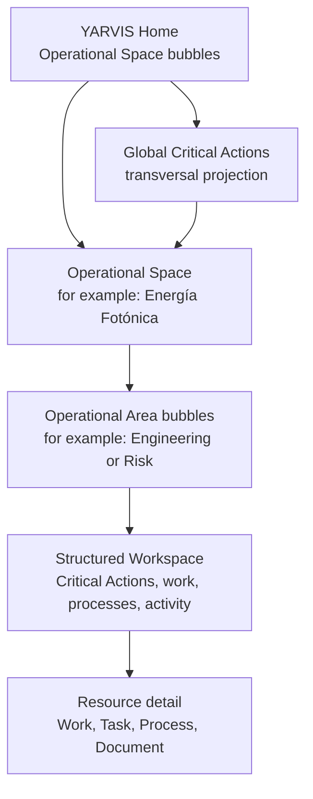

# Operational Workspace Experience and Document Storage Discovery

**Status:** Discovery and decision preparation; not ratified and not implementation authority.
**Work package:** WS-008B.
**Scope:** Frontend and repository discovery, information architecture, UX alternatives, and future document-storage boundary. No runtime, route, model, migration, or UI implementation is authorized by this document.

**Related experience proposal:** [YARVIS Experience Architecture](YARVIS_EXPERIENCE_ARCHITECTURE.md) defines the UX-001 five-level hierarchy and cellular visual language. This discovery remains the repository-evidence and Workspace/Document Registry decision-preparation record; UX-001 does not ratify either document.

## 1. Executive Summary

**Repository fact.** The current checkout is `fix/ws007a-governance` at `3409bac` (WS-008A), not the `main`/`9751d45` state recorded in the older development state file. It contains a tenant-scoped organization Workspace overview API and the Operational Task runtime, but the React application does not consume either. The implemented UI is a small React/Vite application with a separate Mission Work queue and Work-item Workspace, plus a visually distinct Development Workspace shell.

**Product vision.** YARVIS Home uses labelled bubbles to navigate user-recognizable **Operational Spaces** (for example Energía Fotónica, NetPay, and Trading / Finance). Inside a selected Space, labelled Operational Area bubbles may group navigation (for example Commercial, Engineering, Installation, Regulatory, Documents, or Risk). Neither level names a Core capability automatically.

**Architectural recommendation.** The MVP should be a **hybrid Workspace**: bubbles navigate at the Home and Operational-Area levels; structured Critical Actions, active Tasks, Processes, recent activity, and context panels do the operational work. The existing `GET /operational-workspace` composition is the appropriate initial read-model seam for one Organization; it remains non-authoritative.

**Decision requiring human approval.** Adopt the hybrid Workspace and a Document Registry boundary before implementation. Do not let the existing local intake upload become the general document architecture.

**Deferred question.** Whether an Operational Space maps to an Organization, tenant, business unit, vertical, configured application/module, project, or another concept is unresolved. The production document provider, retention schedules, malware scanning service, and external-sharing policy also need product/security decisions after the Registry contract is designed.

## 2. YARVIS Home and Operational Spaces

**Product vision.** An **Operational Space** is a provisional UX label for a recognizable operating environment—such as Energía Fotónica, NetPay, Trading / Finance, future Accounting, or future CTO Office. It answers “where am I operating?” and is intentionally not yet a synonym for Organization, tenant, business unit, vertical, project, application module, or bounded context.

**UX hypothesis.** The bubble metaphor is deliberately limited to these two navigation/orientation levels:

1. **YARVIS Home → Operational Space:** fixed/bounded-size labelled bubbles show available Spaces and invite entry.
2. **Operational Space → Operational Area:** compact labelled bubbles/chips expose recognized ways to enter the Space; selecting one opens a structured panel/list/table/timeline, never a third bubble hierarchy.

Structured panels take over for Critical Actions, active work, Tasks, Processes, Projects/Sites, documents, economics, Inbox, and activity. Resource detail is conventional and data-dense. This avoids representing technical Core capabilities as primary Home bubbles and prevents the visual metaphor from carrying operational state.

### Operational Area classification

**Architectural recommendation.** Operational Areas are UX-only classifications. They must not create a generic Bubble domain model, become persisted Core entities, or imply a new bounded context. The proposed labels classify as follows; the final available Areas may vary by Space.

| Proposed internal bubble | Classification | Rationale and boundary |
| --- | --- | --- |
| Commercial | Navigation grouping | Groups commercially meaningful views in a Space. It is not currently a Core owner and must not create commercial state. |
| Engineering | Navigation grouping | Groups engineering-facing work/projects. It is not automatically the future Energy bounded context. |
| Installation | Vertical capability | Fits a future Energía Fotónica operational capability, but no implementation/owner contract exists yet. |
| Regulatory | Navigation grouping | A role-oriented entry point to governed evidence/requirements; it does not own regulatory state by name alone. |
| Documents | Read-model surface | Lists authorized Registry/intake/evidence references inside the selected Space. The Registry remains the metadata/relationship boundary. |
| Risk | Transversal projection | Surfaces deterministic Critical Actions, future policy results, and future risk indicators; it is not a domain aggregate. |
| Critical Actions | Transversal projection | Same deterministic read model globally and per Space; it is never a business vertical. |
| Mission Work | Read-model surface | Mission Control-owned work surface; a Space-specific view is a read composition, not separate Mission Work state. |
| Operational Tasks | Bounded context | Operational Execution-owned commitments; the Area is a navigation entry into owned Task views. |
| Process Instances | Bounded context | Process Runtime-owned procedure instances; no Area owns their lifecycle. |
| Projects / Sites | Vertical capability | Current operational-context references; their business semantics remain Space/vertical-dependent. |
| Timeline / Recent Activity | Read-model surface | Mission Work-owned projected activity, composed for navigation. |
| Operational Economics | Bounded context | Economics remains owner of facts/calculation; its presentation is not a Space-owned roll-up. |
| Inbox / Intake | Read-model surface | Mission Inbox/Intake entry point where applicable; no frontend-owned queue state. |

**Repository fact.** The canonical module registry includes `netpay_merchant_operations`, platform modules, and no Energy/Trading/Accounting/CTO Office module; `Organization` has only legal/display/type/status fields; and current `Site`/`Project` are Organization-scoped references. Therefore the repository cannot currently list dynamic Operational Spaces or establish a safe mapping from them.

**Decision requiring human approval.** Approve a future, non-authoritative Home read model with only: visible Space navigation identifier, label, optional icon metadata, active-work count, deterministic critical-action count, recent-activity indicator, and last activity timestamp. Its mapping to existing Organization/vertical/module or another concept requires separate architecture approval. It must not add an `OperationalSpace` aggregate or persist bubble layout/semantics in the Core during the MVP.

## 3. Frontend As-Is

| Area | Repository evidence | Assessment |
| --- | --- | --- |
| Framework/build | `apps/web/package.json`: React `18.3.1`, React DOM `18.3.1`, Vite `6.1.0`, TypeScript `5.7.3`. | **Repository fact:** a compact Vite SPA. |
| Entry and routing | `apps/web/src/main.tsx` mounts `BrowserRouter`; `apps/web/src/App.tsx` owns all routes through React Router `6.28.0`. | **Repository fact:** browser routing exists, but no route hierarchy or route-level error boundary exists. |
| Shell/layout/navigation | `App.tsx` has a global plain `<nav>`. `workspace-shell/WorkspaceShell.tsx` is a separate nested shell at `/workspace/*` with sidebar, header, status bar, and routes. | **Repository fact:** two unrelated shells. The Development Workspace shell is for repository/workspace administration, not an operational product shell; it must not become the WS-008B foundation. |
| API client/principal | `api/missionWork.ts` is the only governed frontend client. It stores actor, organization, token, and authority list in `sessionStorage`, and sends `X-Yarvis-*` headers. `App.tsx` also has direct unauthenticated `fetch` helpers. | **Repository fact:** client behavior is duplicated and provisional. **Recommendation:** preserve the typed error/header pattern, but replace its per-feature session state with a single authenticated-principal boundary in a future scoped package. |
| Authority | `MissionWorkQueue.tsx` gates controls with `hasMissionWorkAuthority`; server routes authenticate every request. | **Repository fact:** Mission Work is client-gated for usability and server-gated for enforcement. **Recommendation:** client checks must only hide/disable; backend remains the decision point. |
| State/context | TanStack React Query `5.66.0` is used for remote cache. Component `useState` holds filter, selected Work Item, and access setup. The Development Workspace holds selected development workspace only in memory. | **Repository fact:** no canonical operational Organization/Site/Project context state exists in the frontend. |
| CSS/components | Global `style.css` and isolated `workspace-shell/workspace.css`; reusable cards/items are CSS classes, not a shared design system. Mission Work components are feature-local. | **Repository fact:** no component library, tokens, or accessible shared primitives. **Recommendation:** preserve simple semantic markup and responsive grid patterns, not the global class names as a design-system API. |
| Loading/empty/error/403/404 | Mission Work and Work-item Workspace explicitly render loading, empty, network, 403, and concealed 404 states. Other `App.tsx` routes mostly assume data and use generic errors. | **Repository fact:** the Mission Work patterns are the strongest reusable behavior; no application-wide error/not-found boundary exists. |
| Tests/validation | Vitest + Testing Library are configured; tests exist for `MissionWorkQueue`, `OperationalWorkspace`, API client, shell, and store-intelligence components. Scripts are `dev`, `build`, and `test`; no `lint` or explicit `typecheck` script is defined. | **Repository fact:** focused unit/component coverage exists; no end-to-end suite is evident. |
| Existing screens | `App.tsx` wires Mission Work and Work-item Workspace. It has no operational Project/Site, Task, Process, Economics, Timeline, Documents, or Inbox Workspace screens. The only `OperationalWorkspace.tsx` is Work-item scoped. | **Repository fact:** filenames do not establish a complete operational Workspace. |

### Canonical, provisional, and duplicated

- **Repository fact — preserve:** React Router + TanStack Query, typed Mission Work error handling, semantic loading/empty/error states, tenant-safe `404` presentation, and the existing Work-item Workspace as a detail destination.
- **Repository fact — provisional:** `http://localhost:8000` is repeated in `App.tsx`, `api/missionWork.ts`, and other feature clients; authentication is a local/test trusted-header convention; no environment-configured frontend API boundary exists.
- **Repository fact — duplicated:** global navigation and Development Workspace navigation; direct generic fetch helpers and typed feature API clients; global CSS and isolated shell styling.
- **Architectural recommendation:** WS-008B must not build on the Development Workspace (`/workspace/*`) or on direct `App.tsx` fetch helpers. It should consume only governed operational read models and use a purpose-built operational shell after approval.

## 4. Existing Reusable Patterns

| Pattern | Evidence | Reuse decision |
| --- | --- | --- |
| Tenant-safe query composition | `services/operational_workspace_overview.py` derives the Organization from the authenticated principal and validates Site/Project in that Organization. | **Repository fact / preserve:** use as the first Workspace read seam. |
| Detail Workspace | `GET /mission/work-items/{id}/workspace?currency=MXN` and `components/mission-work/OperationalWorkspace.tsx`. | **Repository fact / preserve:** use as drill-down destination, not as organization dashboard. |
| Task overview | `GET /operational-workspace` returns active/blocked Task lists, active processes, activity, and summary counts. | **Repository fact / preserve:** current backend supports an overview, but no frontend client or screen yet consumes it. |
| Context inheritance | Task/Process Workspace filtering follows `OperationalTask -> MissionWorkItem -> MissionInboxItem -> Site/Project` in the overview service. | **Repository fact:** this is available indirectly and only where the Inbox context exists; it is not a universal subject-context model. |
| Document intake | `data_intake.py`, `DocumentRecord`, `SourceRecord`, and `LocalDocumentRepository`. | **Repository fact:** controlled intake has metadata, hashes, duplicate detection, preview/review, and a local binary adapter. It is not a governed Registry or general download/association system. |

## 5. Workspace User Questions

**UX hypothesis.** The first view should answer these in this order: (1) what needs attention, (2) what is actively moving, (3) what is blocked/late, (4) what recently changed, (5) what context is being viewed, and (6) the next governed destination/action. Documents are linked evidence, not a substitute for work state.

## 6. Information Architecture

**Product vision.** The following are structured capabilities inside an Operational Space. They are not primary YARVIS Home bubbles. An Operational Area may provide a user-recognizable entry to one or several of them, subject to the classification in Section 2.

| Surface | Source of truth / available read model | Destination and possible actions now | Deferred / MVP |
| --- | --- | --- | --- |
| Critical Actions | **Recommendation:** deterministic projection over Task, Process, and Timeline facts. No dedicated API exists. | Filtered overview and linked Task/Work destinations; current UI can only act in Mission Work. | No new aggregate. MVP panel/route only after read model. |
| Mission Work | Mission Control owns `MissionWorkItem`; list/detail/timeline and Work-item Workspace APIs exist. | `/mission-work`, detail query parameter, then `/mission-work/{id}/workspace`; create from Inbox, assign, change status/priority, comment when authorized. | Include in MVP. |
| Operational Tasks | Operational Execution owns `OperationalTask`; `/mission/tasks`, `/mission/tasks/work/{id}` and overview excerpts exist. | API supports governed create/update/assign/transition/complete/cancel/dependencies; no React destination exists. | Include read-only excerpts in MVP; interaction is a later scope. |
| Process Instances | Process Runtime owns instances; `/process-instances` plus Work-item composition exist. | API supports start, transition, cancel, work-link operations; no React screen exists. | Include active process list and drill-down placeholder only when a Process screen is separately scoped. |
| Projects / Sites | Operational Context owns `Site`/`Project`; overview accepts `site_id`/`project_id`. | No frontend selector or project/site routes found. | Include context display/filter in MVP; management UI deferred. |
| Timeline / recent activity | Mission Work owns projected `MissionWorkEvent`; overview returns recent activity. | Work-item timeline and Work-item Workspace show it; no organization timeline page. | Include a bounded recent-activity panel in MVP. |
| Operational Economics | Operational Economics owns `EconomicFact`; direct summaries appear only in the Work-item Workspace. | Read-only economic summaries per Work/process are visible from detail. | Do not include organization roll-ups: they are explicitly deferred. |
| Documents / evidence | Intake owns `DocumentRecord`/`SourceRecord`; legacy Case Evidence owns case-only metadata. | Intake APIs upload/list/process/confirm/reject; no download endpoint, generic associations, or Workspace UI. | Exclude from first UI release except link placeholders; Registry design first. |
| Inbox / intake | Mission Inbox owns its projection; its list is used inside Mission Work queue. | Create/open Mission Work items if authority permits. | Include a count/link only if a bounded Inbox query can be added; no frontend-owned queue state. |

**Repository contradiction.** `CURRENT_STATE.md` says Task and document behavior are not open, while the checkout contains WS-007A/WS-007B and WS-008A commits. This document reports the checkout evidence; it does not ratify, extend, or overwrite the stated gate.

## 7. Bubble Interaction Alternatives

### A. Bubble-first navigation at both levels

**UX hypothesis.** YARVIS Home represents Operational Spaces as bubbles and a selected Space represents Operational Areas as a second compact bubble set. Neither set represents Tasks, Processes, Documents, Economics, or Timeline as Home-level technical capability bubbles. Each bubble has a text label, optional icon, explicit active-work and critical-action counters, and an explicit recent/changed indicator.

Strengths: memorable, approachable orientation for low-density use. Risks: area is poorly comparable, urgency and count compete visually, relationships suggest causality that the read model cannot prove, and many domains become decorative. Keyboard users need a conventional ordered list/grid with the same information; motion must be optional and respect reduced-motion; mobile must become a one-column list. Zero domains stay visible as compact neutral navigation, never vanish. **Data-density limit:** roughly six to eight stable domains before it fails. **Complexity:** medium/high due to accessible equivalent views and responsive layout. **Suitability:** low for Energia Fotónica’s first daily operational use.

### B. Hybrid Workspace: bubbles plus structured panels

**UX hypothesis.** Home Space bubbles and in-Space Area bubbles provide orientation/navigation; structured panels are the primary work surface. Bubbles use label + count rather than area; color communicates only state and is repeated in text; click/Enter opens the selected structured surface; tab order follows displayed order.

Strengths: retains the playful idea without hiding operational detail; panels remain scanable, sortable, responsive, and accessible. Risks: two navigation metaphors require visual restraint; bubbles must not animate as status changes. **Data-density limit:** robust when primary panels are paginated/filtered. **Complexity:** medium. **Suitability:** highest for Energia Fotónica’s first operational use.

### C. Structured command center with compact bubble overview

**UX hypothesis.** Structured panels and filters are primary after entering a Space; compact Space/Area bubbles remain an optional overview/navigation control.

Strengths: strongest high-density and accessibility behavior; lowest ambiguity. Risks: least differentiated/product-playful. **Data-density limit:** highest. **Complexity:** low/medium. **Suitability:** viable if initial users value speed over exploration.

**Decision requiring human approval — MVP recommendation:** B, the Hybrid Workspace. Use no physics, floating, collision, or continuous animation. A relationship line is permitted only where an explicit source relationship exists; otherwise it is decorative and should be omitted.

### Conservative MVP bubble semantics

| Signal | Meaning | MVP rule |
| --- | --- | --- |
| Name and icon | User-recognizable Space or Area identity. | Label is mandatory; icon is optional and decorative unless it has a text alternative. |
| Active-work count | Transparent count from the relevant read model. | Display as text/badge; never infer a composite score. |
| Critical-action count | Deterministic count using the same rules as the Critical Actions surface. | Display explicitly and link to its filtered list. |
| Recent activity / changed since last visit | Latest observed activity or a future user-specific visit marker. | Show current latest activity now; “unread” is deferred until user-visit semantics are designed. |
| Operational health | A bounded presentation of named deterministic warnings. | No color-only health state and no hidden “energy” score. |
| Economic relevance | Direct economics only where available. | Deferred from Home and bubble sizing; no roll-up. |

**Architectural recommendation.** Bubble size remains fixed or within a tightly bounded range. Stop the metaphor after Operational Area: Critical Actions, Tasks, Processes, Documents, Projects/Sites, Economics, Inbox, and Timeline use structured panels, sortable lists/tables, and timelines. Resource detail never uses bubbles. No physics, floating, collision, or continuous animation is appropriate.

## 8. Critical Actions Semantics

**Architectural recommendation.** Critical Actions is one transparent, non-persisted read model with a source link, reason code, detected-at timestamp, deterministic severity, and permitted destination/action. It is neither a domain aggregate nor an AI score.

| Rule | Classification | Deterministic severity / action |
| --- | --- | --- |
| Active Task has incomplete predecessor(s) | Implementable now from Task dependencies; current overview calls this `blocked`. | High; open Task and display predecessor explanation. |
| Active Task `due_at < now` | Implementable now. | High if urgent/high priority, otherwise medium; open Task. |
| Active urgent/high-priority Task without assignee | Implementable now. | High/medium respectively; open Task assignment destination. |
| Active ready/in-progress Task without assignee | Implementable now. | Medium; open Task assignment destination. |
| Process stale beyond a defined inactivity threshold | Small backend extension: threshold and rule must be approved; current process timestamps exist. | Medium/high; open Process/related Work. |
| Recent critical Mission Work event | Small extension: define the event-type allowlist and retention window; events currently have no criticality field. | Medium; open Work timeline. |
| SLA breach, document requirement, economic risk | Future capability. SLA/Waiting/Documents and economics roll-ups/risk indicators are not implemented contracts. | No MVP rule. |

**Recommendation:** expose Critical Actions as (1) a summary bubble/chip, (2) the primary ordered panel on the Workspace, and (3) a filtered deep-linkable route—all views of the same read model. Sort by severity, overdue duration, then deterministic identifier. An acknowledgement, if introduced later, must not alter the source Task/Process state.

**Architectural recommendation — clarification.** Critical Actions is global at YARVIS Home across visible Operational Spaces and filtered inside one selected Space. A summary bubble/chip, a structured panel, and a filtered deep-linkable route are views of that same deterministic projection. It is not an Operational Space, business vertical, or aggregate.

## 9. Context and Navigation Strategy

**Architectural recommendation.** The intended conceptual hierarchy is `/` (YARVIS Home), `/spaces/:spaceId` (Operational Space), then `/spaces/:spaceId/sites/:siteId`, `/spaces/:spaceId/projects/:projectId`, `/spaces/:spaceId/work/:workItemId`, `/spaces/:spaceId/tasks/:taskId`, and `/spaces/:spaceId/processes/:processInstanceId`. These are proposed route names, not a repository routing decision. `spaceId` is a future navigation identifier and never grants Organization/tenant authority.

**Architectural recommendation.** Organization identity belongs to the authenticated principal and is never supplied by the browser as an authority selector. The Operational Space route sets UX/navigation scope; nested Site/Project/resource paths refine it. Query parameters may express non-authoritative view state (`?area=risk&panel=critical-actions&status=overdue`), not identity or authority.

| Situation | Expected behavior |
| --- | --- |
| Global Home | No Space is presumed. List only visible Spaces and show global Critical Actions/cross-Space activity only when the future read model authorizes it. |
| Operational Space view | The selected Space is URL-restorable and supplies the UX/navigation scope; it is not automatically an Organization, tenant, vertical, bounded context, or project. |
| Organization view | Principal Organization is implicit; URL is refreshable and shows all available work. |
| Site/project view | IDs in path are validated tenant-side; project is nested below Site to preserve the existing model. |
| Contextless work | An item without Site/Project remains visible in the organization view and must be explicitly labelled “No site/project”. It is not dropped. |
| Deep link, refresh, back/forward | Route and query restore visual state; React Query refetches canonical read models. No critical state lives only in component memory. |
| Unauthorized/deleted context | Return the existing concealed `404` for unavailable tenant resources; use `403` for known resource with insufficient authority only where backend policy chooses to reveal it. UI must not leak name/counts. |

**Repository fact.** WS-008A currently implements only `GET /operational-workspace?site_id=&project_id=` for the principal Organization; it cannot list/select Operational Spaces, define their label/icon, or aggregate across them. **Decision requiring human approval:** approve the smallest future Home read-model gap—visible Space navigation identifier, label, optional icon metadata, active/critical counts, latest activity, and permitted destination—and approve the path-based hierarchy before routing work begins.

## 10. Document Registry Boundary

**Architectural recommendation.** Create a future Organization-scoped Document Registry that owns document metadata, immutable identity/version lineage, integrity hash, classification, provenance, retention/archival status, storage locator, access policy references, and subject associations. It owns neither binary-provider semantics nor the truth owned by Evidence, Intake, Checklist, Task, Process, or a future Case.

| Concept | Current evidence / future role |
| --- | --- |
| Document metadata | `DocumentRecord` has filename, media type, hash, size, storage reference, extraction/review metadata. **Repository fact:** useful intake metadata, but not tenant-scoped and not a generic Registry. |
| Binary storage | `LocalDocumentRepository` writes generated names under configured `document_storage_root`. **Repository fact:** local adapter only. |
| Evidence | Legacy `Evidence` is Case-bound descriptive metadata. **Repository fact:** it does not reference a binary or DocumentRecord. |
| Source artifact | `SourceRecord` + `DocumentRecord` retain origin, intake metadata, hash, and review/extraction state. |
| Generated document | **Deferred question:** Registry should distinguish producer, generated-at, inputs, and immutable output reference; no current implementation is found. |
| External reference | **Recommendation:** store provider, immutable external ID/URL, provider version/ETag if available, fetched-at, and optional mirrored hash—never make the URL itself canonical evidence. |

The Registry association should be a many-to-many, Organization-checked relation to `Organization`, `Site`, `Project`, `MissionWorkItem`, `OperationalTask`, `ProcessInstance`, and future Case/subjects. Each association needs relationship type (for example `evidence_for`, `source_for`, `deliverable_of`), visibility inheritance/override, creator, and audit provenance. Association must not imply lifecycle, completion, checklist satisfaction, or economic value.

**Architectural recommendation.** Documents are accessed as a structured Documents surface inside an Operational Space and through associated resource detail. An Operational Space is not a separate physical storage provider, bucket, or tenant boundary by default; physical placement follows the approved Registry/storage policy and verified authorization.

## 11. Storage Options Assessment

| Option | Assessment |
| --- | --- |
| Local filesystem | **Repository fact:** simplest existing development adapter. **Recommendation:** suitable only for local/test developer use; weak multi-instance reliability, shared access control, backup discipline, and tenant isolation unless infrastructure supplies them. Portable but operationally fragile. |
| S3-compatible object storage | **Architectural recommendation:** strongest production boundary: durable objects, lifecycle/retention, versioning, encryption, controlled signed delivery, large-file scaling, and vendor-portable API semantics. Requires a Registry, IAM policy, audit design, and backup/version policy. Suitable for Energia Fotónica, NetPay, accounting, and trading verticals. |
| Google Drive | **Architectural recommendation:** suitable as a user-facing external-reference/import connector where customers already govern documents there. Sharing and versioning are convenient, but tenant isolation, retention, auditability, and reliable permission mapping depend on provider configuration; introduces API/vendor coupling. Not a primary canonical binary boundary. |
| SharePoint / OneDrive | **Architectural recommendation:** similar connector choice for Microsoft-governed organizations; strong collaboration controls but complex tenant/site permissions and Graph integration. Not a primary canonical binary boundary. |
| Hybrid local development + object storage production | **Architectural recommendation:** preferred provider strategy. Keep a local adapter for development/tests and define an S3-compatible production port without coupling the Registry domain model to a vendor SDK. |

**Decision requiring human approval.** First Registry implementation should accept metadata plus external references (and optionally migrate the existing intake object records) before broad end-user file upload. Select a production S3-compatible provider only after jurisdiction, retention, expected file size/volume, RPO/RTO, and customer-managed-key requirements are known. Google/SharePoint should remain connectors behind the same Registry boundary.

## 12. Security and Governance

| Boundary | MVP requirement | Production hardening |
| --- | --- | --- |
| Organization isolation and authority | Enforce principal-derived Organization and owner-contract authority on every Workspace/Registry query and command; conceal unavailable objects; do not trust a URL or client header as authority. | Formal identity provider, entitlement lifecycle, provider credential rotation. |
| Visibility/document access | Registry association must inherit subject visibility unless an explicit stricter policy is authorized. Sensitive Task completion notes must not be exposed by a generic document list. | Document-level ACL exceptions, legal holds, policy engine integration. |
| Download/external sharing | No unauthenticated direct filesystem path or provider URL. Stream through authorized service or issue short-lived, scoped signed URL after authorization/audit. External sharing is out of MVP. | Revocation, watermarking/DLP where warranted, expiry/revocation checks. |
| Audit and integrity | Record metadata/association/visibility/download decision events and content hash; preserve source/provenance. | Immutable audit export, provider access-log reconciliation, anomaly monitoring. |
| Retention/deletion | MVP requires explicit archive versus delete states and no silent binary deletion. | Per-class retention, legal hold, verified purge, restore drills. |
| Malware/encryption | Enforce file size/type allowlists; encryption in transit and encrypted storage are expected. Malware scanning may be deferred only if uploads remain restricted and untrusted files are not served. | Quarantine + asynchronous scanning, key management/customer keys, content-disposition defenses. |

## 13. Recommended MVP

**Proposal requiring human approval.** Phase 1 is a shared application shell; YARVIS Home with static/configured Operational Space bubbles if backend discovery cannot yet list them dynamically; navigation into the existing Operational Workspace; structured Workspace panels; and loading, empty, error, forbidden, and missing-Space states. Inside a selected Space, compact Operational Area bubbles/chips navigate to structured surfaces. The first panels consume the existing overview read model: URL-restorable Site/Project scope, a context header, Critical Actions (only Task-derived initial rules), active Task/Process panels, recent activity, and deep links to current Mission Work detail.

**Architectural recommendation.** Phase 2 adds the dynamic Operational Space read model, global Critical Actions, cross-Space activity, personalization, and remembered last Space. It excludes Task mutation UI, Process mutation UI, Inbox creation flow, economic roll-ups, SLA/Waiting, document uploads, Registry runtime, external connectors, persistent visual layout/bubble semantics, and AI prioritization.

## 14. Proposed Workstreams

| Workstream | Goal / prerequisites | Dependencies | Non-goals / acceptance criteria |
| --- | --- | --- | --- |
| WS-008B UI Foundation | Shared shell, static/configured YARVIS Home Space bubbles, selected-Space Area navigation, and structured Workspace consuming the overview. | UX hierarchy approval; WS-008A API; frontend API/principal consolidation. | No dynamic Space model, writes, persisted layout, or new backend state. Criteria: keyboard/mobile fallback, all query states, selected Space navigation, URL-restorable scope. |
| WS-008C Operational Space read model | List visible Spaces with label/icon metadata, counts, latest activity, and permitted destination. | Architecture decision resolving mapping/visibility; explicit query contract. | No `OperationalSpace` aggregate or implicit Organization/vertical mapping. Criteria: tenant/authority-safe, explainable source mapping, stable navigation IDs. |
| WS-008D Critical Actions read model | Deterministic, explainable global and per-Space Task rules and filtered views. | Task runtime; Space read model for global aggregation; rule-order approval. | No AI/SLA. Criteria: each item has source/reason/severity/destination and stable ordering. |
| WS-008E Context selector | Site/Project selector and canonical deep links. | Context-list/read contract; navigation decision. | No context ownership changes. Criteria: refresh/back/forward and unavailable-context behavior work. |
| WS-008F Workspace interactions | Add authorized Task actions from Workspace. | Stable Task frontend client and interaction designs. | No lifecycle inference. Criteria: owner endpoint/authority/idempotency/errors are preserved. |
| WS-008G Process navigation | Process list/detail routes. | Process read UI scope. | No Process redesign. Criteria: Work/Process links remain contextual. |
| DOC-001 Registry architecture | Ratify Registry ownership, associations, access, retention, and port contracts. | Product/security decisions. | No storage implementation. Criteria: precise owner and provider boundary accepted. |
| DOC-002 Registry backend | Metadata/association/audit APIs. | DOC-001. | No general upload UI. Criteria: tenant-safe associations and append-only/auditable history. |
| DOC-003 Local adapter / DOC-004 object adapter | Local development binary adapter, then production object-store adapter. | Registry port; storage requirements. | No vendor-dependent domain model. Criteria: hashes, authorization, migration/backup plan. |
| DOC-005 Document UI | Evidence/document list and authorized access. | Registry backend and delivery policy. | No external sharing by default. Criteria: visibility, empty/error states, audit. |
| Later SLA/Waiting/Intelligence | Separate owners/rules for timing and recommendations. | Explicit architecture and scheduler/authority foundations. | No implicit task state or AI score. |

## 15. Decisions Requiring Human Approval

1. Approve Hybrid Workspace as the MVP interaction model and reject bubble-first as primary workflow.
2. Approve the two-level bubble hierarchy: Operational Spaces at Home and Operational Areas within a selected Space, with structured views after that point.
3. Resolve whether an Operational Space maps to an Organization, tenant, business unit, vertical, configured module, project, or another concept; approve the resulting read-model/visibility contract without creating a generic Bubble domain model.
4. Approve principal-derived Organization scope with Site/Project identity in nested URL paths and view filters in query parameters.
5. Approve initial Critical Actions rules, global aggregation eligibility, and severity order; especially whether unassigned ready work is operationally critical.
6. Approve the Registry as metadata/relationship owner, separated from binary storage and Evidence/Intake semantics.
7. Approve external references first versus a limited upload-first Registry implementation.
8. Approve production storage requirements before choosing an S3-compatible vendor/provider.
9. Resolve the development-documentation drift around WS-007A/B and WS-008A before treating the current checkout as a new baseline.

## 16. Deferred Questions

- Which exact Energia Fotónica roles need each Workspace panel and document visibility tier?
- What counts as a stalled process, and who owns that policy?
- Which documents can be externally shared, for how long, and under whose approval?
- What retention, legal-hold, jurisdiction, RPO/RTO, and encryption-key requirements apply per vertical?
- Should user acknowledgement of a Critical Action be modeled in Mission Control, and what is its audit/visibility behavior?
- When a Work Item has no Intake-derived Site/Project, which owner may associate it with operational context?

- What are the initial visible Operational Spaces, their labels/icons, and their approved user-facing Operational Areas?
- Which authority/identity relationship determines that a person may see a Space when the Space is not identical to an Organization?

## Validation Record

**Repository fact.** Paths cited above were checked in this checkout. Local Markdown links and Mermaid fences must be validated after this revision; the diagram in Section 2 is the only Mermaid fence. `git diff --check` must remain clean. No files are staged or committed by WS-008B discovery.
