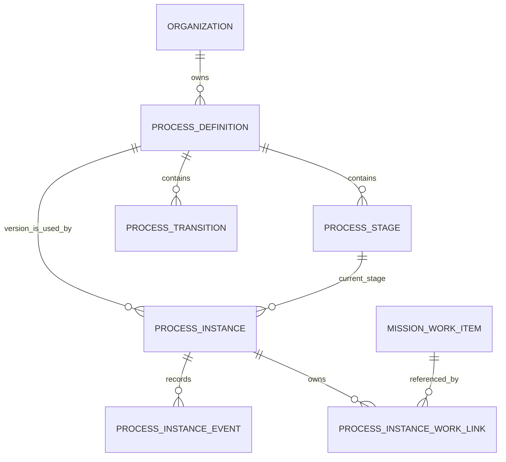
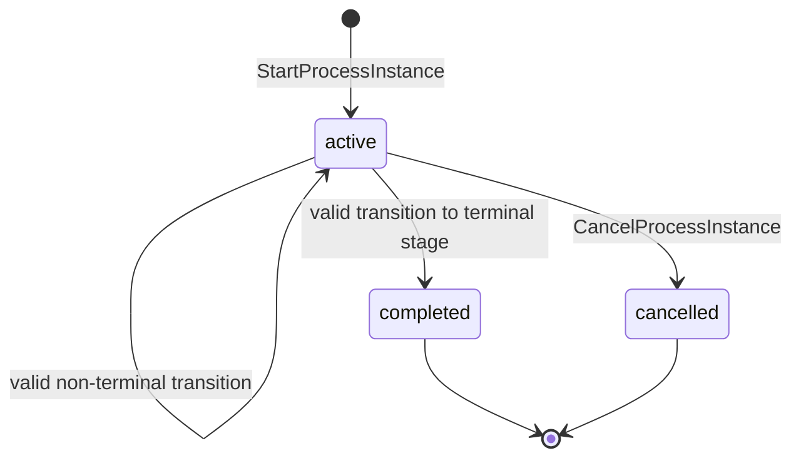
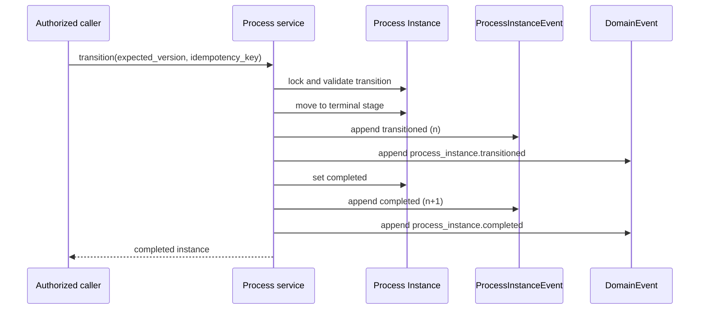

# Yarvis Process Runtime Design

**Status:** Draft for Ratification
**Work package:** WS-006B — Process Runtime Design
**Baseline:** `63740d8` / `ws006a-process-domain-complete`
**Authority:** Derived from the Constitution, Application Architecture, Interaction Contract Catalog, and the implemented WS-006A Process Domain Foundation.

## Purpose

Define the implementation-neutral runtime model through which an Organization uses one immutable, published Process Definition version to govern the lifecycle of a Process Instance. This design does not implement runtime behavior or amend the existing Process Definition model.

## Decisions at a Glance

- `ProcessInstance` is a distinct, Process-owned aggregate; a Process Definition remains a versioned template.
- An instance belongs to one Organization and references one published definition version for its complete history.
- A definition retired after an instance starts prevents new instances but never invalidates an existing instance.
- Lifecycle values are `active`, `completed`, and `cancelled`; `completed` and `cancelled` are final.
- A valid transition into a terminal stage records `process_instance.transitioned` and then `process_instance.completed` as consecutive events in one transaction.
- Work and Process retain independent lifecycles. Neither lifecycle silently changes the other.
- WS-006D will initially permit one active `ProcessInstance` to `MissionWorkItem` association on each side while preserving historical associations.

## Domain Model and Ownership

`ProcessDefinition`, `ProcessStage`, and `ProcessTransition` remain the WS-006A template graph. Only a published definition may start an instance. A new version is a separate template; an existing instance never migrates to it.

`ProcessInstance` is canonical runtime state owned by the Process context. It owns its lifecycle, current stage, version, start idempotency identity, and Process-local event history. It does not own Mission Work status, assignment, priority, or Timeline state.

`ProcessInstanceEvent` is immutable evidence of a Process Instance lifecycle operation. It is the Process-local Timeline source and has a consecutive sequence per instance.

`ProcessInstanceWorkLink`, introduced only in WS-006D, is Process-owned association state. It references a Work Item through its stable identifier without making Mission Work persistence an internal Process repository.

## Invariants

1. Each Process Instance has one immutable `organization_id`.
2. An instance can start only from a published Process Definition in its Organization.
3. A retired definition cannot start a new instance; it does not invalidate, complete, cancel, or otherwise alter an existing instance.
4. An instance records one immutable definition ID and version for all history.
5. Starting selects the definition's sole `start` stage.
6. An active instance has one current stage in its own definition version.
7. A transition is valid only when its source equals the current stage and its target belongs to the same definition and Organization.
8. A non-terminal target preserves lifecycle `active`.
9. A terminal target completes the instance atomically.
10. Completed and cancelled instances are final; no further transition, completion, cancellation, or restart is valid. A completed instance cannot be cancelled.
11. Every successful lifecycle mutation records Process Instance state, a Process Instance Event, and a Domain Event in one Process Unit of Work.
12. Process Instance Events are append-only and sequence numbers are positive, unique, and consecutive per instance.
13. Mission Work may have no Process association. A Process Instance may initially have no Work association.
14. A Process-to-Work link never grants Process authority to mutate Work lifecycle state or grants Work authority to mutate Process lifecycle state.

## Lifecycle and Transition Semantics

There is no arbitrary completion operation. Completion is the governed result of a valid transition to a terminal stage. Cancellation is explicit, accountable, and valid only while the instance is active.

## Conceptual API and Interaction Contracts

New contracts append after the existing Process contract sequence; they do not renumber WS-006A contracts.

| Contract | Type | Purpose | Required authority |
| --- | --- | --- | --- |
| `IC-PROCESS-CMD-011` | Command | StartProcessInstance | `process.instance.start` |
| `IC-PROCESS-CMD-012` | Command | TransitionProcessInstance | `process.instance.transition` |
| `IC-PROCESS-CMD-013` | Command | CancelProcessInstance | `process.instance.cancel` |
| `IC-PROCESS-QRY-003` | Query | ListProcessInstances | `process.instance.read` |
| `IC-PROCESS-QRY-004` | Query | RetrieveProcessInstance | `process.instance.read` |
| `IC-PROCESS-QRY-005` | Query | RetrieveProcessInstanceTimeline | `process.instance.read` |
| `IC-PROCESS-EVT-005` | Event | ProcessInstanceStarted | Process context |
| `IC-PROCESS-EVT-006` | Event | ProcessInstanceTransitioned | Process context |
| `IC-PROCESS-EVT-007` | Event | ProcessInstanceCompleted | Process context |
| `IC-PROCESS-EVT-008` | Event | ProcessInstanceCancelled | Process context |

Conceptual endpoints are `POST /process-instances`, `GET /process-instances`, `GET /process-instances/{id}`, `POST /process-instances/{id}/transitions`, `POST /process-instances/{id}/cancel`, and `GET /process-instances/{id}/timeline`.

Start requires `process_definition_id` and an idempotency key. Transition requires `transition_id`, `expected_version`, and an idempotency key. Cancellation requires `expected_version`, an idempotency key, and an accountable cancellation reason.

## Event and Timeline Model

Every Process lifecycle mutation creates both aggregate-local evidence and a cross-context source assertion:

| Event | Aggregate-local record | DomainEvent source assertion |
| --- | --- | --- |
| Start | `process_instance.started` | `process_instance.started` |
| Non-terminal transition | `process_instance.transitioned` | `process_instance.transitioned` |
| Terminal transition | `process_instance.transitioned`, then `process_instance.completed` | same two assertions in the same order |
| Cancel | `process_instance.cancelled` | `process_instance.cancelled` |

The terminal transition produces two Process Instance Events with consecutive sequence numbers: transition first, completion second. Each payload preserves identifiers, previous and resulting stage/lifecycle, actor, correlation, causation, aggregate version, and the transition identity where applicable.

The Process Timeline reads `ProcessInstanceEvent` in `sequence_number ASC` order. `DomainEvent` remains the source for foreign projections; it is not a substitute for the local ordered Timeline.

## Idempotency, Concurrency, and Transactions

Start idempotency is tenant-scoped through a unique start key and request fingerprint on `ProcessInstance`. A same-key, same-fingerprint retry returns the original instance; a same-key, different-fingerprint request is a governed conflict.

Transition and cancellation idempotency are stored with Process Instance Events, uniquely scoped to Organization, Process Instance, and idempotency key. Replays return the original result only when the command fingerprint matches.

The Process service locks the instance, verifies `expected_version`, validates lifecycle and graph rules, increments the aggregate version once, and appends the corresponding events within one Unit of Work. A stale version, invalid lifecycle, invalid graph edge, or conflicting idempotency replay returns `409 CONFLICT`. Missing idempotency is `412 PRECONDITION_FAILED`; malformed input is `400 VALIDATION_FAILED`; cross-tenant and nonexistent resources are concealed by `404 RESOURCE_NOT_FOUND`; insufficient authority is `403 AUTHORIZATION_DENIED`.

## Authorization and Tenant Isolation

The target Process application boundary verifies a trusted principal and the target authority scope. The Process aggregate verifies the principal Organization against every definition, instance, stage, transition, event, and Work link. No cross-organization identifier is revealed through reads, mutations, errors, or projections.

## Migration Strategy

WS-006C requires one new linear migration after the WS-006A head:

1. Create `process_instances` with Organization, immutable definition/version reference, current stage, lifecycle, timestamps, version, and start idempotency fields.
2. Add composite tenant/definition/stage integrity constraints and lifecycle/version checks.
3. Create `process_instance_events` with per-instance sequence uniqueness and command idempotency uniqueness.
4. Add a database-level update/delete guard for Process Instance Events, following `MissionWorkEvent`.
5. Add list and tenant/lifecycle indexes.

WS-006D receives a separate migration for `process_instance_work_links` and the Mission Work-side source-event idempotency needed for Timeline projection. It does not amend the WS-006C migration.

## Test Plan

- Published-definition start, retired/draft rejection, and version immutability.
- Exactly one start stage and valid same-definition transition enforcement.
- Multiple historical instances against one definition version.
- Active, completed, and cancelled lifecycle behavior; completed cannot cancel.
- Terminal transition produces ordered `transitioned` then `completed` evidence.
- Idempotent start/transition/cancel replay, conflicting fingerprints, and concurrent requests.
- Tenant concealment, target authority enforcement, and no cross-tenant event access.
- Atomic rollback when instance, event, or Domain Event persistence fails.
- Database append-only enforcement and ordered Timeline reads.
- WS-006D link cardinality, history retention, Work independence, and idempotent projection into the Work Timeline.

## WS-006C and WS-006D Scope

### WS-006C — Process Runtime Backend

Implements Process Instance state, local Timeline, contracts, authorization, idempotency, concurrency, migration, and tests. It does not associate instances to Mission Work, introduce a frontend, or add automation, SLA, BPMN, scheduling, or external connectors.

### WS-006D — Process and Mission Work Association

Introduces the Process-owned immutable association. Initially there may be only one active association per Process Instance and one active association per Mission Work Item. Historical links remain preserved rather than being overwritten or deleted. WS-006D also introduces the source-event to Mission Work Timeline projection, with durable projection idempotency. Work and Process lifecycles remain independent.

## Related Decisions

- [ADR — Process Instance Ownership](adr/ADR-PROCESS-INSTANCE-OWNERSHIP.md)
- [ADR — Process Event Model](adr/ADR-PROCESS-EVENT-MODEL.md)
- [ADR — Process and Work Lifecycle Independence](adr/ADR-PROCESS-WORK-LIFECYCLE.md)
