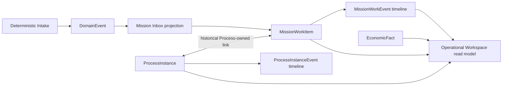
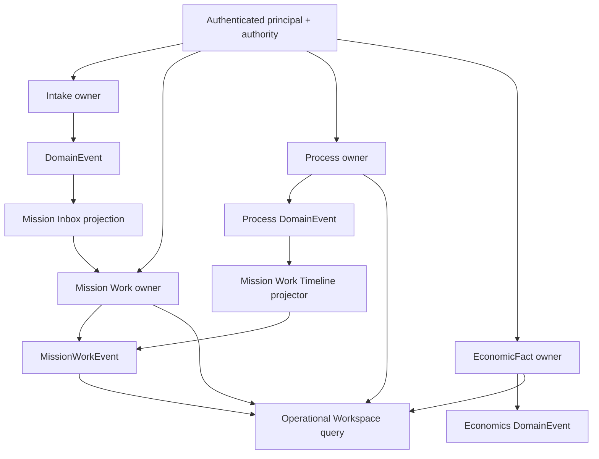

# Yarvis Architecture Checkpoint 002

**Checkpoint:** AC-002  
**Baseline:** `9751d45` / `ws006f-operational-workspace-ui-complete`  
**Status:** Evidence-based implementation checkpoint; no new architecture is ratified here.

## Purpose and Authority

AC-002 records the implemented Core architecture after WS-006A, WS-006C,
WS-006D, OV-001, OV-002, WS-006E, and WS-006F. It is subordinate to the
Constitution, ratified architecture, Interaction Contract Catalog, and applicable
ADRs. When it differs from an earlier checkpoint, this document describes the
newer repository evidence; it does not silently amend higher authority.

AC-001 remains historical evidence for its `63740d8` baseline. Its statements that
Process Runtime, Process/Work association, Operational Economics, and the
Operational Workspace are planned are superseded for current-state navigation by
this checkpoint.

## Executive State

Yarvis is a modular-monolith operational platform with a FastAPI backend, React/Vite
frontend, PostgreSQL persistence, tenant-scoped authority enforcement, and linear
Alembic migrations. The implemented Core path is now:



`MissionWorkItem` is the implemented operator-facing aggregate for an operational
matter. It owns its status, priority, assignment, commentable Timeline, and stable
source identity. It is not the owner of Process lifecycle, Process event history, or
economic facts.

## Core Bounded Contexts and Ownership

| Context | Canonical owner | Implemented responsibility | It does not own |
| --- | --- | --- | --- |
| Identity and Governance | Identity/Governance | Organization boundary, principal and authority basis. | Foreign lifecycle or economic truth. |
| Intake and Operational Context | Intake | Deterministic inbound intake and immutable operational association. | Mission Work lifecycle. |
| Mission Inbox | Mission Control projection | Rebuildable operator projection from source events. | Transactional source truth. |
| Mission Work | Mission Control | Work Item lifecycle, assignment, priority, source identity, Work Timeline. | Process lifecycle or EconomicFact. |
| Process | Process | Versioned definitions, Process Instances, graph transitions, Process events, historical Work links. | Mission Work status/assignment/priority. |
| Operational Economics | Operational Economics | Append-only EconomicFacts, corrections, direct summaries. | Accounting/ERP truth or subject lifecycle. |
| Operational Workspace | Mission Control read composition | Tenant-safe composition of existing owner read models. | Persistence, commands, or a new aggregate. |

Every implemented owner is Organization-scoped. Cross-organization reads of
Mission Work, Process, and Economics resources use concealed absence (`404`) rather
than exposing another tenant's resource.

## Dependency and Event Map



Source aggregate mutations, their owner event records, and their `DomainEvent`
assertions commit in the same local Unit of Work. The Process-to-Work Timeline path
is explicitly projection-based:

```text
Process DomainEvent
  -> ProcessMissionWorkTimelineProjector
  -> idempotent MissionWorkEvent
  -> Operational Workspace Timeline
```

Process Runtime does not write Mission Work Timeline rows directly. A Process/Work
link does not imply an economic roll-up.

## Aggregate Boundaries and Invariants

### Mission Work

- A Work Item can exist without a Process Instance.
- Stable source identity is `(organization_id, source_type, source_id)`; an Inbox
  rebuild cannot create another Work Item for the same source identity.
- `MissionWorkEvent` is append-only, sequence ordered per Work Item, and provides
  attributable operational evidence.
- Process association is historical. A Work Item can have zero or many active or
  historical Process Instances.

### Process Runtime

- `ProcessDefinition` is a versioned template. Published versions are immutable;
  retirement blocks new starts but preserves running/history-bearing instances.
- `ProcessInstance` owns `active`, `completed`, and `cancelled` lifecycle state and
  references its published definition version permanently.
- Valid graph transitions are serialized by expected version plus row locking.
  A terminal transition writes `process_instance.transitioned` and then
  `process_instance.completed` consecutively.
- Completed and cancelled instances are final. Work and Process lifecycles remain
  independent; no automatic status, assignment, completion, or cancellation sync
  exists.
- `ProcessInstanceWorkLink` is Process-owned, historical, and tenant-scoped. One
  Process Instance has at most one active primary link; a Work Item has no
  one-active-process limit.

### Operational Economics

- `EconomicFact` is append-only and database-protected against update/delete.
  A correction writes a new superseding fact with a reason; it never changes prior
  evidence.
- Facts support Project, Mission Work Item, Process Instance, and future
  Task-compatible subject references, after same-Organization validation.
- Summaries are deterministic and direct-subject only. They are currency-specific,
  expose included fact IDs, exclude superseded facts, and do not perform FX or
  cross-subject roll-ups.
- Revenue, cost, labor cost, cash, and forecast remain separate operational facts;
  this is not accounting, an ERP, payroll, invoices, taxes, or a ledger.

## Read Model Strategy

The Operational Workspace is a read-only composition exposed by
`IC-MISSION-QRY-007` at:

```text
GET /mission/work-items/{id}/workspace?currency=MXN
```

It returns Work identity/state/priority/assignee/participants; related Process
Instances with lifecycle, definition/version, current stage, last transition and
links; the unified Work Timeline; and direct summaries for the Work and each Process
Instance. It uses bounded queries and batched economics retrieval rather than a
per-process query pattern. It stores no duplicate aggregate or economic projection.

The WS-006F UI is a consumer of that read model. It formats supplied values only; it
does not calculate roll-ups, margins, currency conversions, or lifecycle state.

## Implemented Interaction Surface

| Area | Commands / Queries / Events |
| --- | --- |
| Mission Work | `IC-MISSION-CMD-002` through `006`; `IC-MISSION-QRY-004` through `007`; `IC-MISSION-EVT-002` through `007`. |
| Process definition/runtime/link | `IC-PROCESS-CMD-001` through `015`; `IC-PROCESS-QRY-001` through `008`; `IC-PROCESS-EVT-001` through `010`. |
| Operational Economics | `IC-ECONOMICS-CMD-001` and `002`; `IC-ECONOMICS-QRY-001` and `002`; `IC-ECONOMICS-EVT-001` and `002`. |

All write interactions remain owner-governed, authority-checked, tenant-scoped, and
idempotent where their command contract requires it.

## Extension Points, Not Implemented Capability

| Extension | Preserved boundary | Current status |
| --- | --- | --- |
| Tasks | A future Task aggregate may be an Economics subject; it needs its own lifecycle, contracts, and owner. | Not implemented. |
| Checklists | Existing checklist artifacts are not a Mission Work child aggregate. A governed Work association needs a separate design. | Not implemented for this Core path. |
| Waiting | No waiting/snoozed lifecycle is inferred from Process stages or Work status. | Not implemented. |
| SLA | No deadlines, breach policy, timer, scheduler, or automatic escalation exists. | Not implemented. |
| Documents | Documents/evidence stay owned by their existing sources; the Workspace does not persist or attach documents. | Not integrated into this workspace. |
| AI | AI may not mutate Work, Process, Economics, or Timeline without a later governed contract and authority. | Not implemented. |

## Deprecated or Superseded Navigation Concepts

| Earlier concept | Current replacement or clarification |
| --- | --- |
| Process Runtime described as planned after WS-006A. | Implemented by WS-006C; current-state navigation uses this checkpoint. |
| Process Definition described as disconnected from runtime. | Definitions remain templates, but published versions now govern Process Instances. |
| One active Process-to-Work association on each side. | Only the Process Instance primary-link limit remains; Mission Work can have many active instances. |
| Operational Economics events/contracts described as proposed only. | Fact and correction contracts/events are implemented by OV-002; roll-up membership and metric snapshots remain deferred. |
| Operational Workspace described as a future read surface. | Implemented by WS-006E and consumed by WS-006F; it remains read-only composition. |
| Implicit economics from a Process/Work link. | Explicitly rejected: association never creates roll-up membership or value transfer. |

## Explicit Non-Goals

AC-002 does not introduce or authorize automatic lifecycle synchronization, process
automation, schedulers, workers, SLA timers, Waiting, Tasks, Checklist ownership,
document attachment behavior, economic roll-ups, FX, accounting/ERP functions,
notifications, AI actions, BPMN, external events, or a new API.

## Approved Future Roadmap Boundaries

The following are documented follow-on boundaries, not permission to implement them
without a scoped work package and review:

1. Complete Operational Economics deferred work only through explicit roll-up,
   snapshot, and FX/adapter decisions; do not infer it from current associations.
2. Design Task, Waiting, Checklist, SLA, and Document associations as separately
   owned capabilities before adding fields or workspace sections.
3. Add operator-facing Process administration and richer Mission Work views only as
   consumers of existing owner contracts.
4. Establish production authority, event-dispatch handlers, worker/scheduler runtime,
   and conformance evidence before automation consumes core events.
5. Introduce AI only as a governed, attributable consumer/proposer after those
   authority and evidence boundaries exist.

## Consistency Findings

- The live development state/sprint documents were stale at WS-006D despite the
  committed WS-006E/WS-006F baseline. AC-002 updates them as repository context,
  not as architectural authority.
- AC-001 and its companion views are historical baseline evidence. The live As-Is,
  Target, and Roadmap views are updated to reference AC-002.
- The Operational Economics ADR/event documentation is updated to distinguish
  implemented fact/correction behavior from still-deferred roll-up membership and
  metric-snapshot behavior.

## Closing Statement

The current Core is an operational composition, not a monolith of merged domains:
Mission Work coordinates operator attention, Process governs procedure, Economics
records economic assertions, and the Operational Workspace makes their existing
evidence readable without taking their authority.
