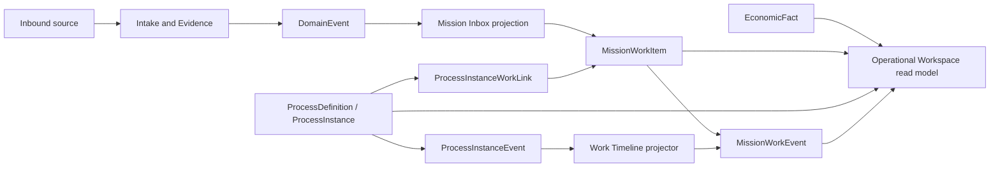
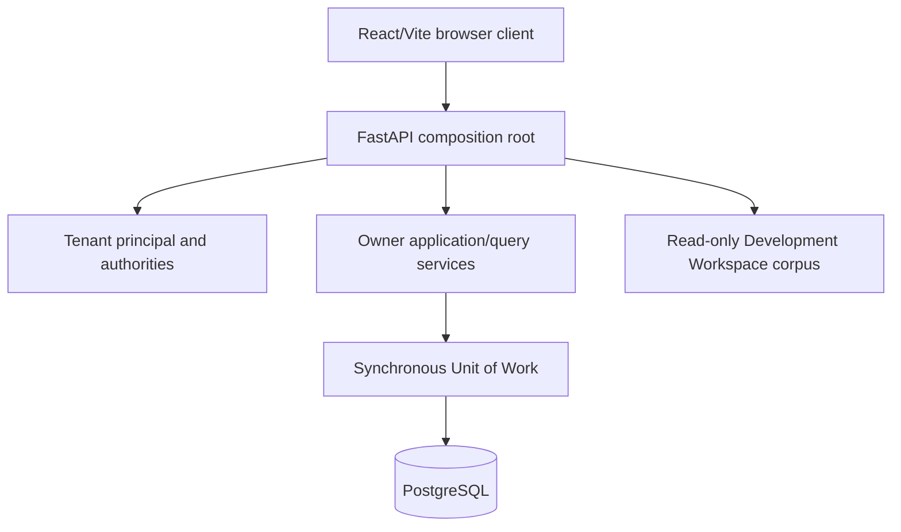
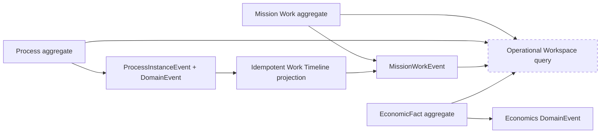

# Yarvis As-Is Architecture

**Baseline:** `9751d45` / `ws006f-operational-workspace-ui-complete`
**Status:** Repository-evidence view; governed by [AC-002](YARVIS_ARCHITECTURE_CHECKPOINT_002.md).

## Context

## Deployment and Composition

The browser's Mission Work UI has a separate Operational Workspace route. The latter
is a consumer of an existing read API, not the Development Workspace corpus surface.

## Transactional Ownership and Read Models

`MissionInboxItem` and the Operational Workspace are projections/read compositions.
They are not sources of transactional truth. Mission Work, Process, and Economics
remain independent owners and commit their own assertions locally.

## Implemented Boundaries

- **Mission Work:** operator lifecycle, assignment, priority, stable source identity,
  append-only operational Timeline.
- **Process:** versioned definitions, Process Instances, graph transitions, Process
  lifecycle evidence, and historical Work links.
- **Operational Economics:** append-only facts, correction lineage, provenance,
  direct-subject summaries, currency separation, and no implicit roll-up.
- **Operational Workspace:** bounded tenant-safe query composition for one Work Item.

## Deferred Boundaries

Tasks, Work-owned Checklist associations, Waiting, SLA, Documents in the workspace,
automatic lifecycle coordination, EconomicRollupMembership, metric snapshots, FX,
automation, schedulers, and AI are not implemented in this architecture view.
