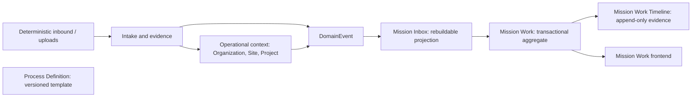
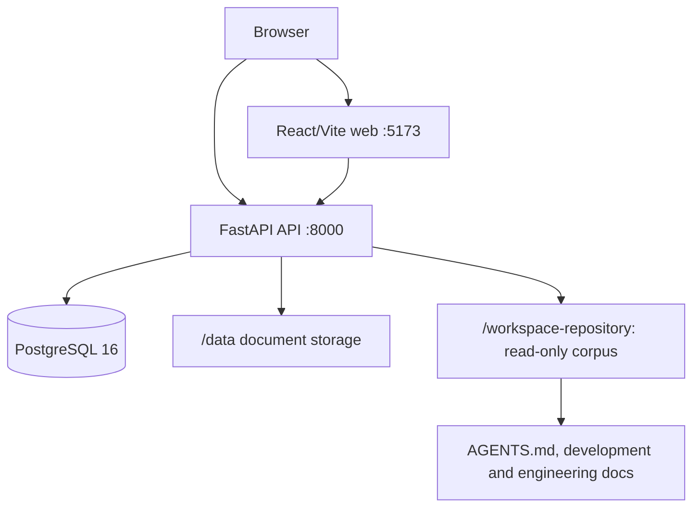
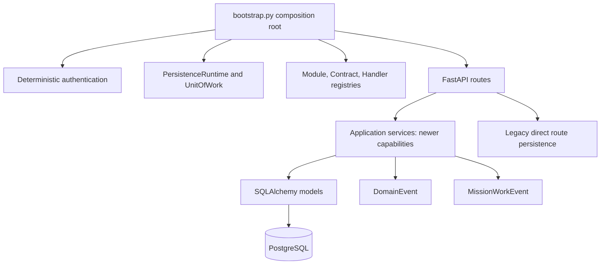
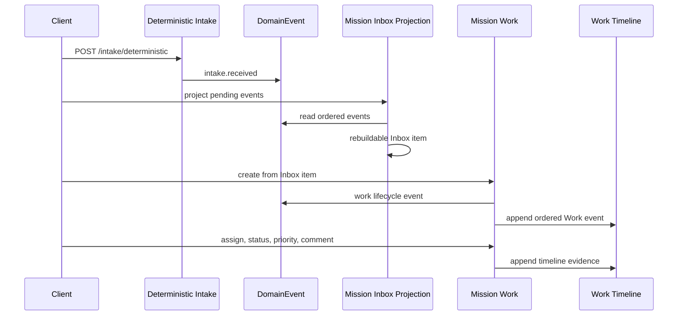
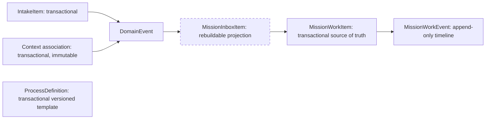

# Yarvis As-Is Architecture

**Baseline:** `63740d8` / `ws006a-process-domain-complete`
**Status:** Repository-evidence view; not a replacement for ratified architecture.

## Context

`ProcessDefinition` is intentionally disconnected from runtime work: no Process Instance exists at this baseline.

## Deployment

## Components

## End-to-End Operational Flow

## Transactional Ownership versus Projections

## Current Boundary Notes

- Workspace routes require `x-yarvis-workspace-token` and expose only an allowlisted corpus mounted read-only in Docker.
- Mission Work reads and writes require distinct authority scopes and conceal cross-organization resources as `404`.
- Process Definition reads require `process.definition.read`; lifecycle and draft changes require `process.definition.manage`.
- The generic `DomainEvent` stream supports projections but lacks a database append-only trigger.
