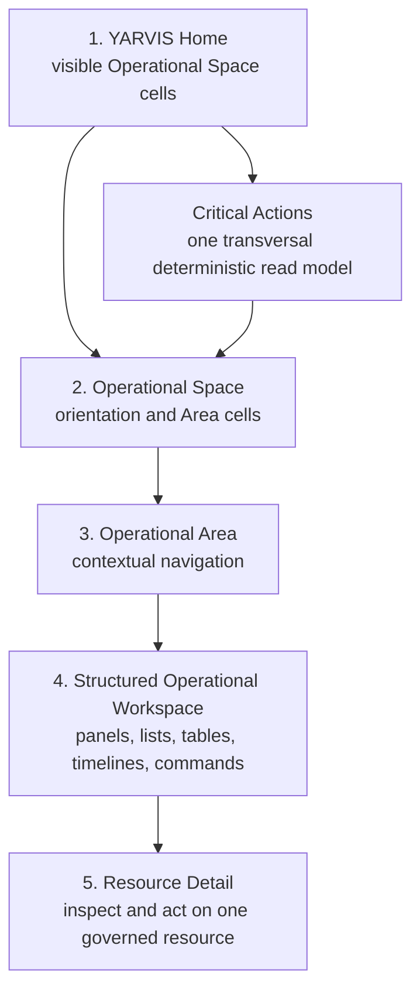

# YARVIS Experience Architecture

**Status:** Product-experience architecture; proposal, not ratified implementation authority.
**Work package:** UX-001.
**Scope:** Experience hierarchy, visual language, navigation, accessibility, and future read-model boundaries. This document creates no route, model, API, storage, animation, component, or runtime behavior.

## 1. Executive Vision

**Product vision.** YARVIS should feel like a living operational organism: users first perceive the state of their operational universes, then enter progressively more precise, governed work surfaces. It is not a conventional ERP, CRM, task manager, or dashboard.

**Experience principle.** The experience lowers cognitive effort while preserving operational truth, uncertainty, provenance, and human authority. Visual awareness may direct attention; it never decides, executes, or redefines canonical state.

## 2. Experience Philosophy

**Architectural invariant.** The YARVIS Reality Graph and owner contexts remain source truth. Experience layers are non-authoritative projections over governed read models.

**Experience principle.** Spatial awareness precedes detailed reading; structured precision follows spatial awareness. The experience should suggest living operations, awareness, changing state, attention, growth, and stability—not illness, contamination, randomness, a game, or uncontrolled animation.

## 3. Experience Hierarchy



| Level | Purpose | Visual mode | Boundary |
| --- | --- | --- | --- |
| YARVIS Home | Cross-space awareness and entry. | Spatial field of labelled Operational Space cells. | No Space is inferred from visual prominence. |
| Operational Space | Orient within one operating universe. | Space identity, summary, Area cells, local attention. | Not automatically an Organization, tenant, vertical, module, project, or bounded context. |
| Operational Area | User-recognizable functional navigation and context. | Compact Area cells/chips and local state. | Not a persisted generic Bubble entity or automatic bounded context. |
| Structured Operational Workspace | Precision and productivity. | Panels, lists, tables, timelines, filters, forms, commands. | Bubble metaphor stops here. |
| Resource Detail | Inspect/action one Task, Process, Work Item, Project, Document, Position, Order, or future resource. | Conventional detail view. | No bubble metaphor is required. |

## 4. YARVIS Home

**Product vision.** Home is an operational map, not a menu grid. It answers: which visible Spaces exist; which require attention; where activity is concentrated; what changed recently; and where the user should enter first.

Primary cells represent only **Operational Spaces** such as Energía Fotónica, NetPay, Trading / Finance, future Accounting, or future CTO Office. A central YARVIS presence may summarize transversal conditions. It must not claim authority, conceal uncertainty, or become a generic chat panel.

**Architectural recommendation.** Critical Actions may appear centrally, as a cell/chip, panel, filtered route, and eventually verbal briefing. Each form resolves to the same deterministic read model.

## 5. Operational Spaces

**Product vision.** An Operational Space is a provisional UX concept: a user-recognizable operating universe. It supplies orientation, permitted navigation, local activity, health/attention summaries, and optional economic context.

**Deferred question.** Its eventual mapping to Organization, tenant, business unit, vertical, configured application/module, project, or another concept is unresolved and requires architecture approval.

**Architectural invariant.** No generic `OperationalSpace` domain aggregate, physical storage provider, or persisted visual layout is implied by UX-001.

## 6. Operational Areas

**Experience principle.** An Area groups a recognizable functional capability and exposes local Critical Actions/state. It is a contextual navigation layer, not an ownership assertion.

| Space | Proposed Area | Classification | Rationale |
| --- | --- | --- |
| Energía Fotónica | Commercial, Engineering, Procurement, CFE / Regulatory, O&M | Navigation grouping | User/role-facing groupings; none establishes a Core context solely by its name. |
| Energía Fotónica | Installation | Vertical capability | Future Energy-specific capability; owner/contract remains to be designed. |
| Energía Fotónica / NetPay | Documents | Read-model surface | Authorized Registry/intake/evidence references inside a Space. |
| Energía Fotónica / NetPay | Economics | Bounded context | Operational Economics owns facts/calculation; a Space view is not a roll-up owner. |
| NetPay | Merchant Operations | Bounded context | Existing Netpay Merchant Operations boundary. |
| NetPay | Recovery, Store Intelligence, Support | Read-model surface | Existing/proposed operational views, not automatic owner contexts. |
| Trading / Finance | Market Watch, Signals, Strategies, Orders, Positions, Performance | Vertical capability | Future vertical capabilities requiring separate ownership design. |
| Trading / Finance | Risk | Transversal projection | Deterministic attention/risk presentation; not an aggregate. |
| Any Space | Mission Work | Read-model surface | Mission Control-owned operational work projection. |
| Any Space | Operational Tasks | Bounded context | Operational Execution owns commitments; Area is an entry to its views. |
| Any Space | Process Instances | Bounded context | Process Runtime owns procedure instances. |
| Any Space | Projects / Sites | Vertical capability | Current operational-context references; semantics remain vertical-dependent. |
| Any Space | Timeline / Recent Activity | Read-model surface | Timeline projection, not source truth. |
| Any Space | Inbox / Intake | Read-model surface | Intake/Mission Inbox view; no frontend-owned queue. |
| Any Space | Critical Actions | Transversal projection | One deterministic model, scoped globally, per Space, or per Area. |

**Architectural recommendation.** Area labels/configuration remain a future approved read-model/configuration concern. They must not duplicate Task, Process, Economics, or Document truth.

## 7. Structured Operational Workspace

**MVP decision.** Structured Workspace begins immediately after Area navigation. It uses panels, lists, tables, timelines, filters, forms, commands, and resource navigation to present Mission Work, Tasks, Processes, Projects/Sites, Documents, Economics, Inbox/Intake, Timeline, and Critical Actions.

**Architectural invariant.** It consumes canonical backend read models. The frontend neither calculates hidden operational scores nor owns business state.

## 8. Resource Detail

**Experience principle.** Detail prioritizes explainability, provenance, available authority, current/historical state, and a focused governed action path. It must preserve normal URLs, back/forward behavior, and resource-safe unavailable/forbidden states.

## 9. Cellular Visual Language

**UX hypothesis.** Cells are suspended in a calm field with soft separation, bounded drift, gentle collision avoidance, restrained breathing, and smooth focus transitions. The field expresses awareness; it never becomes decorative chaos.

Cells use text labels, optional icons, explicit counters, border emphasis, and recent-change indicators. Position/motion can support—not replace—those signals. The field may have a central YARVIS presence, but no visual center is a claim of operational importance unless its rule is shown.

## 10. Motion as Information

| State | Informational behavior | Constraints |
| --- | --- | --- |
| Stable | Almost still; very slow optional breathing; minimal drift. | Remains discoverable. |
| Active | Slightly more movement; moderate optional breathing; recent-change indicator. | Change is also labelled/counted. |
| Needs attention | Modestly nearer the visual center; stronger border/marker; slightly greater breathing. | No color-only meaning. |
| Critical | Clear explicit attention state and counter. | No flashing, shaking, or continuous red pulse. |
| Dormant | Low movement and reduced emphasis. | Never hidden solely because dormant. |

**UX hypothesis.** Layout movement is bounded, collision-aware, and low amplitude. Hover/focus pauses or reduces autonomous movement and exposes the same semantic information. Click/tap enters the selected context; focus/selection transitions communicate depth without compromising standard navigation. Exact amplitudes and durations require prototype testing; UX-001 intentionally specifies no millisecond values.

**MVP decision.** CSS/SVG-level restrained transitions may be sufficient. Force simulation, physics libraries, or continuously autonomous motion require accessible prototype validation before adoption; no animation library is selected here.

## 11. Bubble Semantics

| Signal | Transparent mapping | Conservative MVP | Later experiment | Prohibited/risky |
| --- | --- | --- | --- | --- |
| Size | Bounded category derived from a displayed count only. | Fixed or tightly bounded discrete sizes. | Carefully tested active-work category. | Continuous size tied to hidden “energy.” |
| Distance from center | Named deterministic attention tier. | Do not rely on distance. | Modest proximity for critical attention. | Position as sole meaning. |
| Movement/breathing | Named stable/active/attention state. | Low/no autonomous movement; optional subtle breathing. | State-specific restrained motion. | Flashing, shaking, aggressive pulse. |
| Border | Attention/selection emphasis. | Visible text/badge accompanies it. | Stronger hierarchy after testing. | Color-only urgency. |
| Label/icon | Space/Area identity. | Text label mandatory; icon optional. | Theme metadata after approval. | Icon-only cell. |
| Counters/badges | Active work, Critical Actions, recent activity. | Explicit accessible counters. | Per-user changed-since-visit state. | Composite score. |
| Health | Named deterministic category and reasons. | Show only if source rules exist. | More nuanced explainable classifications. | Hidden health/operational-energy formula. |
| Economic relevance | Direct, explained factual context. | Deferred from sizing/Home priority. | Explicit direct context only. | Implied roll-up or profitability inference. |

## 12. Critical Actions

**Architectural invariant.** Critical Actions is one deterministic transversal read model, not a domain aggregate, business vertical, or AI score.

| Scope | Form | Criteria |
| --- | --- | --- |
| Global | Home central signal/cell/panel/route/briefing. | Aggregates only visible Spaces. |
| Per Space | Local cell, panel, and filtered route. | Same rules filtered by approved Space mapping. |
| Per Area | Local marker and structured list. | Same rules filtered by approved Area configuration. |

**Repository fact.** Current derivable sources are blocked Tasks, overdue Tasks, urgent/high-priority Tasks, and ready/in-progress unassigned Tasks. Stalled Processes, SLA breaches, missing documents, and economic risk are future capabilities. Every item needs source, reason code, detected time, deterministic severity, and destination/action; AI scoring is prohibited.

## 13. Navigation and Depth

**Architectural recommendation.** Conceptual routes are recommendations, not contracts:

```text
/                                  YARVIS Home
/spaces/:spaceId                   Operational Space
/spaces/:spaceId/areas/:areaId     Operational Area
/spaces/:spaceId/workspace         Structured Workspace
/spaces/:spaceId/work/:workItemId
/spaces/:spaceId/tasks/:taskId
/spaces/:spaceId/processes/:processInstanceId
/spaces/:spaceId/projects/:projectId
/spaces/:spaceId/documents/:documentId
```

Deep links, refresh, and browser back/forward restore context from the URL and canonical read models. Remembered last Space is later personalization, never a replacement for URL state. An unauthorized/deleted Space is concealed or forbidden according to backend policy and leaks no labels/counts. Contextless work remains visible in its permitted Space/Organization view with explicit absence of Site/Project. The visual zoom metaphor is additive; normal links and routes remain primary for keyboard, browser, and assistive technology navigation.

## 14. Accessibility

**Architectural invariant.** Every cell field has an equivalent structured, non-animated list/grid view.

- Semantic links/buttons, visible focus, deterministic focus after navigation, and a logical keyboard order are mandatory.
- Screen-reader labels expose Space/Area name, active-work count, Critical Action count, latest activity, and action/destination without requiring motion or position.
- Meaning is never color-, position-, movement-, icon-, or hover-only; labels/badges provide redundant text.
- Respect reduced-motion preference by stopping autonomous motion and using the structured presentation by default where appropriate.
- Cells use accessible hit targets and mobile touch spacing; focus/hover does not conceal information.

## 15. Responsive Behavior

| Form factor | Experience behavior |
| --- | --- |
| Desktop | Spatial field can show multiple Spaces; gentle bounded movement may be available; structured fallback is always available. |
| Tablet | Reduced movement, tighter bounded layout, persistent labels, easy switch to list. |
| Mobile | Stacked/orbit-list hybrid; no free-floating layout that impairs tapping; structured list is normally primary and cells remain identity/navigation elements. |

## 16. Future AI Experience

**Future direction.** YARVIS may become the operational interlocutor across Spaces: morning briefing, cross-space summaries, explainable recommendations, attention routing, contextual questions, and navigation assistance.

**Architectural invariant.** This is not a chatbot design and does not authorize a generic chat panel in the MVP. AI statements must be explainable, permission-aware, tenant-aware, linked to source evidence, and reversible/reviewable when proposing actions.

## 17. Architectural Boundaries

- Visual cells are not Core domain entities; motion/layout/position are never business state or source truth.
- Health and attention derive from governed read models with transparent rules.
- Operational Space mapping remains unresolved; Operational Area configuration is future approved metadata/read-model behavior.
- Structured Workspaces consume canonical backend read models and do not duplicate Task, Process, Economics, or Document truth.
- Documents are accessed inside a Space through authorized associations to Organization, Site, Project, Mission Work, Task, or Process Instance; a Space is not a separate physical storage provider by default.
- Later backend gaps: visible Space listing, Space metadata/configuration, Space visibility, Space-level Critical Actions/recent activity, Area configuration, navigation metadata, and optional theme/icon metadata. No gap is implemented by UX-001.

## 18. MVP Recommendation

**MVP decision.** Start with a shared shell and normal route foundation; Home with static/configured labelled Space cells if dynamic discovery is unavailable; a selected-Space page with Area cells; and a structured Workspace that consumes the existing overview API. Use labels, icons, explicit counters/badges, discrete bounded size, low/no autonomous motion, accessible list fallback, and complete loading/empty/error/forbidden/missing states.

Exclude dynamic Space model, global Critical Actions aggregation, document uploads, SLA, AI scoring/briefing, economic roll-ups, persistent layout, generic Bubble model, physics simulation, and advanced motion.

## 19. Proposed Workstreams

| Workstream | Objective / prerequisites | Non-goals / acceptance criteria | Approval needed |
| --- | --- | --- | --- |
| UX-001 | Experience architecture (this document). | No runtime changes; hierarchy/boundaries explicit. | Review of product vision and unresolved mappings. |
| UX-002 | Interactive visual prototype with static data. | No API/domain coupling; validates cell field, motion, accessibility, mobile fallback. | Prototype criteria and motion safety. |
| WS-008B | Shared frontend shell and route foundation. | No data-model changes; normal URL/navigation/accessible states. | Route naming/context strategy. |
| WS-008C | Home with configured Space cells. | No dynamic Space backend or persisted visual layout. | Initial Space labels/configuration. |
| WS-008D | Space page with Area cells. | No Area aggregate/automatic bounded contexts. | Area taxonomy per initial Space. |
| WS-008E | Structured Workspace consuming existing overview API. | No task/process writes, SLA, documents, or roll-ups. | MVP panel composition. |
| Later | Dynamic Space model, global actions, Registry UI, AI briefing, advanced motion, personalization. | Each needs an owned design/contract. | Separate architecture/product approval. |

## 20. Decisions Requiring Human Approval

1. Approve the five-level hierarchy and the rule that cells stop at Operational Area.
2. Approve initial Operational Spaces, their visible labels/icons, and initial Areas.
3. Resolve the Space-to-Organization/tenant/vertical/module/project mapping and visibility model.
4. Approve deterministic Critical Action rules and global/per-Space/per-Area eligibility.
5. Approve the conservative motion prototype criteria before autonomous/physics behavior.
6. Approve route/context naming and whether static configuration is acceptable for MVP.

## 21. Deferred Questions

- Which roles require which Area views and document visibility tiers?
- What counts as a stalled Process, and which owner defines that policy?
- How is per-user “changed since last visit” recorded without suppressing mandatory attention?
- Which future Trading/Finance resources and ownership boundaries are valid?
- What retention, jurisdiction, and external-sharing policies govern documents?

## Validation Record

**Repository fact.** UX-001 is a documentation-only proposal. Repository path references, local links, Mermaid fences, architecture consistency, and `git diff --check` require validation after creation. No file is staged or committed by this workstream.
