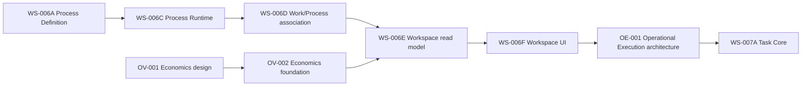

# Yarvis Roadmap and Technical Debt

**Baseline:** `9751d45` / `ws006f-operational-workspace-ui-complete`
**Status:** Evidence-based planning boundary; it does not authorize implementation.

## Implemented Sequence

## Approved Future Boundaries

1. **Foundation completion:** production authority, dispatch handlers, worker and
   scheduler runtime, and conformance evidence before autonomous consumers.
2. **Operational Economics deferred scope:** explicit roll-up membership, metric
   snapshots, then separately ratified FX/adapters if required. No implicit relation
   may substitute for those designs.
3. **Operational Execution:** OE-001 accepts the neutral Task context. WS-007A must
   allocate its accepted command contracts in the canonical catalog before public
   endpoint exposure, then implement the Task Core without expanding scope.
4. **Work extensions:** Waiting, Checklist association, SLA, and Documents each need
   a separately owned aggregate/reference design and contracts; they must not be
   smuggled into the initial Task lifecycle.
5. **Operator surfaces:** Process administration and future workspace sections may
   consume owner queries; they may not embed lifecycle or economics rules.
   [UX-001 Experience Architecture](YARVIS_EXPERIENCE_ARCHITECTURE.md) is a
   non-ratified product-experience proposal for the future Home → Space → Area →
   Structured Workspace hierarchy; it creates no implementation authorization.
6. **Automation and AI:** only after authority, evidence, event dispatch, and
   execution controls are operational.

## Technical Debt Register

| ID | Debt | Boundary | Priority |
| --- | --- | --- | --- |
| TD-001 | Generic `DomainEvent` remains append-only by convention rather than a database update/delete guard. | Event infrastructure | High |
| TD-002 | Process is not reconciled with `canonical_modules.py`. | Module governance | High |
| TD-003 | Legacy route-owned persistence coexists with service/Unit-of-Work ownership. | Application boundary conformance | High |
| TD-004 | Authentication is deterministic and restricted to local/test environments. | Production governance | High |
| TD-005 | Dispatcher has no registered handlers; worker/scheduler runtime is absent. | Foundation execution | High |
| TD-006 | The frontend contains governed Mission Work/Workspace and older simple API surfaces. | UI boundary consistency | Medium |
| TD-007 | Frontend production build can be blocked by an `EPERM` lock on generated `dist/assets`. | Local build environment | Medium |
| TD-008 | Development current-state/sprint documents required AC-002 reconciliation after WS-006E/F. | Development Operating System | Medium |

## Superseded Planning Statements

The earlier sequence that treated Process Runtime, Mission Work/Process association,
Operational Economics foundation, and Operational Workspace as planned is complete.
Those statements remain historical evidence only; AC-002 is the current navigation
point.
