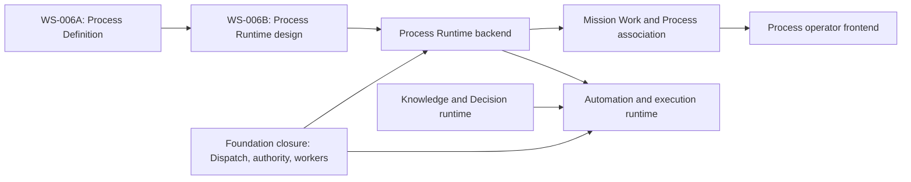

# Yarvis Roadmap and Technical Debt

**Baseline:** `63740d8` / `ws006a-process-domain-complete`
**Status:** Implementation-facing roadmap synthesis. It does not amend the ratified roadmap.

## Roadmap Dependencies

## Recommended Sequence

1. **WS-006B — Process Runtime design review.** Define Process Instance, ownership, transitions, immutable definition-version reference, authorization, idempotency, and event requirements.
2. **Process runtime backend.** Build only after the design is reviewed; keep instance state separate from templates and Mission Work.
3. **Foundation closure.** Materialize Dispatch handlers, production authority envelopes, query/event/notification pathways, worker/scheduler runtime, and conformance evidence.
4. **Mission Work / Process association.** Associate work with an instance and stage without making Inbox a source of truth.
5. **Process frontend.** Add administrative and operator visibility only after public Process Runtime contracts exist.
6. **Decision, execution, and automation workstreams.** Continue only when authority, event integrity, and worker foundations are complete.

## Technical Debt Register

| ID | Debt | Evidence | Priority | Boundary |
| --- | --- | --- | --- | --- |
| TD-001 | Generic DomainEvent lacks database append-only protection. | `models/domain_event.py`; no corresponding trigger migration. | High | Event infrastructure |
| TD-002 | Workspace corpus test has an obsolete sprint assertion. | `tests/test_workspace_api.py`. | Medium | WS-000 test maintenance |
| TD-003 | Process is not in canonical module composition. | `canonical_modules.py` vs Process service/contracts. | High | Module/contract governance |
| TD-004 | Route-owned persistence coexists with service/UoW ownership. | Legacy route modules versus newer services. | High | Application boundary conformance |
| TD-005 | Authentication is local/test deterministic only. | `api/authentication.py`. | High | Production governance |
| TD-006 | Dispatcher has no registered handlers. | `bootstrap.py` composes an empty handler iterable. | High | Foundation execution |
| TD-007 | Worker and scheduler have settings but no runtime process. | `config.py`, `docker-compose.yml`. | High | Async/projection operation |
| TD-008 | Frontend has mixed governed and legacy API surfaces. | `App.tsx`, Mission Work client, legacy helper calls. | Medium | UI boundary consistency |
| TD-009 | Operational state documents lag implementation. | Current-state documents before AC-001B. | Medium | Development Operating System |

## Status Vocabulary

- **Implemented:** executable and present in code, migrations, and tests.
- **Partial:** executable fragments exist, but the end-to-end governed capability is incomplete.
- **Foundation:** reusable technical base exists without its complete runtime execution path.
- **Planned:** described by roadmap or architecture but not implemented.
- **Exploratory:** candidate capability with no committed runtime scope.
