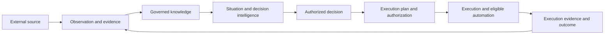
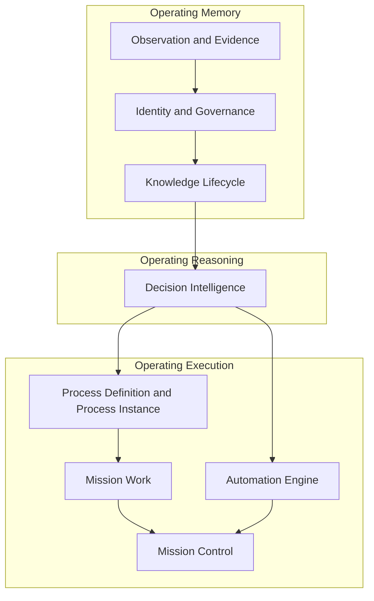

# Yarvis Target Architecture

**Status:** Derived target view from existing architecture and roadmap; no new authority is created here.

## Target Operating Loop

## Target Component Boundaries

## Process Target

The existing Process Definition aggregate is a versioned template. The target runtime must introduce a separate Process Instance aggregate that references one published definition version. It must not mutate published templates, convert a Mission Inbox projection into transactional truth, or make Mission Work the owner of process semantics.

## Non-Goals of this Target View

- It does not select workflow engines, queues, vendors, BPMN, deployment topology, or AI models.
- It does not authorize implementation of Process Runtime, Automation, or Knowledge runtime.
- It does not collapse NetPay, Energy Fotónica, or future domains into one domain model.
