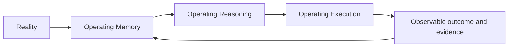
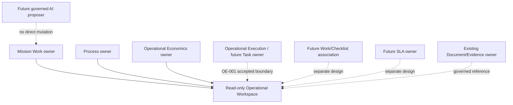

# Yarvis Target Architecture

**Status:** Bounded extension view; governed by [AC-002](YARVIS_ARCHITECTURE_CHECKPOINT_002.md). It introduces no approved runtime scope.

## Enduring Operating Loop

## Core Extension Model

The dotted lines are extension points only. They do not authorize entity fields,
routes, state machines, events, or UI sections.

Operational Execution now defines the accepted OE-001 Task boundary for that dotted line:
every Task belongs to one Mission Work Item, can optionally reference Process context,
and remains lifecycle-independent from both. It is not yet an implemented runtime.

## Target Constraints

- Future capabilities preserve singular ownership and explicit interaction contracts.
- A Process/Work link remains an association, not a lifecycle or economics rule.
- Economic roll-up requires explicit temporal membership and policy; UI nesting is
  never a calculation path.
- Scheduler/automation/AI can consume attributable evidence only through later
  authority and execution designs; none may silently mutate owner aggregates.
- Read models remain rebuildable/replaceable and never become alternative truth.

## Explicit Non-Goals

This view does not select a workflow engine, queue, scheduler technology, BPMN,
vendor, accounting system, AI model, or deployment topology. It does not create an
ERP, ledger, invoice/tax/payroll model, automatic Work completion, or automatic
Process cancellation.
