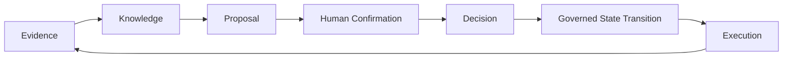
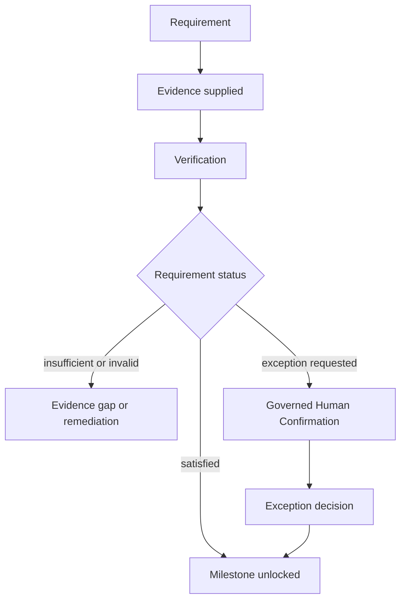
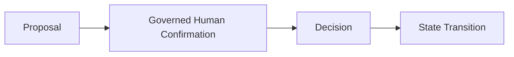
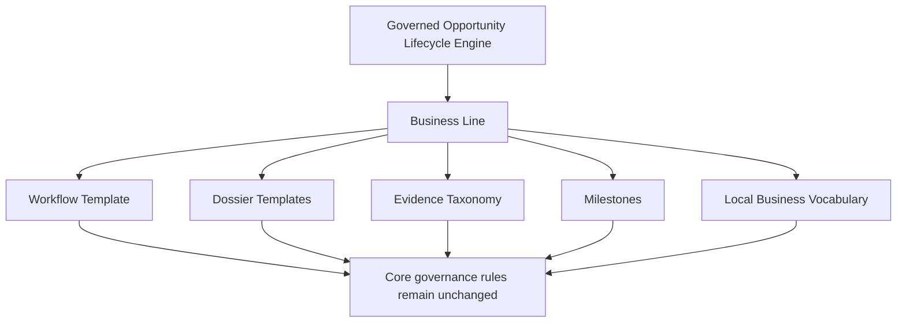

# BA-001B — Opportunity Lifecycle Operational Architecture

**Status:** Proposed business architecture; no implementation authority.  
**Companion:** [BA-001A](BA-001_OPPORTUNITY_LIFECYCLE_ENGINE_ARCHITECTURE.md).  
**Scope:** Operational business semantics for the Opportunity Lifecycle Engine.  
**Boundary:** This document defines neither software design nor any runtime, data, integration, or automation implementation.

## 1. Purpose

BA-001A establishes Yarvis as a governed Opportunity Lifecycle Engine. BA-001B explains the operating semantics of that engine: how an Opportunity moves through a business lifecycle, how evidence satisfies requirements, how milestones permit progression, and how Business Lines adapt a shared model without changing its core meaning.

The unit of progression is not a document, task, or project in isolation. It is an Opportunity moving through governed business work. Evidence can establish knowledge; knowledge can support a proposal; a proposal requires governed confirmation before an authoritative decision advances the lifecycle.

## 2. Opportunity Lifecycle Semantics

The lifecycle below is the common conceptual progression for a project-driven Business Line. It is not a mandatory sequence for every vertical. A Workflow Template selects applicable stages, gates, requirements, and milestones; it cannot convert a missing confirmation or unsatisfied requirement into an authorized transition.

| Stage | Purpose | Entry conditions | Evidence consumed | Knowledge produced | Proposals generated | Required human confirmation | Exit conditions |
| --- | --- | --- | --- | --- | --- | --- | --- |
| **Lead** | Capture a signal of possible value, need, risk, or demand. | A credible inbound, referral, observation, or business signal exists. | Initial contact, request, referral, or signal. | Initial relevance and qualification context. | Qualify, decline, or request discovery. | Confirmation to treat the lead as an Opportunity where that commitment matters. | The lead is declined, held, or established as an Opportunity. |
| **Opportunity** | Establish a governed unit of potential value and accountable attention. | A lead or recognized need warrants ownership and context. | Customer, site, need, and early commercial or operating evidence. | Opportunity framing, stakeholders, goals, constraints, and unknowns. | Assess, defer, decline, or pursue. | Confirmation of the chosen direction and accountable owner. | Assessment begins, the opportunity waits, is declined, or is closed. |
| **Technical Assessment** | Determine whether the need can be served and what conditions shape it. | An active Opportunity has a question requiring technical or operational assessment. | Site facts, source records, photographs, measurements, applicable constraints. | Feasibility, risks, assumptions, and assessment findings. | Request further evidence, perform a configuration study, or stop pursuit. | Confirmation that the assessment is sufficient for the next governed step. | Required assessment knowledge is accepted, exceptions are recorded, or the Opportunity stops. |
| **Configuration Study** | Form a viable configuration, scope, or service approach. | Assessment knowledge can support alternatives. | Assessment findings, customer needs, applicable requirements, estimates, and constraints. | Options, trade-offs, expected outcomes, and preliminary scope. | Recommend one or more configurations. | Confirmation of the option to take forward as a commercial or operating proposal. | A proposal is prepared, further study is requested, or the Opportunity is closed. |
| **Commercial Proposal** | Express a structured offer, commitment option, or commercial path. | A viable configuration and commercial assumptions exist. | Requirements, estimates, customer terms, supplier context, and supported knowledge. | Price, scope, assumptions, validity, risks, and commitments. | Submit, revise, negotiate, accept, reject, or withdraw a proposal. | Confirmation of the proposal and, when accepted, the commitment that creates a sale or equivalent authorization. | Proposal is accepted, rejected, expired, withdrawn, or returned for revision. |
| **Sale** | Record the authorized commercial commitment that permits delivery. | A proposal or equivalent commitment has been confirmed under the Business Line's rules. | Accepted proposal, contract, order, approval, or commitment evidence. | Authorized scope, obligations, commercial conditions, and handoff constraints. | Create a Project, activate a service, or record a non-delivery outcome. | Confirmation of the commitment and its transition to execution. | A Project or operation is authorized, or the opportunity closes with its commercial outcome. |
| **Project** | Organize a bounded body of authorized delivery work. | A sale or other execution decision defines accountable scope. | Authorized scope, requirements, commitments, resources, and delivery constraints. | Delivery plan, dependencies, ownership, and milestone expectations. | Start engineering, procure, schedule installation, or amend scope. | Confirmation of material scope, commitment, or exception changes. | Delivery stages begin, the project pauses, completes, or closes. |
| **Engineering** | Produce the technical definition needed to deliver safely and correctly. | The Project has sufficient scope and conditions for design work. | Project scope, site knowledge, requirements, and technical constraints. | Designs, specifications, calculations, and engineering decisions. | Release for procurement, revise design, or request exception approval. | Confirmation of the engineering output required to commit downstream work. | Engineering output satisfies its gated requirements or an exception is governed. |
| **Procurement** | Secure goods, services, or commitments needed for delivery. | Approved delivery needs and procurement constraints are known. | Specifications, supplier evidence, availability, quotations, and approvals. | Supplier selection, availability, cost, and delivery commitments. | Select supplier, approve purchase, substitute, or defer. | Confirmation for binding commitments, substitutions, or exceptions. | Required commitments are secured, a waiting state begins, or an exception is resolved. |
| **Installation** | Execute or coordinate the authorized physical or operational delivery. | Prerequisites, site readiness, resources, and required approvals are present. | Engineering output, delivery evidence, safety or quality requirements, and site access. | Completion status, deviations, test results, and handover readiness. | Complete, remediate, submit dossier evidence, or request a change. | Confirmation of material completion, accepted deviation, or handover. | Installation completes, pauses, requires remediation, or advances to dossier/submission. |
| **Regulatory Dossier** | Assemble evidence and requirements for a formal regulatory or external purpose. | A submission or compliance purpose is defined. | Required and optional evidence, attestations, engineering outputs, and prior decisions. | Dossier completeness, gaps, validity, and exception status. | Submit, request evidence, remediate, or seek an exception. | Confirmation that the dossier is ready for submission or that an exception is accepted. | Dossier is submitted, returned for completion, or not applicable. |
| **Submission** | Make a governed handoff to an external party or process. | The required dossier or external package is ready and authorized. | Approved dossier, submission evidence, and external recipient context. | Submission identity, acknowledged receipt, and follow-up obligations. | Submit, correct, withdraw, or wait for response. | Confirmation of submission where the act creates external obligation or representation. | External response, withdrawal, rejection, or a Waiting State follows. |
| **External Waiting States** | Preserve accountability while progress depends on another party or event. | A known external dependency prevents the next internal transition. | Submission receipts, requests, commitments, due dates, and communications. | Waiting reason, owner, expected response, and escalation criteria. | Follow up, escalate, amend, or resume work. | Confirmation to change the waiting reason, accept an exception, or resume a consequential path. | Required external response arrives, the condition expires, escalates, or the opportunity closes. |
| **Operation** | Sustain the delivered service, asset, relationship, or operating commitment. | Delivery or activation has been accepted for ongoing use or support. | Handover evidence, operating rules, service commitments, and measured outcomes. | Operating status, service history, performance, and renewal context. | Monitor, service, improve, renew, or create a new Opportunity. | Confirmation for material operational commitments, exceptions, or closure. | Operation continues, transfers, renews, or closes with preserved history. |
| **Monitoring** | Observe performance, commitments, risks, and emerging value after activation. | An Operation or continuing relationship has observable outcomes. | Measurements, service evidence, incidents, customer feedback, and external signals. | Performance assessment, risk, improvement opportunity, and renewal knowledge. | Remediate, renew, optimize, or create a new Opportunity. | Confirmation for a consequential intervention or new commitment. | A monitoring cycle records its outcome, feeds an action, or identifies a new Opportunity. |

## 3. Workflow Templates

A **Workflow Template** is the conceptual, reusable lifecycle pattern for a Business Line. It selects which lifecycle stages are relevant, names them in local business vocabulary, establishes their expected inputs and outputs, and identifies the requirements, milestones, waiting states, proposals, and confirmations that govern progression.

Workflow Templates enable vertical specialization without redefining the core engine. An energy business might use “site visit,” “interconnection dossier,” and “commissioning”; a payment-acquiring business might use “merchant qualification,” “underwriting package,” and “activation.” Both remain instances of governed opportunity progression rather than separate platform definitions.

Workflow governance means that a template identifies the business meaning of a transition and its evidence conditions. It does not imply that a stage is automatically entered, completed, or skipped. A template must preserve the core distinction between evidence, knowledge, proposal, confirmation, decision, and execution.

## 4. Dossier Templates

A **Dossier** is a purpose-specific collection of requirements, evidence, knowledge, attestations, and decisions. A **Dossier Template** defines, conceptually, what “ready” means for a recurring business purpose.

Each template distinguishes:

- **requirements** that must be satisfied or explicitly excepted;
- **required evidence** that ordinarily substantiates each requirement;
- **optional evidence** that increases confidence, context, or reviewability without being a prerequisite; and
- **completion semantics** that describe whether the dossier is incomplete, ready for confirmation, ready for submission, submitted, returned, or closed with an exception.

Readiness is not simple document count. A dossier is ready when its applicable requirements are satisfied by adequate evidence, verification status is understood, required exceptions are governed, and the intended purpose has the required confirmation. Energía Fotónica can validate this concept through a technical or regulatory dossier, but it does not define the universal dossier vocabulary.

## 5. Requirement Model

A **Requirement** states what must be true, evidenced, or consciously waived for a defined business purpose. It is not a file request in isolation. It connects an expected condition to the evidence and verification needed to support it.

A requirement may be satisfied by one artifact, a collection of artifacts, observed work, structured knowledge, or an authorized attestation. Verification establishes whether the supplied support is adequate for the stated purpose; it does not delete evidence that is inadequate, expired, or contradictory. When a requirement cannot be met, the business may remediate, defer, reject progression, or seek a governed exception. Those outcomes remain visible in the lifecycle.

## 6. Milestone Model

A **Milestone** is a governed business checkpoint, not merely a date or task completion. It represents a condition under which an Opportunity, Project, Dossier, or Operation may legitimately move to a new level of commitment, readiness, or accountability.

- **Internal milestones** depend principally on the organization's own evidence, verification, decision, and completion conditions. Examples include an approved configuration or a completed internal review.
- **External milestones** depend on an external party, event, or acknowledgement. Examples include customer acceptance, supplier commitment, regulator response, utility approval, or payment receipt.
- **Automatic milestones** may be recognized from evidence when an approved business policy explicitly permits it. Automatic recognition is not ungoverned automation: the policy defines its authority, evidence standard, exceptions, and review expectations.

Milestones unlock progression when their stated conditions are met. They do not erase prior uncertainty or override a required confirmation. A milestone can be blocked, achieved, superseded, or rendered irrelevant by an authorized lifecycle outcome while its history remains meaningful.

## 7. Waiting States

Waiting is a business state because dependency, responsibility, risk, expected timing, and appropriate next action change when progress depends on another party. Treating waiting as inactivity loses accountability and hides bottlenecks.

Common waiting states include:

- Waiting for customer;
- Waiting for supplier;
- Waiting for regulator;
- Waiting for utility; and
- Waiting for payment.

A waiting state identifies the external dependency, the expected response or event, the accountable internal owner, available evidence, relevant due date or review point, and escalation conditions. It does not imply that the organization has surrendered responsibility. It creates a governed pause: work may be limited, but observation, follow-up, escalation, and decision preparation can continue.

## 8. Human Confirmation Model

BA-001A established Governed Human Confirmation as the default boundary before authoritative state transitions. BA-001B applies that principle to lifecycle operations.

A Proposal is an explainable option, recommendation, or intended path. Confirmation is the accountable act by which an authorized person accepts, rejects, requests revision, or approves an exception. A Decision records that confirmed outcome and its rationale. Only then can a consequential state transition be treated as authoritative.

Delegation is possible only through an approved policy that identifies the delegated authority, conditions, permitted scope, evidence standard, exceptions, and review expectations. This is a business-governance concept, not an implementation mechanism. An automation policy does not turn every recommendation into a decision, and it never removes the need to preserve evidence and rationale.

## 9. Vertical Extension Model

A Business Line specializes the core engine through business meaning, not through a replacement lifecycle engine. It may define:

- a Workflow Template that selects and names lifecycle stages;
- Dossier Templates for recurring commercial, technical, regulatory, or operating purposes;
- an evidence taxonomy that identifies meaningful artifact categories;
- milestones that express its commitments and dependencies; and
- local business vocabulary for roles, services, outcomes, and decisions.

Vertical extension must not redefine Opportunity, artifact preservation, proposal non-authority, confirmation, decision accountability, or the distinction between internal work and external waiting. The core provides durable business semantics; the Business Line supplies context.

## 10. Governance Rules

The following conceptual invariants apply across Workflow Templates and Business Lines:

1. **Milestones cannot be skipped.** A lifecycle may advance only through its applicable milestone conditions, explicit non-applicability, or a governed exception.
2. **Requirements cannot be bypassed.** Unsatisfied requirements remain visible until satisfied, made non-applicable, or explicitly excepted by the appropriate authority.
3. **Authoritative transitions require confirmation.** A proposal or recommendation is never sufficient by itself, except where an approved automation policy provides narrowly delegated authority.
4. **Evidence never disappears.** Evidence may be superseded, invalidated for a purpose, expired, or contradicted, but it remains historically interpretable.
5. **Proposals are never authoritative.** A proposal expresses an option; it does not itself create a project, binding commitment, or lifecycle transition.
6. **Decisions are attributable.** A consequential outcome retains its authority, rationale, supporting knowledge, and resulting transition.
7. **Waiting is explicit.** External dependency states preserve ownership, reason, expected event, and escalation responsibility.
8. **Vertical specialization preserves the core.** Local vocabulary and templates cannot weaken evidence, confirmation, decision, or historical-preservation principles.

## 11. Scope Boundaries

BA-001B does not define APIs, data models, database schema, storage, OCR, AI models, connectors, routing, frontend behavior, infrastructure, workflow engines, policy engines, or automation mechanisms. It authorizes no implementation work. Such work requires a separately ratified architecture and explicitly authorized package under the Yarvis governance framework.

## 12. Assumptions and Questions for BA-001C

### Assumptions recorded

- Workflow Templates govern lifecycle meaning and conditions, while preserving the common core semantics.
- A milestone is a business checkpoint unlocked by requirements, evidence, verification, and any required confirmation.
- Waiting states are accountable business conditions rather than absence of work.
- Dossier readiness is purpose-specific and cannot be inferred from document quantity alone.
- Automatic milestones require a separately approved business policy and remain subject to evidence and review expectations.

### Open questions for BA-001C

1. Which common lifecycle statuses and exception outcomes should be universal across Business Lines?
2. What constitutes adequate verification for evidence types that are subjective, temporary, or externally issued?
3. How should competing or contradictory evidence affect dossier readiness and milestone unlocks?
4. What governance is required to amend a Workflow Template or Dossier Template while live Opportunities exist?
5. Which confirmation roles and delegation policies are appropriate for the first Business Line?
6. How should external waiting conditions define escalation, expiration, and re-entry criteria?
7. Which Business Line should provide the first detailed template review after Energía Fotónica?

## Conclusion

BA-001B defines the operational business architecture of the Opportunity Lifecycle Engine. Opportunities progress through evidence, knowledge, proposals, governed human confirmation, decisions, milestones, execution, and waiting states under Business Line-specific templates. The document clarifies the business semantics necessary for future review without prescribing implementation.
