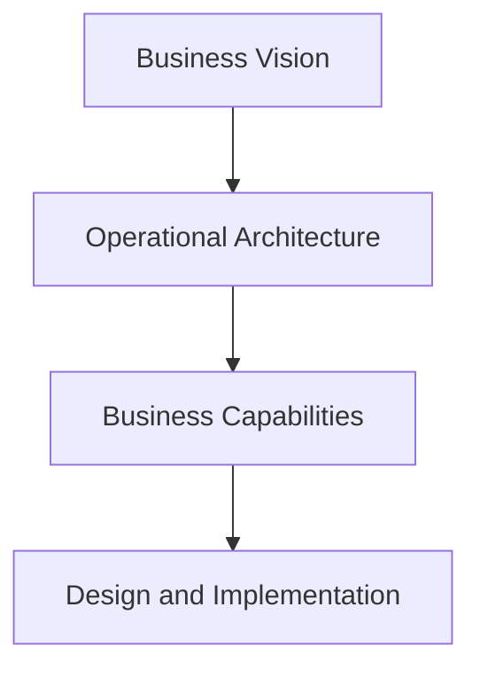
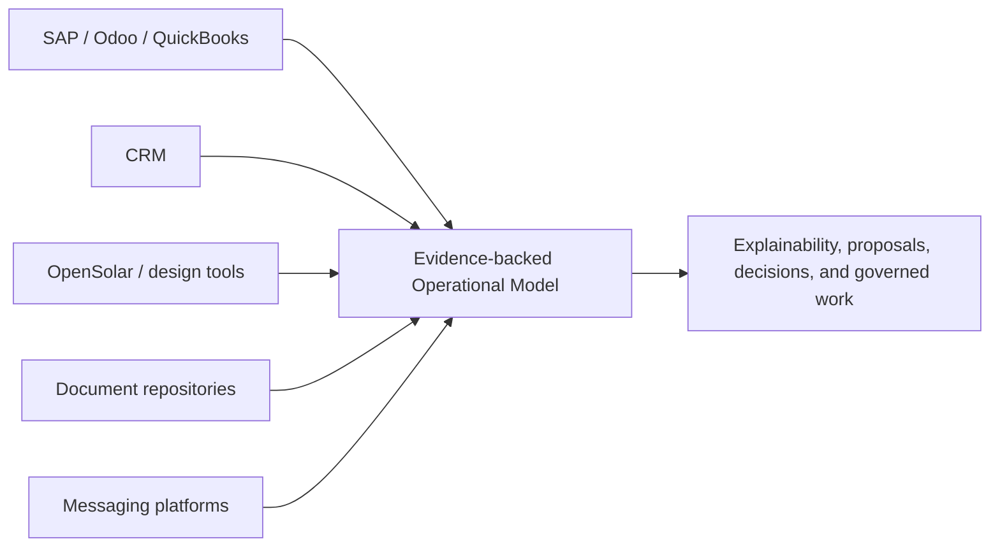
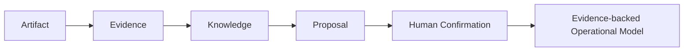
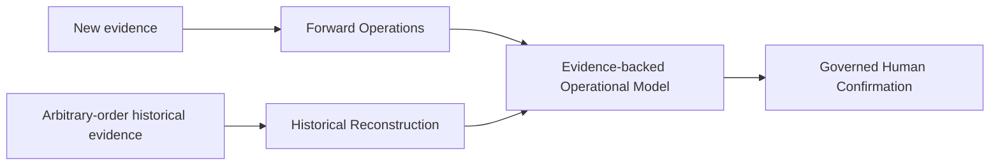
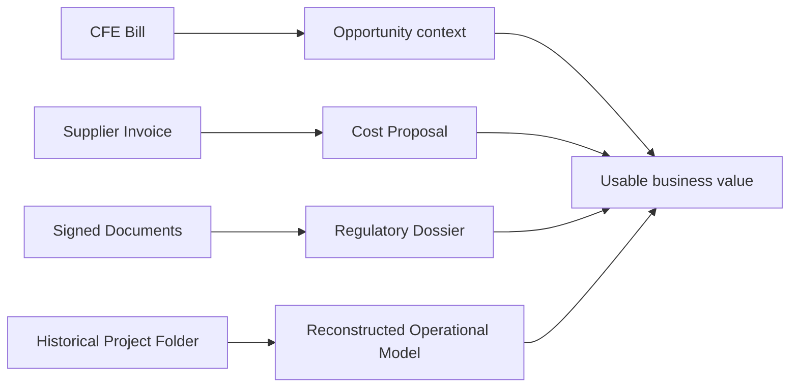
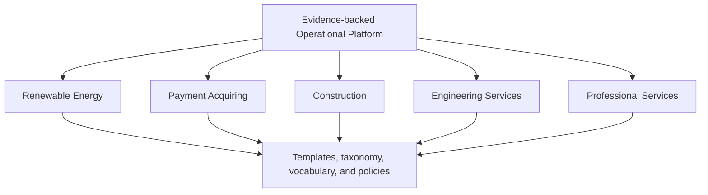

# BA-001C — Business Capability Model and Incremental Platform Strategy

**Status:** Proposed business architecture; no implementation authority.  
**Companions:** [BA-001A](BA-001_OPPORTUNITY_LIFECYCLE_ENGINE_ARCHITECTURE.md) and [BA-001B](BA-001B_OPPORTUNITY_LIFECYCLE_OPERATIONAL_ARCHITECTURE.md).  
**Scope:** Business capabilities, platform positioning, operating modes, and value-first sequencing.  
**Boundary:** This document defines neither technical architecture nor an authorized implementation package.

## 1. Purpose

Business Capabilities describe what Yarvis must enable for a business, independently of the technical components used to deliver it. They provide the bridge from product vision and operational semantics to future design and implementation packages. A capability is meaningful when it changes what an organization can understand, decide, govern, or execute.

Implementation follows business capabilities rather than technical layers. A storage mechanism, connector, interface, or model may be necessary, but it is not an outcome by itself. Each future increment should demonstrate a capability that a business can use to progress an Opportunity more safely, clearly, or effectively.

### Foundational concepts

The Evidence-backed Operational Platform uses a deliberate conceptual chain:

- An **Artifact** is an immutable information asset preserved with its source and provenance. A document is one category of Artifact, not the definition of the concept.
- **Evidence** results when an Artifact is interpreted within a business context for a stated purpose.
- **Knowledge** is a governed, attributable interpretation of evidence; it may qualify, compare, or explain what the evidence supports.
- A **Proposal** is a non-authoritative option informed by knowledge.
- **Human Confirmation** is the accountable act that authorizes a consequential business transition, unless an approved policy delegates bounded authority.
- The **Evidence-backed Operational Model** is the current, explainable understanding of the business assembled from these concepts. It remains traceable to its governed evidence and does not replace any System of Record.

## 2. Platform Positioning

Yarvis is **an Evidence-backed Operational Platform**. It is not an ERP, CRM, accounting platform, engineering design platform, or merely a document-management system. Those systems may remain authoritative systems of record for their own facts. Yarvis works alongside them to construct an explainable model of what an organization knows, what it has decided, what it is waiting for, and what should happen next.

| Position | Systems of Record | Yarvis as System of Understanding |
| --- | --- | --- |
| Primary role | Record transactions, master data, designs, messages, files, or financial entries for a bounded purpose. | Relate evidence, knowledge, proposals, decisions, commitments, and work across bounded purposes. |
| Examples | SAP, Odoo, QuickBooks, OpenSolar, CRMs, document repositories, and messaging platforms. | The Evidence-backed Operational Model for an Opportunity and its lifecycle. |
| Question answered | “What was recorded in this system?” | “What does the evidence mean together, what is missing, who confirmed what, and what is the governed next step?” |
| Replacement intent | Each remains responsible for its own authoritative record. | Does not replace those records or silently take their authority. |

The Operational Model is continuously constructed from multi-source evidence. It is explainable because it preserves provenance, distinguishes source evidence from interpretation, and makes proposals and human confirmations visible. It does not presume that chronology is complete, that any individual source contains the whole truth, or that a source system's record alone determines the governed next action.

Yarvis continuously synthesizes evidence produced by multiple Systems of Record while preserving their domain authority. For example, an accounting system can remain authoritative for a posted financial entry, a design platform for a design artifact, a CRM for its customer record, and a messaging platform for a message. Yarvis complements them by explaining how those artifacts and records together support an Opportunity, a proposal, a decision, or an unresolved business question.

### Conceptual Evidence Lifecycle

The lifecycle is conceptual, not a fixed sequence or implementation process. New artifacts can refine earlier evidence, knowledge, proposals, and the Operational Model. Human Confirmation authorizes a relevant business transition; the model then records the explainable current understanding of that transition and its support.

## 3. Business Capability Model

### Core Business Capabilities

Core capabilities express the identity of the Opportunity Lifecycle Engine. They may be introduced incrementally, but remain core even before their highest maturity is delivered.

**Artifact** is a first-class business concept in this model. Artifacts include PDF documents, images, photographs, videos, emails, WhatsApp conversations, structured XML or JSON, engineering files, external-platform references, and sensor or telemetry records. They are immutable information assets; evidence and knowledge are contextual, governed interpretations of those assets.

| Capability | Purpose and business value | Primary actors | Evidence consumed | Knowledge produced | Proposals generated | Dependencies |
| --- | --- | --- | --- | --- | --- | --- |
| **Opportunity Intake** | Recognize and establish a potential value, need, risk, or request as a governed Opportunity. It prevents valuable signals from remaining unowned. | Commercial owner, operator, founder, customer-facing staff. | Leads, messages, referrals, requests, and observations. | Initial relevance, parties, context, and qualification. | Qualify, defer, decline, or pursue. | Organization, Business Line, and accountable ownership. |
| **Artifact Intake** | Preserve material business artifacts so they can support future understanding. | Operators, customers, suppliers, external sources. | Documents, messages, images, forms, drawings, and references. | Provenance and artifact context. | Associate, interpret, request missing context. | Evidence Management and source accountability. |
| **Evidence Management** | Relate artifacts and observations to business claims, requirements, and decisions. It preserves traceability. | Operators, reviewers, domain specialists. | Artifacts, attestations, observations, and external records. | Evidence adequacy, relevance, validity, and gaps. | Verify, request, supersede for purpose, or seek an exception. | Artifact Intake, Opportunity context, and Requirements. |
| **Document Registry** | Maintain governed documentary evidence across its useful business contexts. | Operators, reviewers, business owners. | Document metadata, versions, provenance, and associations. | Available evidence context and history. | Associate, interpret, request a newer or missing artifact. | Evidence Management; it is evidence infrastructure, not the product. |
| **Knowledge Extraction** | Turn evidence into attributable, reusable business understanding. | Analysts, engineers, operators, future assisted-analysis reviewers. | Evidence, observations, rules, and prior knowledge. | Extracted facts, comparisons, assessments, and confidence or qualification. | Assess, classify, compare, or request confirmation. | Evidence Management and domain vocabulary. |
| **Historical Reconstruction** | Reconstruct Opportunities, Projects, operational context, business relationships, milestones, decisions, costs, and business history from evidence arriving in arbitrary order. It never changes the business authoritatively by itself. | Founders, operators, auditors, transition teams. | Historical folders, messages, invoices, contracts, photos, external records, and other artifacts. | Probable chronology, relationships, commitments, costs, gaps, conflicts, uncertainty, and evidence confidence. | Reconstruct context, request confirmation, or flag conflict; all consequential reconstruction proposals require confirmation under future governance policy. | Evidence Management, Knowledge Extraction, Evidence Confidence, and Human Confirmation. |
| **Evidence-backed Operational Model** | Maintain the coherent, explainable current understanding of an Opportunity's evidence, knowledge, proposals, decisions, milestones, waiting states, relationships, costs, and work. Every significant conclusion remains traceable to governed supporting evidence. | All accountable business participants. | Multi-source evidence and governed lifecycle history. | Current context, rationale, readiness, risks, confidence-qualified understanding, and next-action context. | Advance, wait, remediate, propose, or close. | All core capabilities, preserved history, and System-of-Record coexistence. |
| **Technical Assessment** | Determine feasibility, conditions, and constraints for a potential solution. | Technical assessor, commercial owner, customer. | Site facts, measurements, bills, photographs, requirements, and constraints. | Feasibility, risk, assumptions, and assessment findings. | Request more evidence, configure, defer, or stop. | Opportunity Intake, Evidence Management, and Knowledge Extraction. |
| **Configuration Study** | Form and compare viable solution configurations. | Engineers, specialists, commercial owner. | Assessment knowledge, requirements, availability, and constraints. | Options, trade-offs, expected outcome, and preliminary scope. | Recommend configuration or request further study. | Technical Assessment and applicable Business Line rules. |
| **Commercial Proposal** | Present a reviewable commercial or operating option based on supported knowledge. | Commercial owner, customer, authorized approver. | Configuration, estimates, terms, evidence, and assumptions. | Price, scope, validity, risks, and commitment conditions. | Submit, revise, accept, reject, or negotiate. | Configuration Study, Human Confirmation, and Decision Model. |
| **Opportunity Conversion** | Turn an authorized commercial or operating decision into a Project, Operation, or explicit closure. | Authorized business owner, project owner, customer-facing lead. | Confirmed proposal, contract, order, or approval. | Authorized scope, commitments, handoff conditions, and obligations. | Create project, activate operation, or close outcome. | Commercial Proposal, confirmation, and governed decision. |
| **Regulatory Dossier** | Establish purpose-specific readiness for regulatory or external submission. | Compliance owner, technical assessor, operator. | Required and optional evidence, attestations, engineering outputs, decisions. | Completeness, gaps, validity, exception, and submission readiness. | Request evidence, remediate, submit, or seek exception. | Dossier Templates, Requirement Model, and Milestones. |
| **Project Execution** | Coordinate authorized delivery through accountable work and milestones. | Project owner, engineers, procurement, installers, suppliers. | Authorized scope, requirements, commitments, delivery evidence. | Progress, deviation, completion, and handoff readiness. | Start, amend, remediate, complete, or pause. | Opportunity Conversion, Workflow Templates, and Milestones. |
| **Operations Monitoring** | Maintain an evidence-backed understanding of operating performance, service obligations, and emerging opportunities. | Operations owner, service team, customer-facing staff. | Handover, service evidence, measurements, incidents, feedback. | Performance, risk, renewal, and improvement context. | Service, renew, optimize, or open a new Opportunity. | Operation context, evidence, and lifecycle governance. |

### Strategic Business Capabilities

Strategic capabilities extend the platform's reach after a useful core is established. They are direction-setting examples, not an implementation sequence or approval.

Operational Intelligence, Supplier Intelligence, Financial and Obligation Settlement, Marketplace Intelligence, ERP Integration, Predictive Operational Intelligence, and AI-assisted Optimization are natural evolutions of the Evidence-backed Operational Model. They are not independent products: each extends the platform's ability to interpret evidence, form explainable knowledge, prepare proposals, and support governed decisions across a broader operating context.

| Capability | Purpose and business value | Primary actors | Evidence consumed | Knowledge produced | Proposals generated | Dependencies |
| --- | --- | --- | --- | --- | --- | --- |
| **Predictive Operational Intelligence** | Anticipate likely risks, delays, outcomes, and intervention needs. | Business owners, operators, analysts. | Historical lifecycle outcomes, evidence patterns, operating signals. | Forecasts, risk indicators, and confidence-qualified patterns. | Prioritize, intervene, or monitor. | Historical Reconstruction, Operational Model, explainability governance. |
| **Supplier Intelligence** | Compare supply options, commitments, costs, and dependencies. | Procurement, engineers, commercial owners. | Supplier quotations, catalog information, invoices, delivery evidence. | Availability, comparison, expected cost, and supplier reliability context. | Select, substitute, negotiate, or defer. | Evidence Management, Configuration Study, and commercial governance. |
| **Financial and Obligation Settlement** | Understand commitments, expected and actual obligations, and settlement outcomes across the lifecycle. | Finance owner, project owner, commercial owner. | Contracts, invoices, payments, cost evidence, and commitments. | Obligation status, cost allocation, cash and margin context. | Settle, escalate, allocate, or revise a commitment. | Commercial Proposal, Project Execution, and external financial systems of record. |
| **Marketplace Intelligence** | Understand market options and their relevance to business opportunities. | Commercial, procurement, strategy owners. | Market evidence, external offers, supplier and customer signals. | Comparative opportunity and market context. | Pursue, price, source, or defer. | Evidence Management and governed assessment. |
| **ERP Integration** | Improve cross-system understanding while preserving each system's authority. | Finance, operations, integration owner. | ERP records and reconciliation evidence. | Cross-context commitment, fulfillment, and obligation context. | Reconcile, investigate, or request confirmation. | System-of-record coexistence, evidence governance, and authority policy. |
| **OpenSolar Automation** | Support governed use of design-platform evidence and permitted actions. | Energy specialists, commercial and technical owners. | Design artifacts, assessments, configuration data, and approval evidence. | Design context and configuration comparisons. | Prepare, review, or authorize permitted design actions. | Renewable-energy Business Line policy, confirmation, and external-system coexistence. |
| **AI-assisted Optimization** | Prepare explainable alternatives and prioritization without displacing accountability. | Authorized reviewers, operators, business owners. | Evidence, knowledge, outcomes, and approved policy context. | Recommendations, alternatives, confidence, and rationale. | Optimize, prioritize, investigate, or request confirmation. | Explainability, Human Confirmation, evidence confidence, and automation governance. |

## 4. Operational Modes

Yarvis has two official operating modes. They use the same Opportunity Lifecycle architecture and capability model; the difference is the order and completeness in which evidence becomes available.

| Mode | Meaning | Primary value | Governing distinction |
| --- | --- | --- | --- |
| **Forward Operations** | New evidence initiates and advances Opportunities as business work occurs. | Makes current commitments, gaps, decisions, waiting states, and next actions visible. | The organization progresses a live lifecycle from current evidence. |
| **Historical Reconstruction** | Evidence arriving in arbitrary chronological order is interpreted to reconstruct Opportunities, Projects, operational context, and business history. | Makes inherited or fragmented work understandable without pretending the past was perfectly recorded. | Reconstruction is a proposal for human confirmation, not an automatic rewrite of business history. |

Historical Reconstruction is a Core Capability implemented through progressive maturity. It begins with interpretable context and identified uncertainty; later capability increments may improve confidence, breadth, reconciliation, and explanation. It is not deferred merely because complete automated reconstruction is not an MVP feature.

### Evidence Confidence

Evidence may possess varying confidence: the degree of support available for a particular proposal or conclusion given its provenance, relevance, completeness, consistency, and business context. Confidence makes uncertainty visible; it does not make a conclusion authoritative and does not replace human authority. Historical Reconstruction may identify confidence-qualified possibilities, but it produces governed proposals requiring confirmation rather than silently modifying business history.

## 5. Incremental Delivery Strategy

Yarvis follows **Value-first Engineering**: each design and implementation increment must enable one or more recognizable business capabilities and produce demonstrable value for a defined actor.

1. Every DI or other implementation package enables a named business capability or capability increment.
2. Every increment produces an observable business outcome, such as clearer evidence, a reviewable proposal, a confirmed decision, or a governed next action.
3. Infrastructure-only milestones are avoided unless they are inseparable from a demonstrable capability outcome.
4. Architecture evolves without delaying usable outcomes; a smaller governed slice is preferable to a broad technical foundation without business use.
5. Capability maturity can increase over time without changing the core business meaning.

This strategy does not reduce the need for architecture or governance. It requires that technical sequencing remain traceable to business value and that no convenience integration creates authoritative business state outside the governed lifecycle.

## 6. Vertical Slice Strategy

Yarvis is delivered through complete business slices rather than horizontal technical layers. A slice connects evidence to understanding, proposal, confirmation, decision, and a useful business outcome within a bounded vertical context.

For Energía Fotónica, a CFE bill can support an Opportunity, a supplier invoice can inform a cost proposal, signed documents can contribute to a regulatory dossier, and a historical project folder can reconstruct operational context. These are examples of useful slices, not prescriptions for a technical architecture. Each slice must preserve evidence, make its interpretation explainable, and require confirmation before it advances authoritative business state.

## 7. MVP Strategy

Core status and delivery timing are different dimensions. A capability can be central to Yarvis while its early implementation is deliberately narrow.

| Horizon | Capability focus | Business outcome | Intentionally excluded at this horizon |
| --- | --- | --- | --- |
| **MVP** | Opportunity Intake, Artifact Intake, Evidence Management, governed Document Registry use, initial Evidence-backed Operational Model, basic Technical Assessment, Commercial Proposal preparation, human confirmation, and limited Dossier readiness. | A team can turn bounded evidence into a comprehensible Opportunity, reviewable proposal, confirmed decision, and accountable next action. | Broad connector coverage, full automation, predictive intelligence, ERP replacement, generic workflow coverage, and autonomous decision-making. |
| **Near-term** | Richer Workflow and Dossier Templates, Project Execution, Operations Monitoring, progressive Historical Reconstruction, Supplier Intelligence, and controlled system-of-record coexistence. | Teams can manage more complete vertical lifecycles and reconstruct useful context from fragmented history. | Full cross-vertical standardization, opaque automation, and assumed universal policy. |
| **Long-term vision** | Mature Historical Reconstruction, Predictive Operational Intelligence, Financial and Obligation Settlement understanding, Marketplace Intelligence, approved integrations, and AI-assisted Optimization. | The platform continuously supports explainable operational understanding across multiple Business Lines. | Replacement of systems of record or removal of accountable human governance. |

Historical Reconstruction is core from the beginning, but delivered through progressive maturity: first as human-confirmed context reconstruction, then through increasingly capable evidence comparison and explanation. Strategic assumptions do not imply MVP implementation.

## 8. Platform Evolution

Additional verticals reuse the same engine. Renewable Energy, Payment Acquiring, Construction, Engineering Services, and Professional Services may differ in workflow, dossier templates, evidence taxonomy, business vocabulary, and policies. They do not require a different definition of evidence, proposal, confirmation, decision, milestone, waiting state, or Opportunity.

The platform evolves by adding governed vertical capability, not by making an initial vertical's terminology universal. Coexistence with Systems of Record remains a constant principle across verticals.

## 9. Capability Mapping to Future DI Packages

This mapping is architectural sequencing only. It does not authorize or redefine any DI package, and it avoids technical implementation detail.

| Future package direction | Capability increments it may address | Intended business value |
| --- | --- | --- |
| **DI-003: governed evidence acquisition** | Artifact Intake, Evidence Management, Document Registry use, Forward Operations. | Introduce new evidence into an Opportunity context without treating storage or transfer as the product. |
| **DI-004: evidence context and operational views** | Evidence-backed Operational Model, Opportunity context, Historical Reconstruction maturity. | Make associated evidence and reconstructed context usable for review. |
| **DI-005: durable evidence access** | Artifact Intake and Evidence Management continuity. | Maintain provider-neutral evidence access while preserving business meaning. |
| **DI-006: evidence governance hardening** | Evidence Management, Dossier readiness, and controlled evidence handling. | Improve confidence, protection, retention, and reviewability for business evidence. |
| **Future Opportunity Lifecycle package** | Opportunity Intake, Workflow Templates, Requirements, Milestones, Proposals, Confirmation, and Decisions. | Make the governed lifecycle explicit for a first Business Line. |
| **Future vertical packages** | Technical Assessment, Configuration Study, Commercial Proposal, Regulatory Dossier, Project Execution, Operations Monitoring. | Deliver complete vertical slices with demonstrable operating value. |
| **Future intelligence and coexistence packages** | Historical Reconstruction, Supplier Intelligence, Financial and Obligation Settlement, ERP Integration, and AI-assisted Optimization. | Increase explainable operational understanding while preserving authority boundaries. |

## 10. Architectural Principles

1. **Capability-first implementation.** Technology exists to enable an approved business capability.
2. **Evidence before automation.** Automation consumes governed evidence and does not create unreviewable truth.
3. **Proposal before decision.** Options are made reviewable before a consequential choice is recorded.
4. **Human confirmation before authoritative transition.** Confirmation is explicit unless an approved policy delegates bounded authority.
5. **Architecture before integration.** Integrations fit an established business boundary; they do not define one.
6. **Explainability over opaque automation.** A business actor can understand evidence, knowledge, proposal, authority, and outcome.
7. **Chronology-independent evidence ingestion.** Business understanding can be reconstructed from evidence that arrives late, incomplete, or out of order.
8. **Systems of Record coexistence.** Yarvis constructs understanding without taking unapproved ownership of another system's record.

### Conceptual Invariants

1. **Artifacts are immutable.** Their source and historical identity remain interpretable even when later evidence or knowledge changes.
2. **Evidence remains attributable.** Its purpose, supporting Artifacts, and business context are not obscured.
3. **Knowledge is governed.** Interpretation remains distinct from its supporting evidence and is reviewable in context.
4. **Proposals are never authoritative.** They may recommend or reconstruct; they cannot by themselves cause a business transition.
5. **Human Confirmation authorizes business state.** Delegated automation is possible only through approved, bounded policy.
6. **Operational Models remain explainable.** Every significant conclusion should trace to governed supporting evidence, knowledge, and confirmation where relevant.
7. **Chronology-independent ingestion is supported.** Evidence may arrive late or out of order without erasing uncertainty or historical attribution.
8. **Systems of Record retain their domains.** Yarvis constructs understanding rather than replacing transactional or specialist systems.

## 11. Strategic Assumptions

The following assumptions guide business strategy. They do not imply MVP delivery, technical implementation, or delegated authority.

- An **Evidence-backed Operational Model** is more valuable than a collection of disconnected records.
- **Historical Reconstruction** is a core capability whose maturity grows over time.
- **Operational Intelligence** should improve prioritization and understanding, not obscure accountability.
- **Multi-source evidence** is normal; no single source is presumed complete.
- **Explainable business context** is required for confidence, review, and handoff.
- **Human-confirmed reconstruction** prevents inferred history from silently becoming authoritative fact.
- **Multiple settlement mechanisms** may coexist; none is presumed to be the platform's financial system of record.
- A **System of Understanding** complements rather than replaces Systems of Record.
- Coexistence with Systems of Record is a durable platform position, not a temporary integration tactic.

## 12. Open Questions for BA-001D

1. How should business policy be evaluated when requirements, milestones, and lifecycle conditions conflict?
2. Which authority model governs confirmation, exception, and closure across Business Lines?
3. What delegation boundaries are acceptable for automation, and how are they reviewed?
4. What minimum explanation must accompany a proposal, reconstruction, or intelligence-driven recommendation?
5. How should Operational Intelligence state uncertainty, evidence confidence, and possible bias?
6. How are conflicting sources resolved without deleting historically meaningful evidence?
7. How should policy inheritance work across Organization, Business Line, Opportunity, Project, Dossier, and Operation?
8. What business outcomes prove that an MVP slice creates value before broader platform investment?

## 13. Scope Boundaries

BA-001C does not define APIs, schemas, storage, connectors, OCR, AI models, workflow engines, routing, frontend behavior, infrastructure, or implementation plans. It authorizes no DI package. Future design and implementation must follow the ratification and engineering-gate process described by the repository governance.

## Conclusion

BA-001C completes the BA-001 business-architecture series by defining what Yarvis enables and how value should be introduced over time. The platform is positioned as an Evidence-backed Operational Platform: a System of Understanding that works with Systems of Record to make Opportunities, evidence, knowledge, proposals, decisions, and execution explainable and governable.
