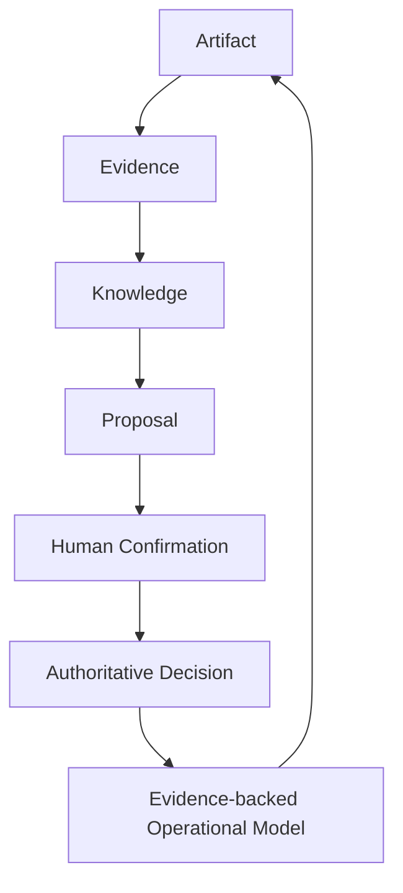
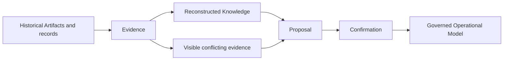

# BA-001D — Governance, Authority, and Decision Architecture

**Status:** Proposed business architecture; no implementation authority.  
**Companions:** [BA-001A](BA-001_OPPORTUNITY_LIFECYCLE_ENGINE_ARCHITECTURE.md), [BA-001B](BA-001B_OPPORTUNITY_LIFECYCLE_OPERATIONAL_ARCHITECTURE.md), and [BA-001C](BA-001C_BUSINESS_CAPABILITY_MODEL_AND_PLATFORM_STRATEGY.md).  
**Scope:** Conceptual governance, authority, policy, confirmation, and decision architecture.  
**Boundary:** This document is business architecture, not an implementation specification or a runtime policy system.

## 1. Governance Purpose

Governance protects the integrity of business understanding. It ensures that the Evidence-backed Operational Model evolves consistently, explainably, and accountably as evidence arrives, knowledge is formed, proposals are made, and decisions affect an Opportunity or its related work.

Governance is more than permission enforcement. It protects against unauthorized business-state transitions, preserves the distinction between source evidence and interpretation, makes accountability auditable, and enables controlled evolution when new or conflicting evidence changes what the organization understands. Its purpose is to ensure that the organization can explain not only what it believes now, but why it believes it, who confirmed consequential changes, and which policy governed the outcome.

## 2. Governance Layers

| Layer | Responsibility | Governed outcome |
| --- | --- | --- |
| **Artifact Governance** | Preserve immutable information assets, their source, provenance, and historical identity. | Artifacts remain available for future interpretation without being silently rewritten. |
| **Evidence Governance** | Relate Artifacts and observations to a stated business context and purpose. | Evidence remains attributable, relevant, and distinguishable from source material. |
| **Knowledge Governance** | Govern the interpretation of evidence, including qualifications, confidence, alternatives, and conflict. | Knowledge is reviewable, context-bound, and not confused with raw evidence. |
| **Proposal Governance** | Ensure a proposal is understandable as a non-authoritative option with its supporting basis. | Proposed actions can be reviewed without silently becoming decisions. |
| **Human Authority** | Establish who is responsible, who may confirm, when authority may be delegated, and when separation is needed. | Consequential decisions have accountable, appropriate authority. |
| **Operational Model Governance** | Control how confirmed decisions and new governed understanding affect the current model. | The Operational Model changes in attributable, explainable ways while preserving history. |

The layers are complementary. Artifact governance does not decide a business outcome; Human Authority does not erase evidence; Operational Model Governance does not make a proposal authoritative. Together they preserve a governed path from information to understanding and action.

## 3. Decision Lifecycle

Every conceptual stage retains traceability to its predecessor. Later understanding may refine an earlier conclusion, but it cannot erase the fact that an earlier conclusion was made on the support then available.

An Artifact becomes Evidence when interpreted for a business purpose. Evidence supports governed Knowledge. Knowledge informs a Proposal. Human Confirmation, by an authorized actor or a bounded policy delegation, permits an Authoritative Decision. That decision may update the Evidence-backed Operational Model, whose current understanding guides further attention, work, and evidence collection.

## 4. Evidence Confidence

**Evidence confidence** expresses the degree of support available for a proposal or conclusion in its business context. It may reflect provenance, relevance, completeness, consistency, timeliness, and the degree to which evidence has been interpreted or verified. It is a way to make uncertainty visible to human judgment.

Confidence is not authority. It never changes business state, approves a transition, or turns a reconstruction into fact. A highly supported proposal still requires the applicable confirmation; a low-confidence proposal may warrant additional evidence, review, or a conscious decision not to proceed. BA-001D defines no scoring algorithm, threshold, or implementation mechanism.

## 5. Human Authority

**Authority** is the recognized right to confirm a decision or authorize a consequential transition for a defined business purpose. **Responsibility** is the obligation to exercise that authority conscientiously and remain answerable for the outcome. Authority and responsibility may be shared across a process, but consequential decisions retain an identifiable accountable actor.

**Delegation** allows authority to be exercised within an explicitly approved scope. A delegation identifies the business purpose, permitted decisions, conditions, evidence expectations, exception boundaries, and review expectations. It does not remove accountability from the organization and must not be inferred from access to information or a technical capability.

**Confirmation** is the explicit accountable act of accepting, rejecting, returning, or excepting a Proposal. **Separation of duties** protects the business when the same actor should not originate, validate, confirm, and settle a consequential matter without review. **Conflict of interest** requires a business to recognize when an actor's personal, commercial, or operational interest may impair independent judgment and to apply an appropriate review or alternate confirmation path.

Authoritative transitions require an authorized actor unless future governance policy explicitly delegates bounded authority. A recommendation, AI output, reconstruction result, or task completion alone does not establish authority.

## 6. Policy Model

Policies are conceptual business rules that make governance expectations explicit and repeatable. They guide judgment; they do not define a syntax, engine, or technical enforcement mechanism in BA-001D.

| Policy category | Business question it governs |
| --- | --- |
| **Transition policies** | What conditions permit, block, pause, resume, or close a lifecycle transition? |
| **Evidence policies** | What evidence is required, suitable, sufficient, expired, or conflicting for a stated purpose? |
| **Milestone policies** | Which requirements, evidence, verification, and confirmations unlock a checkpoint? |
| **Waiting policies** | How are external dependencies owned, reviewed, escalated, expired, or resumed? |
| **Reconstruction policies** | How are inferred contexts, gaps, conflicts, and historical proposals reviewed and confirmed? |
| **Settlement policies** | How are obligations, payment or other settlement mechanisms, exceptions, and reconciliation treated? |
| **Delegation policies** | Which authority may be delegated, for what purpose, under which conditions, and with what review? |

A policy may conceptually **allow**, **deny**, **require evidence**, **require confirmation**, **require a milestone**, **require waiting**, or **require additional review**. A policy outcome directs governed business behavior; it must not silently erase evidence or convert a Proposal into an authoritative decision.

## 7. Operational Model Governance

The Evidence-backed Operational Model represents the explainable current understanding of an Opportunity, Project, Operation, or related business context. It may evolve when new evidence is incorporated, knowledge is governed, a proposal is confirmed, or an authoritative decision is made under the applicable policy.

Proposals never directly modify the model. Governed Confirmation authorizes the relevant change, and the resulting state remains attributable to its authority, governing policy, supporting evidence, applied knowledge, and decision history. A later conclusion can supersede an earlier interpretation for a purpose without destroying the earlier evidence, knowledge, proposal, or decision record.

Every authoritative state must remain explainable through evidence. The Operational Model complements Systems of Record; it does not replace their authority in their own domains.

## 8. Historical Reconstruction Governance

Historical Reconstruction creates governed understanding from evidence that may be incomplete, late, contradictory, or arbitrary in chronology. It can reconstruct Opportunities, Projects, operational context, business relationships, milestones, decisions, costs, and business history. Its output is a confidence-qualified Proposal for review, never a silent authoritative rewrite.

Reconstructed conclusions remain attributable to the evidence and knowledge that support them. Conflicting evidence stays visible as conflict rather than being discarded to force a single narrative. New evidence may supersede a previous interpretation for the relevant business purpose, while preserving the historical interpretation, its confidence, and the confirmation or decision made at that time.

## 9. Explainability

Explainability is a platform invariant. Every significant business conclusion should be explainable through its supporting evidence, applied knowledge, confirmation history, and governing policy. Explainability enables accountability, review, correction, handoff, and trust across Business Lines.

It is independent of AI implementation. A human-created assessment, deterministic reconstruction, automated recommendation, and future AI-assisted proposal are all subject to the same need for traceable support and accountable confirmation. Explainability is not a narrative after the fact; it is the ability to understand the governed basis of a conclusion while it is relevant to the business.

## 10. Governance Invariants

The following are conceptual architecture principles, not runtime rules:

1. **Artifacts remain immutable.** Their source and historical identity remain interpretable.
2. **Evidence remains attributable.** Its supporting Artifacts, business purpose, and context remain visible.
3. **Knowledge remains governed.** Interpretation stays distinct from evidence and is reviewable in context.
4. **Proposals are never authoritative.** They inform decisions but do not themselves change business state.
5. **Confidence is never authority.** It assists human judgment and does not replace confirmation.
6. **Every authoritative transition is attributable.** Its authority, policy, evidence, knowledge, and confirmation remain understandable.
7. **Operational understanding is explainable.** Significant conclusions trace to governed support.
8. **Chronology-independent ingestion is supported.** Late or out-of-order evidence may enrich understanding without rewriting history invisibly.
9. **Systems of Record remain authoritative in their domains.** Yarvis constructs understanding rather than replacing transactional or specialist systems.

## 11. Vertical Governance Extension

Renewable Energy, Payment Acquiring, Construction, and Professional Services may each extend governance through local vocabulary, evidence taxonomy, policies, and workflows. A vertical may define what constitutes a valid utility bill, merchant-underwriting package, construction handover, or professional-service acceptance. It may add appropriate milestones, waiting states, evidence expectations, and confirmation paths.

No vertical may weaken the core architecture: Artifacts remain immutable, Evidence stays attributable, Proposals remain non-authoritative, authority remains accountable, and the Operational Model remains explainable. Vertical governance adds context; it does not replace the common governance model.

## 12. Strategic Assumptions

- **Explainable decisions** are necessary for accountable operational progress.
- **Governed reconstruction** can improve understanding without fabricating authoritative history.
- **Attributable authority** is required for consequential business transitions.
- **Evidence confidence** informs judgment but never substitutes for authority.
- **Human-centered governance** remains the default even as assistance and automation evolve.
- **Policy extensibility** is necessary because Business Lines have different requirements, milestones, waiting conditions, and settlement practices.
- **Coexistence with Systems of Record** is durable: Yarvis complements their authority with evidence-backed understanding.

## 13. Open Questions for MVP-001

The following questions are limited to defining the first demonstrable business value:

1. What minimum evidence is required to establish the first useful Opportunity in the chosen vertical slice?
2. What is the first confirmation workflow that demonstrates accountable decision-making?
3. What is the smallest Evidence-backed Operational Model that makes a meaningful next action explainable?
4. Which first vertical slice best demonstrates evidence, proposal, confirmation, and a governed transition end to end?
5. What initial authority model distinguishes proposal preparation, evidence review, and confirmation?
6. Which evidence-confidence conditions should prompt further review rather than progression in the first slice?

## 14. Scope Boundaries

BA-001D does not define permission schemas, policy syntax, decision engines, APIs, data models, storage, connectors, AI models, frontend behavior, workflow engines, routing, infrastructure, or implementation packages. It authorizes no runtime work. Future design and implementation require the repository's ratification and engineering-gate process.

## Conclusion

BA-001D completes the BA-001 business architecture conceptually by defining how evidence becomes trusted operational understanding. Governance protects explainability, accountable authority, and controlled evolution of the Operational Model. It ensures that a Proposal, confidence signal, or reconstruction can support human judgment without silently becoming authoritative business state.
