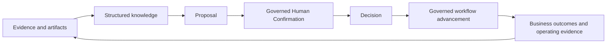
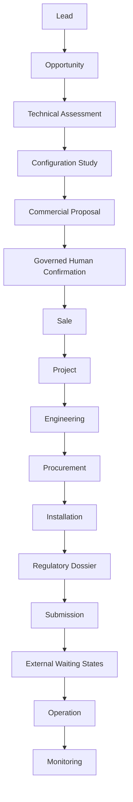
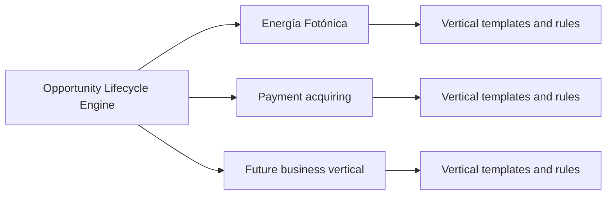

# BA-001A — Opportunity Lifecycle Engine Business Architecture

**Status:** Proposed business architecture; no implementation authority.  
**Audience:** Product owner, CTO, future developers, solution architects, business-line owners, and investors.  
**Scope:** Vision and conceptual business model only.  
**Relationship to implementation:** A future ratification and explicitly authorized work package are required before this document can guide runtime changes.

## 1. Purpose

Yarvis exists to turn fragmented operational information into governed progress. Businesses accumulate messages, documents, quotations, photographs, assessments, commitments, and external responses, but those items rarely form an intelligible account of what the business should do next. People must reconstruct context, identify missing evidence, compare alternatives, make decisions, and coordinate work across commercial and operational teams.

Documents alone are insufficient because a file does not express the opportunity it supports, the knowledge extracted from it, the decision it informs, the authority that approved that decision, or the work that follows. A document may support several legitimate business purposes without itself becoming the purpose.

Yarvis therefore centers on an **Opportunity** rather than a Project. A project begins after a commitment to execute. An opportunity begins earlier: when a potentially valuable need, relationship, request, risk, or outcome first warrants governed attention. It may result in a project, a proposal, an operational service, a declined pursuit, or no further action. This makes the model suitable for sales-led, regulated, service-led, and project-driven businesses without forcing every early-stage activity into a project.

## 2. Vision

Yarvis is a **governed Opportunity Lifecycle Engine**. It enables an organization to bring evidence, knowledge, proposals, decisions, and execution into one traceable lifecycle while preserving human authority over consequential business state.

Documents are evidence. Evidence becomes useful when it is interpreted into knowledge. Knowledge supports a proposal: a structured option for consideration. A governed human confirmation makes the accountable authorization explicit before a decision advances business workflows. The resulting work and outcomes produce further evidence. The engine preserves this chain rather than treating documents, tasks, projects, or automation as isolated products.

The vision is not a universal workflow that erases business differences. It is a shared business foundation that lets each vertical define its own evidence types, lifecycle templates, decision models, and operating rules while using consistent governance and traceability.

## 3. Design Principles

1. **Opportunity before Project.** An opportunity is the first governed unit of potential value; a project is one possible authorized outcome.
2. **Evidence before Automation.** Automation may assist only after relevant evidence and the applicable authority are available.
3. **Human-in-the-loop for authoritative state transitions.** A person remains accountable for consequential decisions unless a separately approved policy explicitly delegates that authority.
4. **Governed human confirmation precedes authoritative transition.** A proposal may inform a decision, but it does not itself change authoritative business state. Explicit confirmation is required unless an approved automation policy delegates that authority.
5. **Documents are evidence, not the product.** Documents, messages, images, and records are interpretable artifacts within a larger business context.
6. **Proposals and decisions are first-class citizens.** A proposal makes an option reviewable; a decision records its confirmation, approval, rejection, or exception with rationale, authority, and consequences.
7. **Workflow Templates express lifecycle variation.** Templates make vertical-specific stages, gates, and waiting states explicit rather than hard-coding one business's process as a platform assumption.
8. **Dossier Templates express evidence completeness.** A dossier defines the evidence and requirements needed for a bounded commercial, operational, or regulatory purpose.
9. **Artifact-first architecture.** Facts and claims must retain a relationship to the artifacts and observations that substantiate them.
10. **Vertical-independent core.** The engine provides common business concepts without defining a particular industry's terminology or operating rules.
11. **Business capabilities drive implementation.** Runtime work is selected to realize an approved capability, not merely to expose a technical component.
12. **Integrations are optional, never foundational.** A vertical must remain conceptually coherent when external systems are unavailable; integrations supply evidence or controlled capabilities, not ungoverned truth.

## 4. Core Business Concepts

The following concepts are a conceptual vocabulary. They do not prescribe entities, schemas, APIs, ownership boundaries, or implementation sequence.

| Concept | Purpose and reason | Created when | Consumes | Produces |
| --- | --- | --- | --- | --- |
| **Organization** | The accountable business or legal operating context. It establishes responsibility, identity, and governance boundaries. | When an operating context participates in the engine. | Business identity and governance information. | A context for business lines, opportunities, evidence, and decisions. |
| **Business Line** | A coherent commercial or operating vertical within an organization. It prevents one vertical's terminology from becoming the platform default. | When a distinct value stream needs its own templates and rules. | Organization strategy, services, and operating policies. | Workflow, dossier, taxonomy, milestone, and decision-model configuration. |
| **Opportunity** | A governed possibility to create, protect, recover, or advance value. It exists before a project or transaction is certain. | When a lead, request, signal, or recognized need merits accountable attention. | Customer and site context, early evidence, commercial or operational signals. | Assessments, proposals, decisions, projects, operations, or an explicit closure. |
| **Customer** | The party whose need, relationship, or outcome is being served. It distinguishes the commercial subject from the work itself. | When a party is known well enough to participate in an opportunity. | Identity, relationship, and consent information. | Commercial context, requirements, proposals, and service history. |
| **Site** | The physical, virtual, or operating location relevant to an opportunity. It captures place-specific facts without redefining the customer. | When location materially affects assessment, execution, compliance, or service. | Location evidence, technical conditions, and access constraints. | Site context for assessments, configurations, projects, and operations. |
| **Artifact** | A preserved business item that can substantiate a fact, claim, decision, or completion. | When material evidence is received, produced, or formally referenced. | Source, provenance, content description, and association context. | Evidence available for interpretation, review, and traceability. |
| **Knowledge** | A structured, attributable interpretation of evidence. It turns artifacts into reusable business understanding without replacing source truth. | When evidence is assessed, compared, extracted, or synthesized. | Artifacts, observations, prior knowledge, and contextual rules. | Assessments, estimates, comparisons, completeness views, and decision inputs. |
| **Proposal** | A structured commercial, operational, or lifecycle option responding to an opportunity. It makes a recommended path reviewable before it becomes a decision. | When knowledge is sufficient to present one or more options for consideration. | Customer needs, assessments, configuration, estimates, commercial assumptions, and other knowledge. | A governed human-confirmation request, revision, withdrawal, or a decision input. |
| **Governed Human Confirmation** | The explicit accountable act that confirms, rejects, or requests revision of a proposal before an authoritative transition. | When a proposal would affect business state, commitment, authority, or workflow direction. | Proposal, supporting knowledge, applicable authority, and policy. | A confirmed, rejected, or returned proposal and a decision input. |
| **Decision** | A governed choice that records the confirmed outcome, why, and by whom. | After the required human confirmation, or when an approved automation policy supplies equivalent delegated authority. | Confirmed proposal, knowledge, authority, and applicable policy. | Authorized workflow advancement, work authorization, or a recorded non-action. |
| **Project** | An authorized, bounded execution endeavor. It exists only when the business commits to organized delivery. | Following an authorized sale or other execution decision. | Approved scope, commitments, requirements, resources, and milestones. | Engineering, procurement, installation, delivery evidence, and operating handoff. |
| **Dossier** | A purpose-specific collection of requirements, evidence, and attestations. | When a commercial, technical, regulatory, or operational submission needs demonstrable completeness. | Dossier template, artifacts, knowledge, and approvals. | Completeness status, submissions, exceptions, and auditable evidence packages. |
| **Requirement** | A condition that must be met, evidenced, or consciously waived for a purpose. | When a template, agreement, regulation, or decision identifies an obligation. | Policy, template, contract, assessment, or external rule. | Evidence requests, validation status, exception decisions, and completion criteria. |
| **Milestone** | A meaningful business checkpoint used to coordinate commitment, timing, dependencies, or value recognition. | When a workflow or project needs an observable checkpoint. | Authorized plan, requirements, and work status. | Progress evidence, decision triggers, and financial or operational signals. |
| **Workflow Template** | A reusable conceptual pattern for a Business Line's lifecycle stages, gates, waiting states, and decision points. | When a business line needs a repeatable opportunity lifecycle. | Business-line rules, milestones, and decision expectations. | A governed lifecycle shape for opportunities, projects, or operations. |
| **Dossier Template** | A reusable conceptual pattern for the requirements and evidence expected for a defined purpose. | When a business line needs repeatable completeness expectations. | Business-line rules, requirement categories, and evidence expectations. | A dossier structure against which completeness and exceptions can be assessed. |
| **Task** | A bounded unit of accountable work. It makes execution visible but does not substitute for an opportunity or decision. | When authorized workflow advancement requires a responsible action. | Instructions, relevant evidence, dependencies, and authority. | Completion evidence, outcomes, blockers, and new decision inputs. |
| **Operation** | The sustained service or monitored state after delivery, activation, or handoff. | When a project or commercial commitment enters ongoing use or support. | Handover evidence, operating rules, service commitments, and monitoring context. | Performance evidence, incidents, renewals, improvements, and new opportunities. |

## 5. Opportunity Lifecycle

The following lifecycle illustrates a project-driven vertical. It is deliberately conceptual: not every opportunity visits every stage, and transitions remain governed by the relevant business line.

The lifecycle separates discovery, assessment, commitment, execution, external dependencies, and operation. A lead becomes an opportunity when it deserves governed attention. A sale or other authorization may create a project. Regulatory submission and external waiting states are explicit because progress may depend on parties outside the organization. Monitoring sustains the relationship and can identify new opportunities.

Each Business Line customizes this model through **Workflow Templates**. A template can omit stages, add sector-specific gates, define allowable waiting states, identify required decisions, and describe completion conditions. Templates organize work; they do not remove the need for accountable decisions.

## 6. Business Evidence Model

Every business artifact represents potential evidence. A utility bill, identity document, invoice, quotation, proposal, photograph, technical drawing, and contract may each support different claims in different contexts. Their value lies in what they can substantiate, not simply in their storage location.

Artifacts are interpreted rather than merely stored. A utility bill may support an energy assessment; a technical drawing may support a configuration study; a contract may substantiate a sale; an invoice may support a cost allocation; and a photograph may evidence installation progress. Interpretation must preserve provenance and must not silently rewrite source material.

Evidence can be incomplete, contradictory, expired, or sufficient only for a narrow purpose. Dossier and requirement views make those conditions visible. Evidence does not automatically advance a workflow or create authoritative business state; it enables people and authorized processes to evaluate what should happen next.

## 7. Knowledge Model

Yarvis transforms evidence into structured, attributable knowledge. Knowledge is not a copy of an artifact and is not assumed to be universally true. It is an interpretation with a source, context, confidence or qualification where relevant, and a business purpose.

Examples include extracted information, engineering assessments, supplier comparisons, project estimates, cost allocations, and compliance status. Knowledge may be produced by people, deterministic methods, or future assisted analysis, but it remains reviewable against the supporting evidence. Knowledge provides reusable inputs to proposals, decisions, workflow templates, and operations.

## 8. Decision Model

Yarvis may prepare, compare, and propose decisions. A Proposal makes a possible course of action explicit; **Governed Human Confirmation** is the accountable act that confirms, rejects, or returns that proposal before it can become an authoritative Decision. Yarvis does not replace the accountable person who authorizes consequential change unless that authority has been explicitly delegated under an approved automation policy.

Proposal and decision examples include a project suggestion, customer matching, cost-center assignment, recommended configuration, dossier completeness determination, and workflow advancement. A decision should make its alternatives, supporting knowledge, confirmation, authority, rationale, and resulting action understandable. A proposal is not a confirmation; a confirmation is not execution; execution must still produce evidence.

## 9. Vertical Architecture

The core engine is business-agnostic. A Business Line extends it through:

- Workflow Templates;
- Artifact Taxonomy;
- Dossier Templates;
- Business Rules;
- Milestones; and
- Decision Models.

Energía Fotónica is the first implementation example: a lead may progress through site assessment, configuration, proposal, installation, regulatory dossier, and operation. It demonstrates the model but does not define the platform. A payment-acquiring business, or another project-driven business, can reuse the same engine with a different evidence taxonomy, workflow, dossier, and decision model.

## 10. Scope Boundaries

BA-001A intentionally excludes implementation design and does not authorize APIs, OCR, AI models, connectors, storage, routing, database schema, frontend, infrastructure, or runtime changes. Those concerns belong to separately scoped future DI or other implementation documents under the ratification framework.

This document also does not define the first vertical's commercial policy, regulatory interpretation, role model, data-retention policy, automation policy, or release sequence. It provides a business vocabulary and direction against which those future decisions can be evaluated.

## 11. Relationship with Existing Architecture

[DI-001](../architecture/DATA_INTAKE_AND_DOCUMENT_ARCHITECTURE.md) defines a preservation-first architecture for intake and documents. [DI-002](../engineering/IG-001_DI002_IMPLEMENTATION_AUTHORIZATION.md) implemented the governed Document Registry foundation authorized by ADR-001. BA-001A reframes their role: documents and registry records are evidence infrastructure within a broader opportunity lifecycle, not the definition of the product.

Future DI-003+ work may implement business capabilities defined by ratified BA documents, but BA-001A by itself grants no implementation authority. Under [AR-001](../architecture/AR-001_ARCHITECTURE_RATIFICATION_FRAMEWORK.md), a reviewed and accepted ADR must explicitly ratify any architecture and name the permitted implementation package. DI-001's existing boundary and non-goals remain unchanged.

## 12. Assumptions and Questions for BA-001B

### Assumptions recorded

- Opportunity is the primary business unit because it precedes project commitment and can end without a project.
- Evidence, knowledge, proposal, governed human confirmation, decision, and execution are distinct stages of a governed business loop.
- A common core can support multiple verticals without collapsing their terminology or rules.
- Human accountability is the default for authoritative lifecycle changes.
- An approved automation policy is the only conceptual exception to explicit human confirmation; its criteria remain outside BA-001A.
- Documents retain value as evidence even when no current workflow action follows.

### Open questions for BA-001B

1. What event or decision formally establishes, qualifies, pauses, resumes, or closes an Opportunity?
2. Which lifecycle concepts are globally stable, and which must be vertical-local vocabulary?
3. What minimum decision record is required for a human approval, rejection, exception, or delegated automation?
4. How should a single customer, site, or artifact participate in multiple opportunities while preserving context and authority?
5. Which dossier and workflow templates should Energía Fotónica validate first?
6. What is the initial business-line model for payment acquiring and other future verticals?
7. Which outcomes, milestones, and economic commitments require separate business architecture before implementation?
8. What confirmation roles, delegation limits, and automation-policy evidence are needed for each Business Line?
9. How should Workflow Templates and Dossier Templates represent their decision points and completeness expectations without becoming implementation specifications?

## Conclusion

BA-001A establishes the business direction for Yarvis: a governed Opportunity Lifecycle Engine that converts evidence into knowledge, decisions, and accountable execution. It replaces the product assumption that document management is the primary purpose while preserving documents as essential evidence. The next step is business-architecture refinement and review, not runtime implementation.
