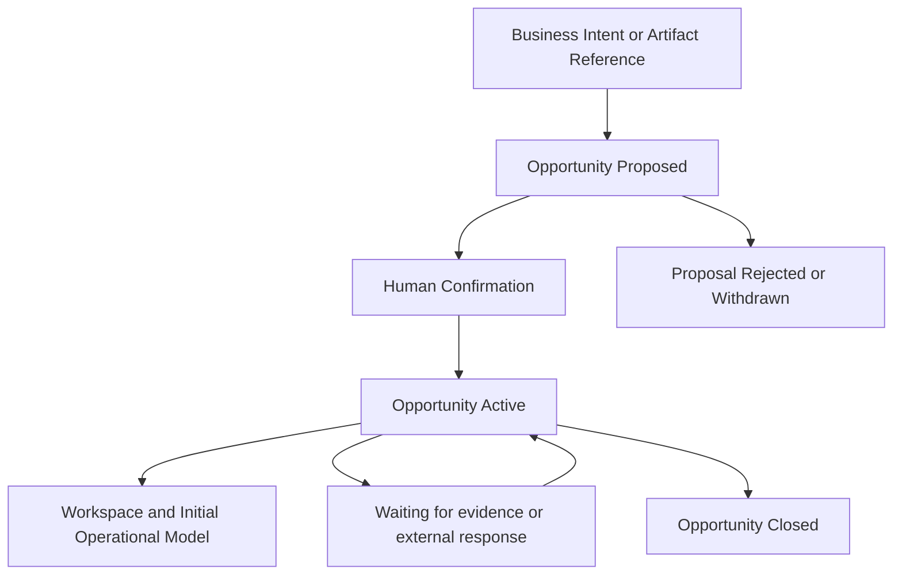

# DI-003 — Opportunity Foundation

**Status:** Proposed design architecture; documentation only.  
**Business sources:** [AR-002 Business Architecture Ratification](../architecture/AR-002_BUSINESS_ARCHITECTURE_RATIFICATION.md) and [MVP-001](../product/MVP-001_FIRST_DEMONSTRABLE_BUSINESS_VALUE.md).  
**Implementation authority:** Not granted by this document. Runtime work requires a separately accepted ratification record, contract allocation, and an open engineering gate.  
**Scope:** The minimum conceptual foundation for the first demonstrable Opportunity Lifecycle experience.

## 1. Purpose

Opportunity Foundation defines the business model required to realize the first demonstrable workflow in MVP-001: transform intent or an Artifact into a reviewable Opportunity, obtain governed confirmation, establish a durable business context, select an Opportunity Template, initialize a Dossier, and make the initial Operational Model understandable.

It supports both **Forward Operations** and **Historical Reconstruction** through one Opportunity lifecycle. Forward Operations begins with new intent or evidence. Historical Reconstruction begins with incomplete or arbitrarily ordered materials and creates confidence-qualified proposals for confirmation. Neither mode requires a separate business architecture.

DI-003 is deliberately the smallest design capable of expressing this workflow. It does not introduce the later evidence, knowledge, proposal, intelligence, or integration capabilities that may enrich it.

## 2. Aggregate Analysis

### Options considered

| Option | Strengths | Tradeoffs |
| --- | --- | --- |
| **A. Opportunity as aggregate root** | Keeps the governed unit of potential value, confirmation, template, lifecycle, and initial business context together. Supports a focused first vertical slice and allows independent opportunities to advance, wait, close, or be reconstructed without unnecessary coupling. | Requires a later concept to describe a broader commercial or customer situation that contains multiple opportunities or projects. |
| **B. Business Case as aggregate root containing Opportunities, Projects, Proposals, and context** | Can express a larger commercial narrative and shared long-term context. | Couples multiple independently governed lifecycles, decisions, projects, and possibly customers or sites into one root too early. It risks making a future cross-opportunity view dictate the consistency boundary of the first MVP. |

### Decision

**Opportunity is the DI-003 aggregate root.**

This decision follows long-term architectural consistency rather than implementation convenience. BA-001 defines Opportunity as the first governed unit of potential value, before a Project or other outcome. It is the smallest unit that can hold a meaningful proposal, confirmation, lifecycle, template, initial dossier, and explainable operational understanding. A Business Case may emerge later as a separate, broader business-continuity concept, but it is not required to make the first Opportunity accountable and understandable.

This decision intentionally does not decide the eventual relationship among multiple Opportunities, multiple Projects, customer portfolios, or cross-project knowledge. Those require evidence from future business use and must not be prematurely forced into DI-003.

## 3. Core Business Concepts

| Concept | Responsibility | Initial lifecycle meaning |
| --- | --- | --- |
| **Opportunity** | The aggregate root and governed unit of potential value. It owns its initiation, confirmation state, selected template, initial context, and lifecycle meaning. | Begins as a reviewable proposal; becomes active only through confirmation; may wait or close under governed business conditions. |
| **Business Case** | A possible future concept for a broader commercial, customer, or strategic situation containing multiple related outcomes. | Not introduced by DI-003; recorded as an evolution question. |
| **Opportunity Workspace** | The persistent business context created after Opportunity confirmation. It organizes the human-facing context for an Opportunity without becoming a separate business aggregate. | Exists for the confirmed Opportunity and makes its current context, evidence gaps, and next actions visible. |
| **Opportunity Template** | The selected business-line specialization of the core Opportunity lifecycle. It names expected evidence, workflow, requirements, milestones, dossier structure, proposal types, and vocabulary. | Assigned to an active Opportunity; may make expectations visible without changing the Opportunity Engine. |
| **Opportunity Status** | The current business lifecycle condition of the Opportunity. | Represents proposed, active, waiting, and closed conditions without claiming the full future workflow. |
| **Business Intent** | An explicit statement of a possible need, request, risk, or value. | Can initiate an Opportunity proposal even before supporting Artifacts are available. |
| **Artifact Reference** | A contextual reference to an existing or future Artifact relevant to initiation or evidence collection. | Provides provenance-aware input; it does not imply parsing, extraction, or automatic evidence sufficiency. |
| **Operational Context** | The initial explainable understanding around the Opportunity: known facts, unknowns, gaps, pending proposals, and next required actions. | Initialized after confirmation and evolves only through future governed capabilities. |
| **Initial Dossier** | The selected template's first view of requirements, available support, and missing evidence. | Starts incomplete where evidence is missing; it makes readiness visible without asserting completion. |

## 4. Opportunity Initiation

Every initiation mechanism converges into the same governed Opportunity lifecycle. Initiation supplies context for an Opportunity proposal; it never makes an Opportunity authoritative by itself.

| Mechanism | Business role in DI-003 |
| --- | --- |
| **Business Conversation** | Signals potential value, need, or demand and supplies initial context. |
| **Explicit Intent** | Lets an accountable user state a recognized business need or opportunity directly. |
| **Uploaded Artifact** | Supplies a relevant Artifact reference, not document parsing or evidence extraction. |
| **Historical Folder** | Supplies a set of contextual references for a reconstruction proposal with visible uncertainty. |
| **Email** | Supplies an externally originated conversation or Artifact reference when such intake is later authorized. |
| **WhatsApp** | Supplies a business-conversation or media reference when such intake is later authorized. |
| **Manual Creation** | Establishes an Opportunity proposal from the user's declared intent and known facts. |
| **API** | Supplies an authorized external initiation input, subject to the same proposal and confirmation semantics. |

Forward Operations and Historical Reconstruction differ only in the character and chronology of their inputs. Both produce a reviewable Opportunity proposal, identify known and unknown context, and require human confirmation before the Opportunity becomes active.

## 5. Opportunity Templates

An Opportunity Template specializes an Opportunity for a Business Line without modifying the Opportunity Engine. It conceptually defines:

- required evidence and visible evidence gaps;
- the applicable workflow and local business vocabulary;
- requirements and milestones;
- the initial Dossier structure; and
- allowable proposal types and expected confirmation points.

For the first MVP, a **Residential Solar** template is the reference specialization. It may present utility-bill, site, and customer-context expectations and the first commercial path. It does not authorize other verticals, automation, or the complete delivery lifecycle. Commercial Solar, EV Charging, Payment Acquiring, and Engineering Services remain examples of later template specialization.

## 6. Workspace and Business Context

DI-003 retains **Opportunity Workspace** as the persistent business context created after confirmation. The Workspace is the organized human-facing context for one Opportunity: it exposes the selected template, initial dossier, known facts, missing evidence, pending proposals, and next required actions.

The Workspace is not the aggregate root and is not a Business Case. It is a contextual expression of the confirmed Opportunity, not an independent commercial container. This preserves the MVP promise of a shared place to understand the work without deciding future questions about portfolios, multiple projects, or cross-opportunity continuity.

## 7. Initial Operational Model

Immediately after an Opportunity is confirmed, its Operational Context initializes the first Evidence-backed Operational Model. It contains only what is meaningfully available:

| Model element | Initial meaning |
| --- | --- |
| **Known facts** | The confirmed business intent, accountable owner, selected template, and attributable initiation context. |
| **Unknown facts** | Material customer, site, commercial, technical, or timing facts not yet established. |
| **Missing evidence** | Template-relevant evidence that is absent, insufficient, or not yet reviewed. |
| **Pending proposals** | Reviewable options or requests that have not received required confirmation. |
| **Next required actions** | The business actions needed to reduce uncertainty, satisfy an initial requirement, request evidence, or prepare a later proposal. |

The initial model is intentionally incomplete. It is an explainable starting point, not a claim that the business situation has been fully understood or reconstructed.

## 8. Lifecycle

The transition from **Proposed** to **Active** requires Human Confirmation. Closing an active Opportunity requires the applicable accountable confirmation because it determines the business outcome and preserves the reason for closure. Entering or leaving a material Waiting condition requires governed business treatment; the first MVP records it as context and does not define a complete waiting-policy engine. Template assignment and initial dossier creation occur for the confirmed Opportunity and remain attributable to its context and authority.

## 9. Events

The first conceptual business events make lifecycle changes and their reasons understandable. They are event meanings, not technical event schemas.

- **Opportunity Proposed:** a new potential business situation has been expressed with its initiating context.
- **Opportunity Confirmed:** an authorized actor has confirmed that the proposal is now an active Opportunity.
- **Opportunity Workspace Created:** the persistent business context for the confirmed Opportunity has been established.
- **Opportunity Template Assigned:** a Business Line template has been selected to make expectations visible.
- **Initial Dossier Created:** the first requirements, available support, and evidence gaps have been organized.
- **Operational Model Initialized:** known facts, unknowns, missing evidence, pending proposals, and next required actions have been made explainable.
- **Artifact Requested:** an evidence gap has been translated into a request for a relevant Artifact or business input.

## 10. Boundaries

DI-003 intentionally excludes:

- OCR and document parsing;
- evidence extraction or verification automation;
- Marketplace or ERP integration;
- Historical Reconstruction automation;
- Predictive or Operational Intelligence;
- Supplier optimization;
- automatic proposal generation;
- Financial analytics or settlement;
- automatic engineering generation;
- connector implementation for email, WhatsApp, upload, or API intake;
- autonomous authoritative transitions; and
- the full long-term Business Case model.

These capabilities belong to later, separately reviewed and authorized design packages. Artifact references in DI-003 provide context only; they do not expand the Document Registry, connector, storage, or parsing boundary.

## 11. Mapping to Future Packages

DI-003 prepares later capability packages without implementing them.

| Future package direction | Prepared by DI-003 | Not implemented by DI-003 |
| --- | --- | --- |
| **DI-004: Artifact Intake** | The need to associate initiation context and requested Artifacts with an Opportunity. | Acquisition, transfer, storage, parsing, or connector behavior. |
| **DI-005: Evidence Engine** | Initial dossier gaps, requirement context, and evidence-purpose expectations. | Evidence sufficiency, verification, confidence calculation, or conflict resolution. |
| **DI-006: Knowledge Engine** | Known/unknown facts and the initial Operational Model. | Extraction, interpretation, inference, or reconstruction intelligence. |
| **DI-007: Proposal Engine** | The distinction between an Opportunity proposal, later business proposals, confirmation, and decisions. | Automatic proposal generation, decision automation, or policy evaluation. |

## 12. Acceptance Criteria

The design succeeds when MVP-001's business workflow can be completed end to end:

1. A user introduces business intent or a contextual Artifact reference.
2. A reviewable Opportunity proposal clearly identifies its initial context and uncertainty.
3. An accountable actor confirms the Opportunity.
4. An Opportunity Workspace is established.
5. A Residential Solar Opportunity Template is selected.
6. An initial Dossier makes available and missing evidence visible.
7. An initial Operational Model explains known facts, unknowns, pending proposals, and next actions.
8. The user can understand what Opportunity exists and what needs to happen next without relying on informal memory.

## 13. Risks and Open Decisions

- **Business Case evolution:** A future broader commercial or customer context may be needed, but DI-003 must not make it the initial consistency boundary without operational evidence.
- **Multiple Opportunities:** The rules for related or competing opportunities require future business decisions.
- **Multiple Projects:** An Opportunity may later lead to one, several, or no projects; DI-003 does not decide that relationship.
- **Cross-project knowledge:** Shared knowledge may become valuable, but it must not transfer authority or erase context.
- **Long-term operational memory:** The enduring relationship among Opportunities, Projects, Operations, and historical context needs later architecture.
- **Authority details:** The first confirmation role and any separation-of-duties requirement must be agreed before runtime work.
- **Template governance:** The process for changing a live Opportunity Template remains a future governance decision.

## Conclusion

DI-003 selects Opportunity as the first aggregate root and defines the minimal conceptual foundation for MVP-001. It turns intent or an Artifact reference into a confirmed Opportunity, a Workspace, a selected template, an initial dossier, and an explainable initial Operational Model. It remains a proposed design and does not itself authorize runtime implementation.
