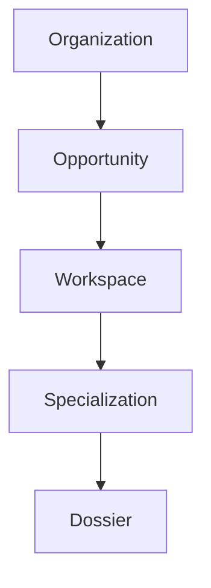
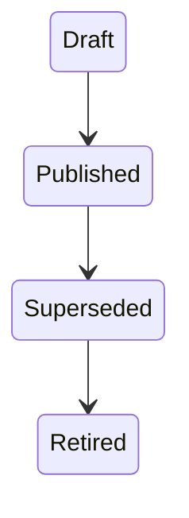
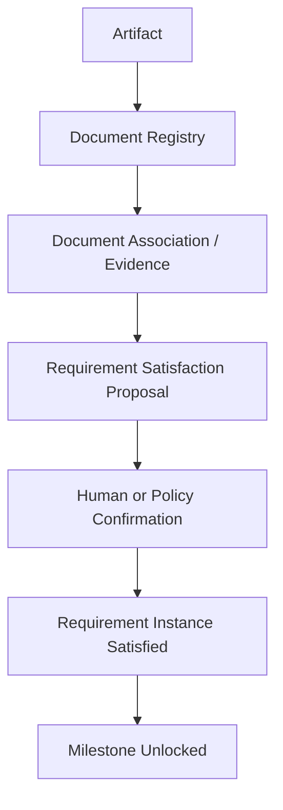

# DR-001 — Dossier Template, Requirement & Milestone Model

**Status:** Proposed design review; no implementation authorization.  
**Scope:** The conceptual model for future Dossier Templates, Requirements, and Milestones.  
**Authority:** AR-002, BA-001, MVP-001, DI-003, IG-002, and EP-001.

## 1. Decision Context

The current authoritative hierarchy is:

Capability 04 established the Dossier as the authoritative **Business Residence** for future governed process information. C05 and later need a stable distinction between reusable Template Definitions and tenant-local Requirement and Milestone Instances. The Dossier remains a business structure, never a file store, document repository, or Evidence store.

## 2. Business Semantics

| Concept | Meaning |
| --- | --- |
| Opportunity Template | The Business Line specialization selected for an Opportunity. |
| Dossier Template | The versioned process blueprint selected by that specialization. |
| Requirement Definition | A reusable statement of what must, may, or need not be established. |
| Requirement Instance | The Dossier-specific obligation instantiated from a published definition. |
| Milestone Definition | A reusable governed checkpoint and its dependencies. |
| Milestone Instance | The Dossier-specific checkpoint instantiated from a published definition. |
| Requirement Satisfaction | An attributable proposal that sufficient governed evidence exists. |
| Milestone Unlocking | The governed consequence of satisfied dependencies and required confirmation. |

A definition is reusable; an instance is an obligation for one Dossier; Evidence may support an obligation; confirmation is what makes satisfaction authoritative.

## 3. Alternatives

| Option | Assessment |
| --- | --- |
| A — Direct Dossier Ownership | Simple initially, but combines reusable policy with local history; weak auditability and unsafe template evolution. |
| B — Versioned Template Definitions and Dossier Instances | Separates reusable definitions from local obligations; strongest auditability, vertical specialization, reconstruction support, and policy governance. |
| C — Hybrid Live Reference Model | Reduces copying but lets live definition changes alter historical meaning; unsuitable for governed history. |

## 4. Decision Criteria

The model must prevent silent Dossier change, explain every Requirement and Milestone, reuse definitions, keep instances tenant-local, preserve Document Registry/Evidence ownership, reject filesystem authority, retain Human Confirmation where required, and avoid a generic workflow or rule engine in the MVP.

## 5. Recommended Model

**Decision: Option B — Versioned Template Definitions and Dossier Instances.**

Opportunity Template and Dossier Template are separate concepts: the former identifies business specialization; the latter provides a published, versioned blueprint for governed obligations and checkpoints. A Dossier binds to one immutable published Dossier Template version. Requirement and Milestone Instances snapshot the relevant definition semantics and retain template-version provenance.

Definitions are amendable only by publishing a new version. Existing Dossiers remain bound to their original version. Moving a Dossier to another version is a future governed action, never an automatic update.

## 6. Template Versioning

Only Published versions may be assigned. Published versions are immutable; changed rules require a new version. Superseded versions remain readable for their bound Dossiers. Retired versions cannot serve new assignments but preserve historical interpretation.

## 7. Requirement Model

A Requirement Definition has identity, stable semantic key, title, purpose, mandatory/optional classification, applicability condition, expected Evidence category, verification requirement, Milestone dependencies, and Template-version provenance.

A Requirement Instance is `pending`, `partially_satisfied`, `satisfied`, `waived`, or `not_applicable`. Waiver and not-applicable decisions require future explicit governance. Conditions and policy language are not defined here.

## 8. Milestone Model

A Milestone Definition has identity, stable semantic key, title, purpose, required Requirement dependencies, predecessor Milestones, confirmation requirement, and Template-version provenance. A Milestone Instance is `locked`, `available`, or `achieved`; invalidation/supersession requires future governed behavior. Milestones are checkpoints, not general workflow states.

## 9. Evidence Relationship

Dossiers do not store binaries and Requirements do not own Documents. Evidence may support several Requirements, and one Requirement may require several evidence items. Satisfaction must remain attributable, explainable, and governed by future Evidence and confirmation capabilities.

## 10. Example Vertical Models

Residential Solar may use CFE bill, customer identity, site location, and signed commercial acceptance requirements; illustrative milestones include Initial Assessment Ready, Commercial Proposal Ready, and Opportunity Converted.

EV Charging may use fleet profile, site location, electrical-capacity information, and charger assumptions; illustrative milestones include Assessment Ready, Configuration Ready, and Proposal Ready. These examples do not freeze vertical checklists.

## 11. Historical Reconstruction

When evidence arrives late or a historical project lacks a recorded Template version, reconstruction selects an explicitly qualified template hypothesis, instantiates proposed obligations, and proposes retrospective Milestones. It preserves uncertainty and never silently manufactures authoritative satisfaction or history.

## 12. Boundaries

Deferred: runtime Requirements and Milestones; generic workflow/policy engines; condition language; evidence extraction; Document Associations; Artifact Intake; template administration UI; template migration commands; completeness calculations; and automatic milestone achievement.

## 13. Decision Record

Option B is selected. Options A and C are rejected because they merge reusable policy with local history or permit live definitions to alter historical meaning. Binding rules are immutable published template versions, immutable Dossier bindings, snapshot/provenance-bearing instances, tenant-local obligations, external Evidence ownership, and confirmed authoritative satisfaction. C05 must establish versioned definitions; C06 and C07 instantiate Requirements and Milestones. Policy semantics, migration authority, and final vertical checklists remain unresolved.

## 14. Capability Sequencing Recommendation

1. **C05 — Versioned Dossier Template Definitions**
2. **C06 — Requirement Instance Bootstrap**
3. **C07 — Milestone Instance Bootstrap**
4. **C08 — Dossier Readiness Projection**
5. **C09 — Artifact / Document Association Intake**

This recommendation does not authorize any capability.
