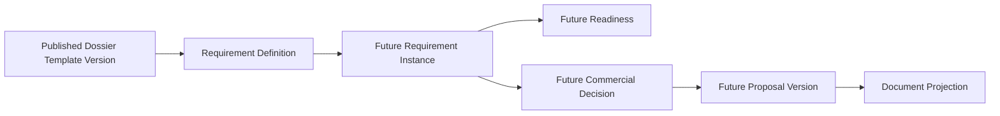
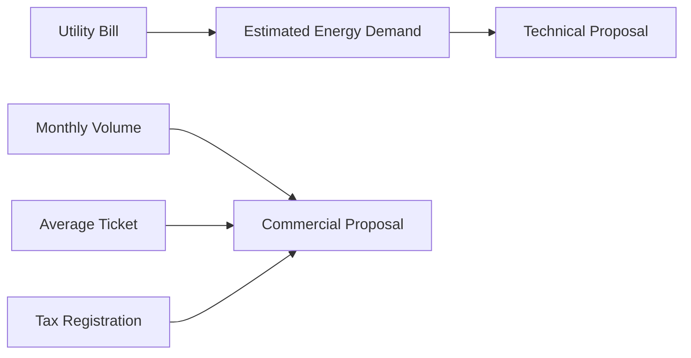

# DR-002 — Requirement Definition Semantic Model

**Status:** Design review; non-authorizing.
**Authority:** [AR-002](../architecture/AR-002_BUSINESS_ARCHITECTURE_RATIFICATION.md), [AR-003](../architecture/AR-003_PROCESS_ARCHITECTURE_RATIFICATION.md), and [AR-004](../architecture/AR-004_PLATFORM_EVOLUTION_ROADMAP.md).
**Scope:** Semantic language for future Requirement Definitions; no persistence or runtime behavior.

## 1. Purpose and Motivation

A Requirement is a governed business obligation that must be provided, derived, verified, or confirmed before a specific business decision becomes authorized. It is not a document, workflow step, task, milestone, checklist item, PDF, or form.

The platform now has governed Opportunity, Workspace, Dossier, and published Dossier Template Version identities. The next Process capability needs a reusable language for obligations that works across business verticals without embedding vertical-specific logic.

## 2. Architectural Position

Definitions describe reusable process meaning. Future instances are tenant-local, Dossier-specific obligations. A Dossier must bind to one published Template Version so later template changes cannot silently change the meaning of historical obligations.

## 3. Design Alternatives

| Model | Assessment |
| --- | --- |
| Document-centric checklist | Rejected: a document may support several obligations and an obligation may need no document. |
| Workflow-step model | Rejected: sequences describe execution, while Requirements describe what must be established irrespective of process route. |
| Task model | Rejected: tasks are assigned work; an obligation may outlive, require, or be satisfied without a particular task. |
| One generic category field | Rejected: it conflates what a Requirement concerns with how it becomes fulfilled. |
| Semantic subject plus fulfillment modes | Selected: preserves reusable meaning while allowing multiple attributable paths to satisfaction. |

## 4. Selected Semantic Model

A Requirement Definition has a stable semantic identity, purpose, applicability, expected supporting information, fulfillment modes, verification/confirmation expectation, dependency relationships, and published-template provenance. It does not contain a document, workflow, or implementation rule.

The proposed categories—Identity, Evidence, Business Data, Derived Knowledge, and Human Decision—are **semantic subjects**, not mutually exclusive fulfillment states. They express what business concern is being established. A Requirement may use one primary subject and associated qualifiers; it must not become a vertical-specific enum disguised as architecture.

Fulfillment modes are orthogonal:

| Mode | Meaning | Authoritative support | Future readiness meaning |
| --- | --- | --- |
| Provided | An accountable source supplies business information. | Attributable Artifact, System-of-Record fact, or governed attestation. | Available for verification. |
| Derived | A governed derivation produces a conclusion from attributable inputs. | Provenance to inputs, method, and version. | Available for verification; never silently authoritative. |
| Verified | An authorized actor validates adequacy or correctness. | Verification decision and support. | May satisfy a verification-required obligation. |
| Confirmed | An accountable authority accepts a consequential business conclusion. | Confirmation decision, actor, authority, and rationale. | May authorize dependent decision or milestone behavior. |

## 5. Dependencies

Requirements form a directed business-dependency graph because the dependency is semantic, not a workflow route.

For Energy Fotónica, a utility bill can support derived estimated demand, which supports a technical proposal. For NetPay, monthly volume, average ticket, and tax registration can support a commercial proposal. The same graph model explains both; it does not prescribe their workflow sequence, task assignment, or evidence technology.

## 6. Business and Historical Meaning

Requirement Definition and Requirement Instance remain separate. A published definition is reusable, versioned process meaning; an instance is one Dossier’s historical obligation. Historical reconstruction must identify a qualified template hypothesis and propose obligations with visible uncertainty. It cannot silently assert that a Requirement was satisfied or alter the historical definition.

Requirements enable future Readiness by expressing which obligations are pending, supported, verified, confirmed, waived, or inapplicable under future authorized governance. They enable Commercial Decisions by establishing what business inputs and confirmations are necessary before a proposal may be authorized.

## 7. Commercial Engine Observation

Commercial Proposals are future business aggregates. Requirements enable Commercial Decisions; Commercial Decisions generate Proposal versions. Proposal documents are projections of business state, not the authoritative state itself. This observation establishes a future architectural dependency only; it authorizes no Commercial Engine, Proposal Engine, or document generation.

## 8. Architectural Invariants

- Requirement ≠ Document.
- Requirement ≠ Workflow.
- Requirement ≠ Task.
- Requirement ≠ Milestone.
- Requirement Definition ≠ Requirement Instance.
- Proposal ≠ PDF.
- Business Aggregate → Projection → Document.
- Filesystem hierarchy is never authoritative.
- Definitions are reusable and versioned; instances preserve Dossier-local historical meaning.
- Satisfaction, verification, and confirmation remain attributable and explainable.

## 9. Explicitly Deferred

This review does not design Requirement persistence, instances, Milestones, Readiness algorithms, Commercial or Proposal Engines, rules or policy engines, Evidence, Knowledge, AI, OCR, integrations, settlement, or execution workflows.

## 10. Future Implications and Recommended Documents

The recommended next architectural record is **AR-005 — Requirement Definition Architecture Ratification**. Its scope should ratify the semantic-subject and fulfillment-mode distinction, definition/instance separation, template-version provenance, dependency-graph meaning, and Commercial Decision observation. A subsequent bounded implementation design and gate may then authorize C06 Requirement Instance Bootstrap.

## Related Records

- [DR-001 — Dossier Template, Requirement and Milestone Model](DR-001_DOSSIER_TEMPLATE_REQUIREMENT_AND_MILESTONE_MODEL.md)
- [DI-003 — Opportunity Foundation](DI-003_OPPORTUNITY_FOUNDATION.md)
- [EP-001 — Engineering Governance](../engineering/EP-001_ENGINEERING_GOVERNANCE_AND_DEVELOPMENT_PRACTICES.md)
