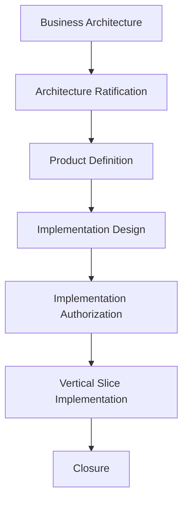

# EP-001 — Engineering Governance & Development Practices

**Status:** Engineering governance standard.  
**Scope:** Repository-wide engineering process.  
**Authority:** Applies under the Constitution, ratified architecture, applicable ADRs, and approved implementation gates.  
**Non-authorizing:** This document defines how engineering work is performed; it does not authorize product scope or runtime implementation.

## 1. Purpose

Engineering Practices make delivery repeatable, reviewable, and safe as YARVIS evolves. They preserve the distinction between deciding what the platform means, deciding what work is allowed, and executing that work.

- **Product Governance** defines intended business value, outcomes, priorities, and acceptance from a user or business perspective.
- **Engineering Governance** defines the standards for designing, building, validating, documenting, reviewing, and evolving the system.
- **Implementation Governance** authorizes a bounded implementation package through ratified architecture, contracts, designs, gates, and acceptance criteria.

No layer substitutes for another. A useful product idea is not implementation authority; passing tests do not ratify architecture.

## 2. Engineering Principles

- **Business-first engineering:** begin with the business outcome and authoritative owner, not a technology preference.
- **Evidence-driven engineering:** use repository evidence, validation results, and explicit decisions rather than assumptions.
- **Architecture before implementation:** establish boundaries, authority, invariants, and non-goals before runtime changes.
- **Value over infrastructure:** prioritize a demonstrable business slice over isolated technical activity.
- **Explainability:** preserve why a state exists, who authorized it, and what evidence supports it.
- **Deterministic behavior:** equivalent authorized requests must produce predictable, tenant-safe outcomes.
- **Incremental delivery:** deliver small, independently verifiable slices that leave the system usable.
- **Governed evolution:** extend and specialize ratified architecture; do not silently replace it.
- **Long-term maintainability:** favor clear ownership, explicit contracts, reversible migrations, and readable history over short-lived convenience.

## 3. Governed Vertical Slice Development

| Stage | Responsibility |
| --- | --- |
| Business Architecture | Defines enduring business concepts, boundaries, principles, and vocabulary. |
| Architecture Ratification | Records explicit architectural consensus and the governing conceptual direction. |
| Product Definition | States the demonstrable value, user outcome, and acceptance intent. |
| Implementation Design | Translates authorized architecture into bounded contracts, persistence, behavior, and non-goals. |
| Implementation Authorization | Opens a named engineering gate with prerequisites, scope, and exit evidence. |
| Vertical Slice Implementation | Delivers an end-to-end, observable increment within that gate. |
| Closure | Verifies scope, validation, documentation, and release readiness; it does not invent new scope. |

## 4. Value Slice Rule

Every implementation package must produce observable business value or directly complete an already-authorized vertical slice required to demonstrate that value. Infrastructure-only activity is not a completed package merely because it compiles or deploys. Necessary enabling work must remain explicitly traceable to a bounded value outcome and close with the slice it enables.

## 5. Implementation Budget

Each package implements the minimum sufficient behavior to meet its acceptance criteria.

- Avoid speculative abstractions, generalized engines, and unrequested extension points.
- Avoid premature optimization that obscures the business model or complicates validation.
- Defer future capabilities explicitly instead of approximating them with partial behavior.
- Preserve architectural extensibility through clear boundaries and invariants, not unused code.
- Stop and defer when a decision depends on a future capability or missing authority.

## 6. Commit Taxonomy

Commit prefixes identify the kind of governed change. They do not themselves confer authority.

| Category | Purpose |
| --- | --- |
| `BA` | Business Architecture concepts, vocabulary, and business-model evolution. |
| `AR` | Architecture ratification, decisions, reviews, or governance records. |
| `MVP` | Product-definition and demonstrable-value artifacts. |
| `DI` | Authorized implementation-design work and its governed runtime slice. |
| `IG` | Implementation-gate authorization or authorization evidence. |
| `Sxx` | A bounded implementation sub-slice, where `xx` identifies the approved sequence. |
| `Z` | Closure validation, cleanup, and final conformance evidence for an approved package. |

Commit messages should name the governed package and describe the completed outcome. A closure commit must not contain unreviewed feature work.

## 7. Test Execution Discipline

Validation proceeds incrementally so failures are isolated near their cause and feedback remains useful.

1. Run the focused test or check while developing a behavior.
2. Use a last-failed workflow to diagnose and correct the immediate regression.
3. Run the focused suite for the package or capability.
4. Run affected regression suites for shared boundaries, contracts, persistence, and runtime composition.
5. At closure, run the complete required regression set.
6. Run compilation, migration upgrade/downgrade and head validation where applicable, and `git diff --check`.

Tests are evidence, not a substitute for design review. Each validation command and outcome should be recorded in the closure report. Docker or the repository-approved runtime environment is used when local environments are not authoritative or reproducible.

## 8. Scope Audit

Before every package or slice closure, verify:

- the implemented behavior is inside the authorized scope;
- no unauthorized capability is present or implied as complete;
- documentation, contracts, and current-state records describe repository reality;
- implementation conforms to the applicable architecture and design;
- models, migrations, constraints, and downgrade paths agree where persistence changed; and
- OpenAPI, routes, runtime registration, and client contracts agree when public interfaces are in scope.

## 9. Definition of Done

A slice is complete only when its implementation is finished, required validation passes, and the intended business value is demonstrable. Its documentation must be updated as authorized, its scope audit must be complete, and the working tree must be clean apart from explicitly reviewed changes awaiting the approved commit. Deferred work must remain deferred and visible.

## 10. Documentation Hierarchy

| Artifact | Role |
| --- | --- |
| `AR` | Records ratified architectural direction and governance decisions. |
| `BA` | Defines durable business concepts, vocabulary, and business architecture. |
| `MVP` | Defines the smallest demonstrable business value and acceptance outcome. |
| `DI` | Defines a bounded implementation design consistent with higher authority. |
| `IG` | Opens or records the implementation gate for a specific authorized package. |
| `EP` | Defines repository-wide engineering practices for executing and validating governed work. |

The Constitution and ratified architecture remain higher authority. Lower documents specialize or implement higher documents; they do not silently redefine them.

## 11. Prompt Conventions

Implementation prompts should make the governing context and boundaries explicit. The standard structure is:

1. **Review** — authoritative documents and current worktree facts to inspect.
2. **Objective** — the precise intended outcome.
3. **Scope** — allowed work and explicit exclusions.
4. **Validation** — commands, evidence, and expected checks.
5. **Deferred Scope** — future work that must not be introduced.
6. **Acceptance** — observable completion criteria.
7. **Report** — required results, changed files, blockers, and commit instruction.

Prompts must not use ambiguity to broaden authority. They should state whether staging, committing, migrations, public interfaces, or external changes are permitted.

## 12. Engineering Invariants

- Business before technology.
- Evidence before assumptions.
- Authorization before implementation.
- Architecture before integration.
- Explainability over opacity.
- Deterministic behavior and tenant-safe isolation.
- One authoritative source of truth for every business capability.
- Vertical slices over disconnected technical layers.
- Historical state remains interpretable; approved history is not silently rewritten.
- Automation supports governed authority and never infers it.

## 13. Future Engineering Practices

The following documents may refine this standard without redefining it:

- **EP-002 — Testing Strategy**
- **EP-003 — Git Strategy**
- **EP-004 — Documentation Standards**
- **EP-005 — Prompt Engineering Standards**

They remain future work until separately proposed, reviewed, and accepted through the applicable governance path.
