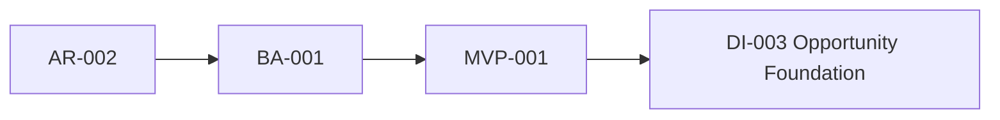
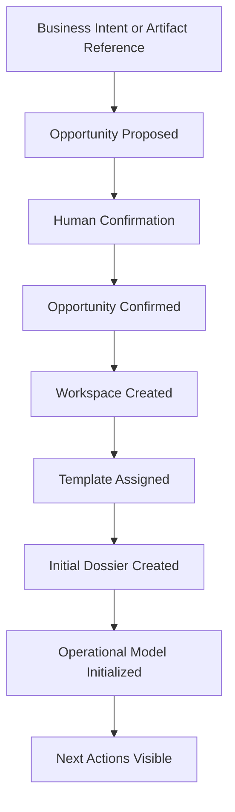

# IG-002 — DI-003 Opportunity Foundation Implementation Authorization

**Status:** Approved implementation gate.  
**Authorized work package:** DI-003 — Opportunity Foundation only.  
**Authority chain:** AR-002 Business Architecture Ratification → BA-001 → MVP-001 → DI-003.  
**Scope boundary:** This gate authorizes only the capabilities listed below; it does not authorize adjacent DI packages or platform expansion.

## 1. Purpose

Implementation authorization exists to turn a ratified business direction into a bounded, verifiable engineering package. DI-003 is the first implementation package of the Opportunity Lifecycle Engine. It must deliver the first demonstrable business value defined by MVP-001 while remaining consistent with the BA-001 business architecture and the governing ratification framework.

## 2. Authorized Scope

DI-003 is authorized to implement only the capabilities required to satisfy MVP-001:

- Opportunity aggregate and initial lifecycle;
- Opportunity proposal;
- governed Human Confirmation;
- Opportunity Workspace;
- Opportunity Template assignment;
- Initial Dossier creation;
- Operational Model initialization;
- Business Intent;
- Artifact Reference; and
- initial business events.

These capabilities are sufficient for the first complete business experience: intent or Artifact Reference becomes a reviewable Opportunity, an accountable actor confirms it, and the resulting Workspace, template, dossier, and Operational Model make the next actions visible.

## 3. Explicitly Unauthorized Scope

DI-003 shall not introduce:

- OCR or document parsing;
- an Evidence Engine or Knowledge Engine;
- Proposal Engine automation or AI reasoning;
- Marketplace, ERP, connector, or OpenSolar integrations;
- Historical Reconstruction automation;
- Financial, Supplier, or Operational Intelligence;
- automatic engineering generation;
- autonomous business decisions or authoritative lifecycle transitions; or
- a Business Case aggregate.

These belong to future DI packages and receive no implementation authority from IG-002.

## 4. Architectural Constraints

Implementation shall preserve:

- Opportunity as the aggregate root;
- governed Human Confirmation before authoritative lifecycle transition;
- explainable and attributable business state;
- immutable Artifacts and attributable Artifact References;
- chronology-independent future evolution without implementing reconstruction automation;
- Opportunity Templates as Business Line specialization rather than a replacement engine;
- initialization, rather than premature completion, of the Operational Model;
- the possibility of a future Business Case concept; and
- the possibility of future Historical Reconstruction without creating a parallel architecture.

## 5. Implementation Budget

DI-003 implements only what MVP-001 requires.

- Do not implement speculative abstractions.
- Avoid premature optimization.
- Do not introduce generalized workflow or rule engines.
- Do not build future integrations.
- Favor understandable business behavior over technical completeness.
- Keep every model, command, view, event, and test traceable to the authorized workflow.

## 6. Acceptance Criteria

The following workflow must complete end to end:

The result is accepted only when a business user can understand the Opportunity, its template and evidence gaps, its initial Operational Model, and its next required actions without relying on informal memory.

## 7. Required Validation

Implementation shall follow repository standards and validate:

- exact authority enforcement and tenant concealment;
- persisted idempotency, replay, and conflict behavior;
- deterministic behavior and aggregate consistency;
- lifecycle correctness and optimistic concurrency where applicable;
- business-event persistence with aggregate changes;
- regression protection; and
- scope conformance: no unauthorized capability is introduced.

## 8. Implementation Order

Each increment must leave the system runnable and preserve the authorized scope.

| Increment | Authorized focus |
| --- | --- |
| **Sprint 1** | Opportunity aggregate, Business Intent, Artifact Reference, and initial lifecycle. |
| **Sprint 2** | Opportunity proposal and governed Human Confirmation. |
| **Sprint 3** | Opportunity Workspace. |
| **Sprint 4** | Opportunity Template assignment and Initial Dossier. |
| **Sprint 5** | Initial Operational Model and visible next actions. |
| **Sprint 6** | Initial business events, full workflow validation, and closure evidence. |

## 9. Closure Criteria

DI-003 may close only after:

- all authorized capabilities are implemented;
- the MVP-001 workflow and business acceptance criteria are satisfied;
- focused and relevant regression validation passes;
- architecture consistency is verified against AR-002, BA-001, MVP-001, and DI-003;
- current documentation records the resulting state; and
- a scope audit confirms that no unauthorized capability was introduced.

## 10. Deferred Capabilities

The following future packages receive no implementation authority from IG-002:

| Future package | Deferred capability |
| --- | --- |
| **DI-004** | Artifact Intake |
| **DI-005** | Evidence Engine |
| **DI-006** | Knowledge Engine |
| **DI-007** | Proposal Engine |
| **DI-008** | Historical Reconstruction |
| **DI-009** | Operational Intelligence |

## 11. Risks

- **Aggregate evolution:** the future need for a Business Case must not cause DI-003 to over-broaden Opportunity.
- **Business relationships:** a future relationship model may connect customers, sites, Opportunities, and Projects more richly.
- **Cross-opportunity knowledge:** shared knowledge must not silently transfer authority or context.
- **Long-term operational memory:** later architecture must preserve continuity across Opportunities, Projects, Operations, and history.
- **Template governance:** live-template amendment and versioning require later governance decisions.
- **Multi-project support:** an Opportunity may ultimately lead to multiple projects, but DI-003 must not model that future prematurely.

## Conclusion

IG-002 authorizes the bounded DI-003 Opportunity Foundation implementation. It authorizes the first demonstrable MVP-001 business workflow and no broader platform capability. All later evidence, knowledge, proposal, reconstruction, intelligence, connector, and integration work remains deferred.
