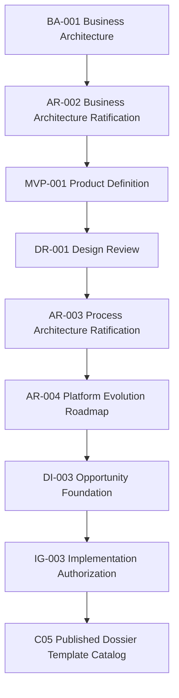
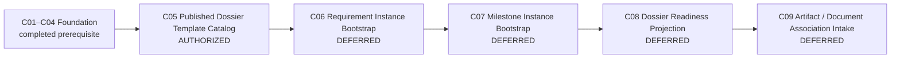

# IG-003 — Process Engine Implementation Authorization

**Status:** Approved implementation gate.
**Authorized work package:** DI-003 Capability 05 — Published Dossier Template Catalog only.
**Engineering standard:** [EP-001 — Engineering Governance & Development Practices](EP-001_ENGINEERING_GOVERNANCE_AND_DEVELOPMENT_PRACTICES.md).
**Implementation authority:** This document opens C05 only. It does not authorize C06–C09 or any later platform layer.

## 1. Purpose

IG-003 authorizes the second architectural layer of the platform: the Process Engine. It follows the Foundation capabilities C01–C04 and establishes the bounded implementation gate for the first Process capability: a catalog of versioned, immutable, published Dossier Template Versions.

The business value is precise: YARVIS can identify and preserve the exact published process blueprint that governs a future Dossier. This authorization does not introduce Requirements, Milestones, Evidence, or workflow execution.

## 2. Authority Chain

Architecture Ratification records governing architectural decisions. Implementation Design defines bounded behavior and contracts. Implementation Authorization opens implementation authority. Only an IG document grants implementation authority; neither this authority chain nor a passing validation suite extends the authorized scope.

The governing sources are [AR-002 — Business Architecture Ratification](../architecture/AR-002_BUSINESS_ARCHITECTURE_RATIFICATION.md), [AR-003 — Process Architecture Ratification](../architecture/AR-003_PROCESS_ARCHITECTURE_RATIFICATION.md), [AR-004 — Platform Evolution Roadmap](../architecture/AR-004_PLATFORM_EVOLUTION_ROADMAP.md), [DR-001 — Dossier Template, Requirement and Milestone Model](../design/DR-001_DOSSIER_TEMPLATE_REQUIREMENT_AND_MILESTONE_MODEL.md), [MVP-001 — First Demonstrable Business Value](../product/MVP-001_FIRST_DEMONSTRABLE_BUSINESS_VALUE.md), and [DI-003 — Opportunity Foundation](../design/DI-003_OPPORTUNITY_FOUNDATION.md).

## 3. Authorized Capability and Boundary

Implementation authority is open exclusively for **DI-003 Capability 05 — Published Dossier Template Catalog**.

The C05 implementation may establish a Dossier Template aggregate, stable Template identity, immutable published Template Versions, publication and retirement lifecycles, deterministic version identity and retrieval, business events, tenant isolation, durable idempotency, optimistic concurrency, rollback validation, and migration validation.

Existing Dossiers remain valid. C05 must not automatically bind, backfill, migrate, or otherwise alter them.

## 4. Authorized Contracts

| Contract ID | Name | Boundary |
| --- | --- | --- |
| `IC-DOSSIER-TEMPLATE-CMD-001` | Publish Dossier Template Version | Governed publication of one immutable version. |
| `IC-DOSSIER-TEMPLATE-CMD-002` | Retire Dossier Template Version | Governed retirement of one eligible published version. |
| `IC-DOSSIER-TEMPLATE-QRY-001` | Retrieve Template Version | Authoritative tenant-local retrieval by Template identifier. |
| `IC-DOSSIER-TEMPLATE-QRY-002` | Retrieve Published Template Version | Authoritative tenant-local retrieval by stable key and version. |

These IDs remain subject to repository-wide uniqueness and ownership verification before implementation. No conflicting allocation was found in the current repository reference scan; implementation must repeat the canonical-catalog check before registering them.

## 5. Authorized and Unauthorized Scope

| Authorized in C05 | Explicitly unauthorized |
| --- | --- |
| Dossier Template aggregate and stable Template identity | Requirement Definitions or Instances |
| Published immutable Template Versions and version identity | Milestone Definitions or Instances |
| Publication and retirement lifecycle | Readiness calculations, workflow execution, policy or rule engines, conditional expressions |
| Authoritative retrieval, events, tenant isolation, durable idempotency, optimistic concurrency | Artifact associations, Evidence, Knowledge, Operational Models, intelligence layers |
| Rollback, concurrency, migration, and affected regression validation | Generic template engines, plugin architectures, dynamic registries, template UI, listing, search, cloning, migration, deletion, or purge |
| Preservation of existing Dossiers without automatic rebinding | Business Case, Marketplace, ERP integrations, AI, OCR, Historical Reconstruction |

Implementation is limited to the minimum sufficient MVP behavior. It shall not introduce generic engines, speculative extensibility, reusable policy engines, or workflow engines.

## 6. Engineering Invariants

C05 implementation shall preserve:

- immutable published Template Versions;
- deterministic, explainable, tenant-isolated behavior;
- authoritative retrieval with concealed cross-tenant and missing-resource behavior;
- System-of-Record and Business Residence boundaries;
- optimistic concurrency and durable replay determinism;
- rollback safety and historical immutability; and
- the AR-003 rule that changed process rules require a new Template Version rather than in-place mutation.

Published versions may remain historically valid after supersession or retirement. Retirement prevents future assignment without invalidating any future governed binding. Automatic supersession is not authorized unless separately established by an approved publication rule.

## 7. Validation Requirements

Capability closure requires evidence for:

- exact authority and tenant concealment;
- publication, retirement, deterministic retrieval, replay, and conflict behavior;
- durable idempotency, post-lock receipt recheck where a real race requires it, and tenant isolation;
- forced rollback and deterministic concurrent publication and retirement behavior;
- migration upgrade, downgrade, and round trip; affected regression; compilation; and `git diff --check`.

No capability closes merely because an aggregate persists. The validation must prove that events, state transitions, receipts, and rollback form one governed outcome.

## 8. Closure Checklist

- [ ] C05 conforms to [DR-001](../design/DR-001_DOSSIER_TEMPLATE_REQUIREMENT_AND_MILESTONE_MODEL.md), [AR-003](../architecture/AR-003_PROCESS_ARCHITECTURE_RATIFICATION.md), and [AR-004](../architecture/AR-004_PLATFORM_EVOLUTION_ROADMAP.md).
- [ ] Stable key and version uniqueness, publication immutability, and historical safety are enforced.
- [ ] Publication, retirement, retrieval, authority, concealment, idempotency, rollback, and concurrency evidence pass.
- [ ] Migration and affected regression evidence pass.
- [ ] Scope audit confirms that deferred capabilities remain absent.
- [ ] Closure records the validation evidence without introducing new scope.

## 9. Deferred Capabilities

The Process Engine authorization envelope identifies, but does not open, the following future capabilities:

| Capability | Status under IG-003 |
| --- | --- |
| C06 — Requirement Instance Bootstrap | Explicitly unauthorized pending an implementation prompt and gate decision. |
| C07 — Milestone Instance Bootstrap | Explicitly unauthorized pending an implementation prompt and gate decision. |
| C08 — Dossier Readiness Projection | Explicitly unauthorized pending an implementation prompt and gate decision. |
| C09 — Artifact / Document Association Intake | Explicitly unauthorized pending an implementation prompt and gate decision. |

Each requires an explicit future implementation prompt and its scope must remain within the Process Engine architecture established here. Completion of the Process Engine does not authorize Evidence Engine, Knowledge Engine, Operational Intelligence, or Business Intelligence work; each architectural layer requires its own future Implementation Authorization.

## 10. Authorization Statement

IG-003 authorizes implementation of DI-003 Capability 05 — Published Dossier Template Catalog, subject to the authority chain, contracts, invariants, validation requirements, and scope boundary in this document. All other Process Engine capabilities and every higher architectural layer remain closed until separately and explicitly authorized.
