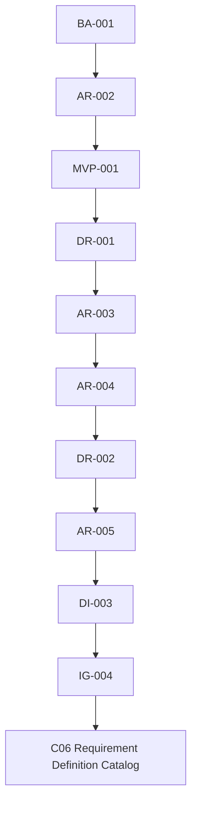
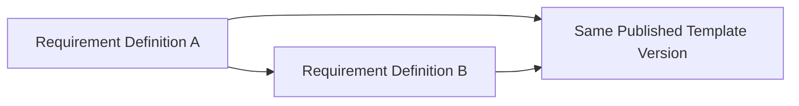

# IG-004 — Requirement Definition Implementation Authorization

**Status:** Approved implementation gate.
**Authorized work package:** DI-003 C06 — Requirement Definition Catalog only.
**Implementation authority:** This document opens C06; it does not authorize C07–C09 or any Evidence, Commercial, or intelligence capability.

## 1. Purpose

IG-004 authorizes the minimum reusable, version-bound definitions that describe governed business obligations. The resulting business value is: **YARVIS can attach immutable, semantically explicit business-obligation definitions to an exact Published Dossier Template Version.**

## 2. Authority Chain

Design Reviews explore and recommend; Architecture Ratifications govern architecture; Implementation Design defines implementation context; Implementation Authorization grants permission to build. AR-005 alone grants no runtime authority.

## 3. Authorized Semantic Boundary

| Dimension | Authorized meaning |
| --- | --- |
| Semantic Subject | Identity, Evidence, Business Data, Derived Knowledge, or Human Decision. |
| Fulfillment Mode | `provided`, `derived`, `verified`, or `confirmed`. |
| Dependency identity | A semantic dependency on another Definition in the same Published Dossier Template Version. |

Dependencies express business knowledge, never workflow order, task sequencing, readiness, or automatic activation.

## 4. Authorized Scope

Authorize only Requirement Definition persistence; tenant ownership; immutable binding to one Published Dossier Template Version; stable semantic key, title, purpose, subject, fulfillment mode, mandatory/optional classification, provenance, same-version dependency references, authoritative retrieval by ID and by Template Version plus semantic key, minimum registration events, durable idempotency, authority/concealment, optimistic concurrency where applicable, rollback/concurrency validation, and one narrow linear migration.

Each Definition belongs to exactly one Published Template Version, preserves Template Version provenance, remains historically immutable, and uses a stable semantic key within that Version.

## 5. Contract Boundary

Before implementation, repository-wide contract ownership and uniqueness must be verified. IG-004 conceptually authorizes only contracts to register a Requirement Definition, retrieve by ID, and retrieve by Template Version plus semantic key. It allocates no final identifiers before that verification. No listing, search, bulk administration, or update contract is authorized.

## 6. Dependency and Immutability Boundary

Implementation may validate same tenant/version ownership, missing or foreign dependency concealment, self-dependency rejection, and deterministic duplicate prevention. It may not add graph traversal, cycle-resolution, readiness, satisfaction, workflow, or activation behavior. If cycle prevention needs a decision beyond AR-005, implementation must stop and record the gap.

Database protection must preserve immutable Organization, Template Version, semantic key, title, purpose, subject, fulfillment mode, mandatory/optional classification, provenance, and authoritative dependencies. Published meaning is corrected through a future governed Template Version, never in place.

## 7. Authorized versus Unauthorized

| Authorized | Explicitly unauthorized |
| --- | --- |
| Immutable Definition catalog and same-version dependency identity | Requirement Instances, satisfaction, partial satisfaction, waiver, and not-applicable decisions |
| Version-bound retrieval, receipts, events, validation, migration | Evidence matching, Document Associations, Artifact Intake, Milestones, Readiness |
| Tenant-safe authority, concealment, rollback, and race handling | Rules, policies, formulas, workflow tasks, Commercial Proposals, settlement |
| | AI, OCR, integrations, Historical Reconstruction, listing/search/UI, update/delete/purge, backfill, or Dossier rebinding |

## 8. Implementation Budget

C06 must use existing repository patterns for aggregates, services, contracts, tenant isolation, receipts, events, migrations, rollback, and concurrency. Generic ontology engines, graph databases, plugin systems, dynamic schemas, arbitrary JSON semantics, expression languages, speculative abstractions, and premature C07–C09 infrastructure are prohibited.

## 9. Validation Checklist

- [ ] Exact, missing, and wrong authority behavior.
- [ ] Tenant concealment and Published Template eligibility.
- [ ] Stable-key uniqueness per Template Version and subject/mode validation.
- [ ] Dependency tenant/version ownership, self-dependency, and duplicate validation.
- [ ] Replay, mismatch conflict, immutability, rollback, and matching/mismatched/different-key race evidence.
- [ ] Exact row, event, receipt, and aggregate count assertions.
- [ ] Zero mutation to C01–C05 aggregates.
- [ ] Migration upgrade/downgrade/re-upgrade, affected regression, compile, diff, and scope-audit evidence.

## 10. Closure Checklist

C06 may close only when it conforms to [DR-002](../design/DR-002_REQUIREMENT_DEFINITION_SEMANTIC_MODEL.md) and [AR-005](../architecture/AR-005_REQUIREMENT_SEMANTIC_ARCHITECTURE_RATIFICATION.md); Definitions are immutable and version-bound; dependencies are not workflow execution; C05 history remains stable; C07–C09 remain absent; and all governance/resilience evidence passes.

## 11. Deferred Roadmap

Explicitly unauthorized: C07 Requirement Instance Bootstrap, C08 Requirement Dependency Readiness, C09 Artifact/Document Association Intake, Milestones, Commercial Decision Engine, Proposal versioning, settlement, and closure semantics. Each requires separate authorization.

## Authorization Statement

IG-004 authorizes DI-003 C06 — Requirement Definition Catalog within the boundaries, budget, and validation requirements stated here. It does not authorize any adjacent capability.

## Related Records

- [AR-003 — Process Architecture Ratification](../architecture/AR-003_PROCESS_ARCHITECTURE_RATIFICATION.md)
- [AR-004 — Platform Evolution Roadmap](../architecture/AR-004_PLATFORM_EVOLUTION_ROADMAP.md)
- [AR-005 — Requirement Semantic Architecture Ratification](../architecture/AR-005_REQUIREMENT_SEMANTIC_ARCHITECTURE_RATIFICATION.md)
- [DR-001 — Dossier Template, Requirement and Milestone Model](../design/DR-001_DOSSIER_TEMPLATE_REQUIREMENT_AND_MILESTONE_MODEL.md)
- [EP-001 — Engineering Governance](EP-001_ENGINEERING_GOVERNANCE_AND_DEVELOPMENT_PRACTICES.md)
