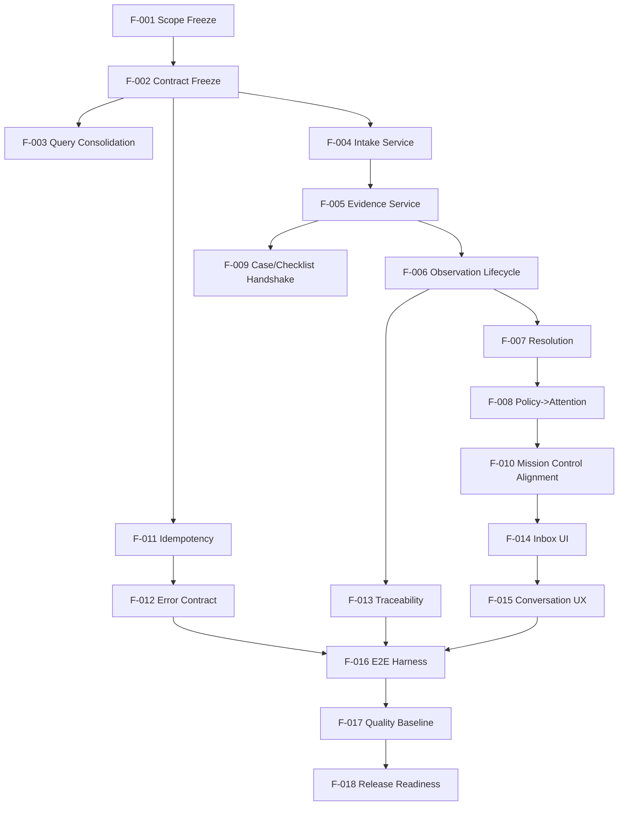

# WS-001 Inbox Implementation Plan

## Document Control

- Work Package: WS-001
- Title: Inbox First Implementation Plan
- Status: Execution planning baseline
- Last Updated: 2026-07-24
- Owners: Engineering

## 1. Authority, Gate, and Allowed Action

- Current engineering gate: Ratified scoped EOS Foundation Documentation gate (scope-limited).
- Current active package in repository state: WS-000 context bootstrap, with WS-000 explicitly authorized outside EOS documentation scope.
- Next allowed action for this document: define executable WS-001 increments without modifying EOS-scoped artifacts.
- Repository state verification required before implementation start: YES (branch, HEAD, dirty tree, runtime/test health are TO BE VERIFIED at execution kickoff).

This plan is documentary and preparatory. It does not authorize out-of-scope architectural redesign.

## 2. WS-001 Objective

Deliver a stable Inbox-first execution slice over the existing platform so operators can run Intake -> Evidence -> Observation -> Policy -> Attention workflows with deterministic behavior, explicit authority, and full traceability.

## 3. Current-State Assessment (Repository Reality)

### Strengths already present

- FastAPI modular monolith bootstrap and persistence runtime are in place.
- Core operational entities exist: IntakeItem, Evidence, Observation, ResolutionDecision, PolicyEvaluation, AttentionItem, DomainEvent.
- Controlled Data Intake backend exists with duplicate detection, preview, confirm/reject/reprocess.
- Mission Control summaries and projections exist.
- Test suites cover operational core, intake/evidence/events, observation engine, checklists, data intake, NetPay operations, workspace API, and store intelligence.

### Gaps relevant to WS-001

- Write-side orchestration still concentrated in route handlers; command-level application services are incomplete for Inbox behavior.
- Idempotency enforcement is partial and endpoint-specific rather than uniform.
- Error semantics are functionally present but not fully standardized as a cross-endpoint contract.
- Correlation/causation propagation into DomainEvent is incomplete.
- Inbox-focused frontend workspace flows are partial; operational UI still fragmented.
- Performance and recoverability acceptance baselines are not formalized as WS-001 quality gates.

## 4. Implementation Strategy

- Reuse existing modules and data model where compatible with DM-001/AM-001.
- Extract write orchestration from routes to application services incrementally.
- Preserve append-only traceability and human authority controls.
- Keep projections read-only and non-authoritative.
- Deliver in small, test-locked increments F-001..F-018.

## 5. Increments F-001..F-018

### F-001 Scope Freeze and Baseline

- Goal: lock WS-001 scope and acceptance mapping before code changes.
- Outputs: baseline checklist, AC mapping, explicit exclusions.
- Primary files: docs/product/WS-001_INBOX_ACCEPTANCE_CRITERIA.md, docs/engineering/WS-001_INBOX_IMPLEMENTATION_PLAN.md.
- Exit condition: scope and AC set approved.

### F-002 Inbox API Contract Freeze

- Goal: freeze endpoint contracts and response/error expectations for inbox-critical routes.
- Outputs: endpoint inventory and contract assertions.
- Primary files: apps/api/src/yarvis_api/api/routes/intake.py, apps/api/src/yarvis_api/api/routes/data_intake.py, apps/api/src/yarvis_api/api/routes/observations.py, apps/api/src/yarvis_api/api/routes/mission_control.py, apps/api/src/yarvis_api/schemas/*.py.
- Exit condition: contract tests defined and passing for frozen set.

### F-003 Inbox Query Surface Consolidation

- Goal: ensure inbox queue/detail queries are deterministic and projection-safe.
- Outputs: consolidated query service paths and route simplification.
- Primary files: apps/api/src/yarvis_api/api/routes/mission_control.py, apps/api/src/yarvis_api/services/*query*.py (new as needed), apps/api/tests/test_workspace_api.py, apps/api/tests/test_data_intake.py.
- Exit condition: query-only guarantees verified.

### F-004 Intake Command Service Extraction

- Goal: move intake mutating behavior from route bodies into application service methods.
- Outputs: Intake application service with explicit transaction boundaries.
- Primary files: apps/api/src/yarvis_api/api/routes/intake.py, apps/api/src/yarvis_api/services/intake_application_service.py (new), apps/api/tests/test_intake_evidence_events.py.
- Exit condition: route logic reduced to validation + service call; tests green.

### F-005 Evidence Promotion Service

- Goal: centralize evidence creation/linking semantics.
- Outputs: evidence promotion orchestration and cross-case guards.
- Primary files: apps/api/src/yarvis_api/api/routes/evidence.py, apps/api/src/yarvis_api/services/evidence_application_service.py (new), apps/api/tests/test_intake_evidence_events.py.
- Exit condition: evidence mutation paths covered by service-level tests.

### F-006 Observation Lifecycle Hardening

- Goal: enforce complete observation lifecycle semantics with immutable terminal protections.
- Outputs: service-level lifecycle policy and explicit error taxonomy.
- Primary files: apps/api/src/yarvis_api/services/observation_engine.py, apps/api/src/yarvis_api/api/routes/observations.py, apps/api/tests/test_observation_engine.py.
- Exit condition: lifecycle transition matrix tested.

### F-007 Resolution Coordination Completion

- Goal: complete proposal/confirm/reject orchestration and persistence behavior for resolution decisions.
- Outputs: deterministic resolution service behavior aligned to DM-001 terminology.
- Primary files: apps/api/src/yarvis_api/api/routes/observations.py, apps/api/src/yarvis_api/services/observation_engine.py, apps/api/tests/test_observation_engine.py.
- Exit condition: all resolution endpoints pass acceptance tests.

### F-008 Policy to Attention Pipeline Stabilization

- Goal: guarantee deterministic policy result to attention generation and prevent duplicate open attention states.
- Outputs: dedupe strategy and explicit attention creation rules.
- Primary files: apps/api/src/yarvis_api/services/policy_engine.py, apps/api/src/yarvis_api/api/routes/operational_policies.py, apps/api/tests/test_observation_engine.py.
- Exit condition: matched/insufficient/conflict paths tested with stable behavior.

### F-009 Case and Checklist Handshake

- Goal: ensure inbox artifacts flow into checklist and case workflows without ad hoc data operations.
- Outputs: explicit orchestration points and validation.
- Primary files: apps/api/src/yarvis_api/api/routes/checklists.py, apps/api/src/yarvis_api/api/routes/intake.py, apps/api/tests/test_classification_checklists.py, apps/api/tests/test_operational_alerts.py.
- Exit condition: intake->evidence->checklist->alerts path passes end-to-end tests.

### F-010 Mission Control Alignment

- Goal: align mission-control counters with confirmed/candidate semantics and inbox workload visibility.
- Outputs: summary consistency checks and regression tests.
- Primary files: apps/api/src/yarvis_api/api/routes/mission_control.py, apps/api/tests/test_data_intake.py, apps/api/tests/test_observation_engine.py.
- Exit condition: counter semantics validated against test fixtures.

### F-011 Uniform Idempotency Enforcement

- Goal: define and apply consistent idempotency strategy for mutating inbox endpoints.
- Outputs: idempotency key/duplicate rules and replay tests.
- Primary files: apps/api/src/yarvis_api/api/routes/data_intake.py, apps/api/src/yarvis_api/api/routes/netpay.py, apps/api/src/yarvis_api/services/*, apps/api/tests/test_data_intake.py, apps/api/tests/test_netpay_operations.py.
- Exit condition: replay-safe behavior verified.

### F-012 Error Contract Normalization

- Goal: standardize operational error semantics (404/409/422 and payload shape).
- Outputs: shared error helper and endpoint conformance.
- Primary files: apps/api/src/yarvis_api/api/routes/*.py, apps/api/src/yarvis_api/schemas/*.py, tests across affected routes.
- Exit condition: negative-path contract tests pass.

### F-013 Traceability Completion (Correlation/Causation)

- Goal: ensure event records allow full causal reconstruction across inbox flow.
- Outputs: correlation and causation propagation policy.
- Primary files: apps/api/src/yarvis_api/models/domain_event.py, apps/api/src/yarvis_api/api/routes/*.py (mutating inbox routes), apps/api/tests/test_intake_evidence_events.py, apps/api/tests/test_netpay_operations.py.
- Exit condition: event trace tests prove end-to-end reconstruction.

### F-014 Inbox Workspace UI

- Goal: provide Inbox workspace screens for queue/detail/preview/confirm/reject/reprocess.
- Outputs: frontend views and API integration.
- Primary files: apps/web/src/api/*, apps/web/src/workspace-shell/pages/*, apps/web/src/components/*, apps/web/src/types/*.
- Exit condition: UI tests and manual runbook scenarios pass.

### F-015 Conversation and Attachment UX Completion

- Goal: complete operator flow for conversation messages, attachments, and context confirmation.
- Outputs: UI controls and validations for conversation-driven intake.
- Primary files: apps/web/src/components/*, apps/web/src/api/*, apps/web tests.
- Exit condition: conversation -> intake -> evidence path validated.

### F-016 End-to-End Integration Harness

- Goal: encode canonical WS-001 workflows in automated integration tests.
- Outputs: E2E suites and fixtures for deterministic replay.
- Primary files: apps/api/tests/*, apps/web/src/*.test.tsx, shared test fixtures under apps/api/tests/fixtures (new as needed).
- Exit condition: TG-01..TG-08 automation stable.

### F-017 Operational Quality Baseline

- Goal: establish performance/recoverability thresholds and operational runbook.
- Outputs: benchmark scripts, failure-recovery script, runbook note.
- Primary files: scripts/*, docs/engineering/*runbook*.md (new as needed), tests for retry/reprocess paths.
- Exit condition: TG-09 report meets agreed thresholds.

### F-018 Release Cut and Rollback Readiness

- Goal: package release evidence and rollback playbook for WS-001 go/no-go.
- Outputs: gate report, migration/rollback checklist, release note.
- Primary files: docs/engineering/WS-001_RELEASE_READINESS.md (new), docs/product/WS-001_RELEASE_NOTES.md (new), docker-compose and operational scripts if needed.
- Exit condition: Gate G8 approved.

## 6. Dependency Graph

## 7. Engineering Gates G0..G8

### G0 Authority and Scope Gate

- Checks: authority chain applied; scope and exclusions locked.
- Pass requires: F-001 complete.

### G1 Contract Gate

- Checks: inbox endpoint contracts frozen and tested.
- Pass requires: F-002 complete.

### G2 Write-Orchestration Gate

- Checks: intake/evidence write paths extracted to services with clear transaction boundaries.
- Pass requires: F-004, F-005 complete.

### G3 Observation/Resolution Gate

- Checks: observation and resolution lifecycle consistency and terminal-state controls.
- Pass requires: F-006, F-007 complete.

### G4 Policy/Attention Gate

- Checks: deterministic policy outcomes and attention lifecycle behavior.
- Pass requires: F-008, F-010 complete.

### G5 Reliability Contract Gate

- Checks: idempotency, error contract, and event trace completeness.
- Pass requires: F-011, F-012, F-013 complete.

### G6 Workspace UX Gate

- Checks: Inbox UI supports operator flow including failure handling.
- Pass requires: F-014, F-015 complete.

### G7 E2E and Quality Gate

- Checks: automated E2E suites pass; performance/recoverability baseline acceptable.
- Pass requires: F-016, F-017 complete.

### G8 Release Gate

- Checks: release evidence package, rollback plan, and sign-offs complete.
- Pass requires: F-018 complete.

## 8. Test Strategy Alignment

- Backend: pytest suites under apps/api/tests grouped to TG-01..TG-09.
- Frontend: vitest + React Testing Library for Inbox UI flows.
- Integration: cross-route canonical scenario tests.
- Operational: repeatable benchmark and recoverability scripts.

## 9. Risks and Controls

- Risk: route-level orchestration drift continues.
  - Control: F-004/F-005 service extraction with code review checklist.
- Risk: duplicate side effects under retries.
  - Control: F-011 idempotency enforcement and replay tests.
- Risk: projection treated as authoritative.
  - Control: G4/G5 checks and explicit read-only route constraints.
- Risk: release without causal trace completeness.
  - Control: F-013 and G5 mandatory pass.

## 10. Readiness Verdict

Current verdict for implementation kickoff: CONDITIONALLY READY.

Mandatory preconditions before first code increment:

1. Verify branch, HEAD, and working tree state.
2. Verify runtime parity path for tests (Dockerized API test execution preferred).
3. Confirm no concurrent governance changes supersede WS-001 assumptions.

If any precondition fails, status becomes NOT READY until corrected.

## 11. Completion Rule

WS-001 implementation is complete only when:

- G0 through G8 are passed in order.
- Product acceptance criteria AC-001..AC-020 are satisfied with evidence.
- No open critical defects remain in authority, integrity, traceability, or idempotency paths.
