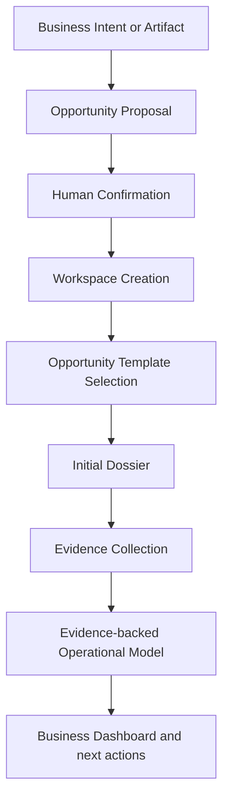

# MVP-001 — First Demonstrable Business Value

**Status:** Proposed product architecture; no implementation authority.  
**Business foundation:** [BA-001 business architecture](../architecture/AR-002_BUSINESS_ARCHITECTURE_RATIFICATION.md).  
**Scope:** The first complete business experience for the Evidence-backed Operational Platform.  
**Boundary:** This is neither a requirements specification nor an implementation package. DI-003 or any successor work requires separate authorization.

## 1. Purpose

MVP-001 demonstrates the complete Opportunity Lifecycle as a usable business experience, rather than showcasing isolated technical features. Its objective is to validate business value: whether an accountable person can move from a signal or Artifact to a comprehensible, governed Opportunity with clear evidence needs and a meaningful next action.

The MVP is successful when it reduces the administrative effort required to organize and understand an early business situation while preserving human confirmation for consequential transitions. It does not seek to prove a particular technology, replace Systems of Record, or automate business judgment.

## 2. Business Promise

For a Commercial Engineer, Business Developer, or Project Developer, Yarvis promises to transform a business intent or incoming Artifact into a governed Opportunity that is easier to understand and advance.

The MVP business promise is that the user can:

- turn business intent into a visible Opportunity proposal;
- organize relevant Artifacts and identify their evidence purpose;
- confirm the Opportunity through an accountable human action;
- receive an organized Workspace for the Opportunity;
- apply an appropriate Opportunity Template;
- initialize a Dossier and expose missing evidence; and
- begin an explainable Evidence-backed Operational Model with clear next business actions.

## 3. Primary Persona

The reference vertical is Energía Fotónica. The primary persona is a **Commercial Engineer / Business Developer / Project Developer** who turns customer interest and technical context into an executable commercial opportunity.

| Aspect | Persona context |
| --- | --- |
| **Responsibilities** | Qualify demand, gather source material, understand site and customer context, prepare a viable commercial path, coordinate specialists, and preserve the basis for follow-up. |
| **Pain points** | Business context is spread across conversations, bills, photographs, folders, quotations, and personal memory; missing evidence is discovered late; next actions and ownership are unclear. |
| **Current workflow** | Receive a conversation or file, search for related material, manually assemble a folder, request missing information, prepare an assessment, and track status through informal messages or ad hoc lists. |
| **Desired outcome** | See one accountable Opportunity, its organized evidence, the selected lifecycle template, missing requirements, current understanding, and the next meaningful action. |

## 4. Primary User Story

A commercial conversation begins with a customer interested in a solar solution. The developer receives a utility bill, photographs, or an expression of business intent; alternatively, the developer begins with a manual statement of the need. Yarvis recognizes that the material may represent a business opportunity and prepares an Opportunity proposal rather than silently creating authoritative business state.

The developer reviews and confirms the proposal. A Workspace is then established around the confirmed Opportunity. The developer selects the relevant Opportunity Template, such as Residential Solar, and Yarvis presents an initial Dossier: what evidence is already available, what is still missing, and what the next business action should be. The initial Evidence-backed Operational Model begins with its support and uncertainty visible. The developer spends less time assembling context and more time advancing an understood Opportunity.

## 5. Opportunity Initiation

The MVP recognizes that business value can begin from several initiation mechanisms. Each converges into the same governed Opportunity Lifecycle; none creates an authoritative Opportunity without the required confirmation.

| Initiation mechanism | Business meaning | Common lifecycle destination |
| --- | --- | --- |
| **Business Conversation** | A customer, partner, or internal discussion signals a possible need or value. | Opportunity proposal informed by conversational context. |
| **Business Intent** | A user explicitly records an observed need, request, or commercial possibility. | Opportunity proposal with an initial stated purpose. |
| **Email** | Correspondence may contain a request, commitment, or relevant evidence. | Artifact and context for an Opportunity proposal. |
| **WhatsApp** | A business conversation or media exchange may reveal opportunity context. | Artifact and context for an Opportunity proposal. |
| **Uploaded Artifact** | A bill, photograph, drawing, or other Artifact can indicate a potential business need. | Artifact registered as evidence candidate for an Opportunity proposal. |
| **Existing Folder** | A collection of materials may indicate an in-progress or inherited business situation. | Historical or forward Opportunity proposal with visible uncertainty. |
| **Historical Documents** | Prior records can support reconstruction of a previously unorganized context. | Reconstruction proposal requiring confirmation. |
| **Manual Creation** | A user knows sufficient business intent before relevant artifacts are available. | Opportunity proposal with explicit evidence gaps. |
| **API** | An authorized external business source may supply intent or Artifact context. | Governed initiation input, subject to the same confirmation path. |

## 6. Opportunity Templates

An **Opportunity Template** is the MVP-facing specialization of the BA-001 Workflow and Dossier Template concepts. It selects the required evidence, workflow, requirements, milestones, dossier structure, and proposal types appropriate to a Business Line. It does not change the Opportunity Engine, foundational governance, or the requirement for confirmation.

| Template example | Business focus | Illustrative specialization |
| --- | --- | --- |
| **Residential Solar** | Qualify and advance a residential energy opportunity. | Utility-bill and site context, initial assessment, commercial proposal, and regulatory dossier expectations. |
| **Commercial Solar** | Govern a larger or more complex energy opportunity. | Commercial demand, site and consumption context, technical assessment, multi-stakeholder proposal, and delivery milestones. |
| **EV Charging** | Explore charging infrastructure opportunity. | Site, demand, electrical context, configuration study, and relevant approvals. |
| **Payment Acquiring** | Qualify a merchant or payment-service opportunity. | Merchant context, onboarding dossier, requirements, confirmation, and activation path. |
| **Engineering Services** | Govern a professional technical-service engagement. | Statement of need, scoped assessment, proposal, delivery milestones, and acceptance evidence. |

Templates make business expectations visible. They are not a promise that all verticals, integrations, or automated decisions are part of the MVP.

## 7. First Demonstrable Workflow

The workflow demonstrates a single coherent business path. It begins with an intent or Artifact, makes an Opportunity proposal reviewable, requires human confirmation, and produces a shared operating context. Workspace creation, template selection, dossier initialization, evidence collection, and the Operational Model support the user in understanding what exists and what must happen next. A dashboard communicates business transformation: context is organized, gaps are visible, and actions are accountable.

## 8. Success Criteria

MVP-001 succeeds when the primary persona can, in a real business situation:

- understand which Opportunity exists and why it matters;
- see what supporting evidence is available and what is still missing;
- work from an organized Workspace rather than an informal collection of files and messages;
- recognize which Opportunity Template is active and what it expects;
- inspect an initial Evidence-backed Operational Model with visible support and uncertainty; and
- feel that Yarvis has removed meaningful administrative effort from organizing and advancing the work.

The measure is a credible improvement in business clarity and follow-through, not a technical benchmark.

## 9. Explicit MVP Scope

### Included business capabilities

- Opportunity proposal and governed human confirmation.
- Opportunity Workspace creation and organization.
- Opportunity Template selection.
- Artifact registration and evidence collection.
- Initial Evidence-backed Operational Model.
- Dossier initialization with visible evidence gaps.
- Clear next business actions within the selected template.

### Intentionally excluded

- Marketplace integration.
- ERP integration.
- Automatic OpenSolar interaction.
- Advanced OCR.
- Predictive AI.
- Mass Historical Reconstruction.
- Supplier optimization.
- Financial analytics.
- Automatic engineering generation.
- Autonomous authoritative decisions or lifecycle transitions.

## 10. Architectural Alignment

MVP-001 implements the ratified BA-001 conceptual foundation without redefining it.

| Foundation | MVP-001 alignment |
| --- | --- |
| **AR-002 Business Architecture Ratification** | Treats BA-001 as the stable conceptual framework and preserves the need for separate implementation authorization. |
| **BA-001A** | Centers the experience on the Opportunity Lifecycle Engine, with Artifacts as evidence rather than the product. |
| **BA-001B** | Uses Workflow, Dossier, Requirement, Milestone, Waiting, and Confirmation concepts to make operational progress understandable. |
| **BA-001C** | Delivers a value-first vertical slice and an initial Evidence-backed Operational Model without treating infrastructure as the outcome. |
| **BA-001D** | Keeps proposals non-authoritative, requires governed human confirmation, preserves explainability, and respects System-of-Record boundaries. |

## 11. Success Demonstration

In approximately ten minutes, a live demonstration should show an audience a real Energía Fotónica Opportunity being understood rather than merely entered into a system:

1. A business intent or real Artifact is introduced.
2. Yarvis presents a reviewable Opportunity proposal.
3. An accountable user confirms it.
4. A Workspace exists for the confirmed Opportunity.
5. The Residential Solar Template is active.
6. Artifacts are organized as candidate or supporting evidence.
7. An initial Dossier identifies available and missing evidence.
8. The Evidence-backed Operational Model explains the current context and next business actions.

The audience should observe the transformation from fragmented business material to governed operational understanding. The demonstration should not emphasize framework choices, storage mechanics, or automation novelty.

## 12. Open Questions for DI-003

The following are implementation-independent questions that must be resolved before an Opportunity Foundation package begins:

1. What defines the identity and lifecycle boundary of the first Opportunity?
2. What defines the identity and business purpose of its Workspace?
3. What is the smallest useful Opportunity Template for Residential Solar?
4. Which Artifact initiation mechanisms have priority for the first slice?
5. What is the first confirmation workflow, including the accountable role and visible rationale?
6. What is the smallest Evidence-backed Operational Model that is useful on the first day?
7. Which Dossier requirements and evidence gaps demonstrate clear business value without overextending scope?

## 13. Scope Boundary and Next Step

MVP-001 does not authorize implementation. It does not define APIs, schemas, storage, connectors, policy engines, OCR, AI, frontend design, infrastructure, or automation mechanics. Its next step is a separately ratified and authorized Opportunity Foundation package that turns this business promise into a bounded implementation plan.

## Conclusion

MVP-001 defines the first demonstrable value of Yarvis: a user can transform intent or evidence into a confirmed Opportunity, an organized Workspace, an active template, an initial dossier, and an explainable Operational Model. This validates the Opportunity Lifecycle Engine as a business experience, not as a collection of technical features.
